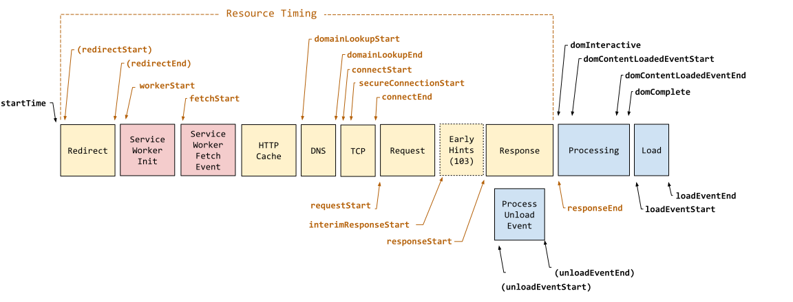

# Web Performance Specifications

## Navigation Timing - 2012

为了帮助开发者更好地衡量页面性能，`W3C` 在 2012 年提出了 [Navigation Timing](https://www.w3.org/TR/navigation-timing)

该标准提供了 `PerformanceTiming` `PerformanceNavigation` 接口，通过只读属性的方式，提供了完整的客户端延迟度量 （complete client-side latency measurements），具体内容可以查看 [MDN](https://developer.mozilla.org/zh-CN/docs/Web/API/PerformanceTiming) 或者 [W3C Recommendation](https://www.w3.org/TR/navigation-timing/#sec-navigation-timing-interface)

标准细化的指标都存储在全局的 `performance` 上，可以直接通过 `const {navigation, timing} = window.performance` 的方式读取

### 为什么需要 `Navigation Timing`

假设有如下代码，旨在衡量页面的加载时间

```html
<html>
  <head>
    <script type="text/javascript">

    var start = new Date().getTime();
    function onLoad() {
      var now = new Date().getTime();
      var latency = now - start;
      alert("page loading time: " + latency);
    }

    </script>
  </head>
  <body onload="onLoad()">
  <!-- Main page body goes from here. -->
  </body>
</html>
```

实际上该脚本有一个明显的问题：它只会在 `script` 执行时才开始计算，而没有累计任何 *从服务端获取页面* 的时间

基于以上原因，`W3C` 基于页面的生命周期，在`PerformanceTiming` 和 `NavigationTiming` 中定义了包含了 `navigationStart` 在内的属性，方便衡量从前一个页面卸载开始的整个页面周期内页面加载耗时的各项指标

### `Navigation Timing` 的处理模型

`Performance Timing` 以及 `Navigation Timing` 准确来讲并不是直接的衡量指标，而是基于页面周期的 **时间点**

如下图所示，整个生命周期经历了以下阶段

1. 导航开始：记录 `navigationStart` 时间点
2. 重定向处理：如果存在重定向，记录 `redirectStart` 和 `redirectEnd` 时间点
3. `DNS` 查找：记录 `domainLookupStart` 和 `domainLookupEnd` 时间点
4. `TCP` 连接：记录 `connectStart` 和 `connectEnd` 时间点
5. 请求发送：记录 `requestStart` 时间点
6. 响应接收：记录 `responseStart` 和 `responseEnd` 时间点
7. `DOM` 处理：记录 `domLoading` `domInteractive` `domContentLoadedEventStart` `domContentLoadedEventEnd` 和 `domComplete` 时间点
8. 页面加载：记录 `loadEventStart` 和 `loadEventEnd` 时间点

在不同的阶段中，用户代理 (User agents 多数情况下为 browsers)会将对应的时间点写入 `window.performance.timing` 和 `window.performance.navigation` 对象中，方便后续使用


*图片来源 <https://www.w3.org/TR/navigation-timing/#processing-model>*

::: warning

1. 当 `window` 对象创建后，`window.performance.timing` 和 `window.performance.navigation` 才能被写入
2. `window.performance.timing` 和 `window.performance.navigation` 可能被浏览器禁用，此时两者的值返回 `null`

:::

### 属性

可以通过 `window.performance` 访问对应内容 `timing` 和 `navigation`

```typescript
interface PerformanceTiming {
  readonly navigationStart: number;
  readonly unloadEventStart: number;
  readonly unloadEventEnd: number;
  readonly redirectStart: number;
  readonly redirectEnd: number;
  readonly fetchStart: number;
  readonly domainLookupStart: number;
  readonly domainLookupEnd: number;
  readonly connectStart: number;
  readonly connectEnd: number;
  readonly secureConnectionStart: number;
  readonly requestStart: number;
  readonly responseStart: number;
  readonly responseEnd: number;
  readonly domLoading: number;
  readonly domInteractive: number;
  readonly domContentLoadedEventStart: number;
  readonly domContentLoadedEventEnd: number;
  readonly domComplete: number;
  readonly loadEventStart: number;
  readonly loadEventEnd: number;
}
enum NavigationType {
  TYPE_NAVIGATE = 0;
  TYPE_RELOAD = 1;
  TYPE_BACK_FORWARD = 2;
  TYPE_RESERVED = 255;
}
interface PerformanceNavigation {
  readonly type: NavigationType;
  readonly redirectCount: number;
};
interface Performance {
  readonly timing: PerformanceTiming;
  readonly navigation: PerformanceNavigation
}
interface Window {
  readonly performance: Performance
}
```

::: warning

需要注意的是 `Navigation Timing` 特性已被标注为[废弃](https://w3c.github.io/navigation-timing/#obsolete)，并不推荐使用。但由于其良好的兼容性（Chrome 6），仍有了解的必要

:::

## Navigation Timing Level 2

目前在 `W3C` 议程上的是最新的 [Navigation Timing Level2 标准](https://www.w3.org/TR/navigation-timing-2/#abstract)。简而言之，该标准相对于 `Navigation Timing - 2012` 主要有以下改变：

1. 提供了更多的时间点和属性
2. 提供协议支持

使用方式与 `Navigation Timing - 2012` 也有所不同，可以通过 [performance.getEntriesByType](https://developer.mozilla.org/en-US/docs/Web/API/Performance/getEntriesByType) 或者 [PerformanceObserver](https://developer.mozilla.org/en-US/docs/Web/API/PerformanceObserver) 获取到对应的属性

`performance.getEntriesByType` 支持[多种类型的资源](https://developer.mozilla.org/en-US/docs/Web/API/PerformanceEntry/entryType)，通过指定 `type` 可以指定获取对应的 `performance` 数据

``` typescript
const [navigationTl] = performance.getEntriesByType("navigation");
const srcTimelines = performance.getEntriesByType("resource");
```

需要注意的是，`performance.getEntriesByType` 不会通知到对应 `performanceNavigationTiming` 属性的变化，返回的是 `FrozenArray` 格式的 **调用时的** `performance timeline`。如果需要动态监听变化，应该使用 `PerformanceObserver`

```typescript
function perfObserver(list, observer) {
  list.getEntries().forEach((entry) => {
    if (entry.entryType === "mark") {
      console.log(`${entry.name}'s startTime: ${entry.startTime}`);
    }
    if (entry.entryType === "measure") {
      console.log(`${entry.name}'s duration: ${entry.duration}`);
    }
  });
}
const observer = new PerformanceObserver(perfObserver);
observer.observe({ entryTypes: ["measure", "mark"] });

```

::: details 变更详情，摘自 [w3c Editor's Draft](https://w3c.github.io/navigation-timing/#introduction)

1. `Performance interface` 移动到单独的 [PERFORMANCE-TIMELINE-2](https://www.w3.org/TR/performance-timeline/) 标准中，支持该标准
2. 建立在的 [RESOURCE-TIMING-2](https://www.w3.org/TR/resource-timing/) 基础上
3. 支持 [HR-TIME-2](https://www.w3.org/TR/hr-time-2/)
4. 支持 [RESOURCE-HINTS] 的预渲染技术
5. 暴露自上次非重定向导航以来的重定向次数
6. 暴露 [next hop network protocol](https://www.w3.org/TR/resource-timing/#dom-performanceresourcetiming-nexthopprotocol)
7. 暴露 `transfer` 以及编解码的请求体大小
8. 强制 `secureConnectionStart` 属性

:::

### Level 2 处理模型



1. 导航开始：记录 `startTime` 和 `navigationStart` 时间点
2. `Service Worker` ：如果存在 `Service Worker`，记录 `workerStart` 时间点
3. 重定向处理：如果存在重定向，记录 `redirectStart` 和 `redirectEnd` 时间点，并更新 `redirectCount` 属性
4. `DNS` 查找：记录 `domainLookupStart` 和 `domainLookupEnd` 时间点
5. `TCP` 连接：记录 `connectStart` `secureConnectionStart`（如果适用）和 `connectEnd` 时间点
6. 请求发送：记录 `requestStart` 时间点
7. 响应接收：记录 `responseStart` `responseEnd` `transferSize` `encodedBodySize` 和 `decodedBodySize` 时间点
8. 底层协议：记录 `nextHopProtocol` 属性
9. `DOM` 处理：记录 `domInteractive` `domContentLoadedEventStart` `domContentLoadedEventEnd` `domComplete`时间点
10. 页面加载：记录 `loadEventStart` 和 `loadEventEnd` 时间点
11. 预渲染：如果存在预渲染，记录 `prerenderStart` 和 `prerenderEnd` 时间点

对比 [Navigation Timing 2012](#navigation-timing---2012) 可以发现，`Navigation Timing Level2` 的记录颗粒度明显更细致，并且多了诸如 `Service Worker` 等

### 属性

```typescript
/** 导航类型 */
enum NavigationTimingType {
    "navigate",
    "reload",
    "back_forward",
    "prerender"
};
/** 未存储原因 */
interface NotRestoredReasons {
  readonly src?: string;
  readonly id?: string;
  readonly name?: string;
  readonly url?: string;
  readonly reasons?: {reason: string}[];
  readonly children?: {reason: string}[];
}
interface PerformanceNavigationTiming {
    readonly unloadEventStart: number;
    readonly unloadEventEnd: number;
    readonly domInteractive: number;
    readonly domContentLoadedEventStart: number;
    readonly domContentLoadedEventEnd: number;
    readonly domComplete: number;
    readonly loadEventStart: number;
    readonly loadEventEnd: number;
    readonly type: NavigationTimingType;
    readonly redirectCount: number;
    readonly criticalCHRestart: number;
    readonly NotRestoredReasons?  notRestoredReasons?: ;
}
```
