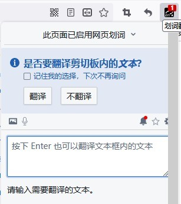
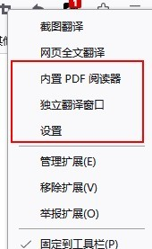
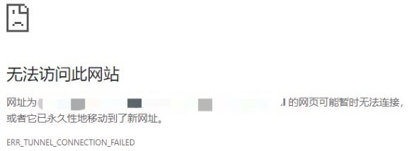

# Hosts Extension Development: From Start to Finish

## What is hosts

According to [Wikipedia](<https://en.wikipedia.org/wiki/Hosts_(file)>), `hosts` is a system file used by the operating system to map `host names` to `ip addresses`. It is a plain text file. We won't go into detail about `IP` and `DNS` here.

## Business Scenario

In real-world development, a feature typically goes through functional testing across different environments: development -> testing -> staging -> production. In most cases, the development, testing, and staging environments are not publicly accessible. When a domain name cannot be correctly resolved by the DNS server, the page will fail to load. A common workaround is to configure the system-level host file, manually adding DNS cache entries so the browser can correctly resolve domain names and access the corresponding IP addresses.

However, some business domains share the same domain name across all environments and can only be distinguished by IP address. In that case, our host file would look like the following, and we'd switch environments by commenting/uncommenting the corresponding host entries. This invisibly adds a lot of repetitive work and may lead to inaccurate test results due to missed host entries, ultimately affecting business progress.

```
# Staging
172.127.80.1 common-url.com
# Testing
172.127.230.16 common-url.com
```

`Don't Repeat Yourself` is an important principle in software development, and it absolutely applies to daily work as well. Repeatedly modifying host files is neither elegant nor sustainable. Automation, or at least visualization, is urgently needed.

## Solutions

There are two main approaches:

1. Automated scripts to modify the system host file
2. Browser extensions to redirect browser requests

### Automated Scripts

We won't go into detail about automated scripts here. The general idea is:

1. Create separate host files like `env1.txt`, `env2.txt` for different environments
2. Create an automation script that modifies the system host file with administrator privileges, controlling host clearing and writing through a single command

You could even create a dedicated application for dynamic host switching, such as [SwitchHosts](https://github.com/oldj/SwitchHosts).

The advantage of this approach is convenience and speed. It can globally manage `hosts`.

The downside is that modifying the `hosts` file requires system administrator privileges. In some scenarios, if the user cannot obtain admin privileges, they won't be able to modify `hosts`.

### Browser Extension Development

The idea behind browser extension development is straightforward. Through the API provided by [`Chrome.proxy`](https://developer.chrome.com/docs/extensions/reference/proxy), we can use `PacScript` in `mode=pac_script` mode to proxy `hosts`.

Moreover, due to the nature of extension development ~~(it's basically a feature-rich web page)~~, extensions can achieve better visualization compared to automated scripts.

#### Prerequisites

Browser extensions can achieve different effects through various file and feature configurations, but they typically consist of the following components:

- The manifest

`manifest.json` is a required file for any extension system and must be located in the extension's root directory. This file defines `metadata`, `resources`, `permissions`, `background files`, and other information.

- The service worker

The extension's `service worker` can listen to browser [events](https://developer.chrome.com/docs/extensions/reference/), such as navigation, bookmark changes, or tab closures. Note that while the `service worker` can listen to events, it cannot interact with page content — that's the job of `content scripts`.

- Content scripts

As the name suggests, `content scripts` are scripts injected into pages. They can directly read or manipulate the page's DOM. Some common extensions like [Immersive Translate](https://hcfy.app/) use this feature to replace page content. `Content scripts` can only call a subset of [Chrome APIs](https://developer.chrome.com/docs/extensions/reference/), but can access other APIs through communication with the `service worker`.

- The popup and other pages

An extension can include many HTML pages, such as popup windows and options pages. Using the Immersive Translate extension as an example, left-clicking opens the popup window:



Right-clicking opens the entry to the additionally configured options page:



Based on the above requirements, the extension we need to develop is actually quite simple, with two main features:

1. Edit the hosts list through the popup
2. Proxy hosts through Chrome APIs

No page content modification or background services are needed. Therefore, we don't need `service worker` or `content scripts`. We mainly use the `popup and other pages` functionality. So the initial `manifest` for our host extension looks like this:

```json
{
  "manifest_version": 3,
  "name": "Host Manager",
  "description": "A Simple Host Tool",
  "minimum_chrome_version": "24",
  "version": "0.0.1",
  "icons": {
    "16": "icons/logo-16.png",
    "48": "icons/logo-48.png",
    "128": "icons/logo-128.png"
  },
  // Controls icon click behavior
  "action": {
    "default_icon": "icons/logo-16.png",
    "default_title": "Host Manager",
    "default_popup": "index.html"
  },
  // Extension permissions
  "permissions": ["proxy"]
}
```

#### Development Approach

Since page development is involved, modern web development should naturally use a framework for future extensibility. Using vite@4.2.0 and vue@3.2.47 as an example, the project structure (excluding scaffolding files) should look like this:

```
// source
├─dist
├─public
│  ├─icons
│  └─manifest.json
└─src
    ├─assets
    ├─components
    ├─hooks
    ├─store
    ├─test
    ├─utils
    ├─App.vue
    ├─main.ts
    └─style.css
```

Write popup files in the `src` directory. After `build`, the compiled output and public files will be moved to the `dist` directory, which then serves as the extension source files for debugging.

```
├─index.html
├─manifest.json
├─assets
│   ├─index-022763e2.css
│   └─index-64e73436.js
└─images
    ├─logo-128.png
    ├─logo-48.png
    ├─logo-16.png
    └─logo.png
```

#### Extension Workflow

We'll skip the specific page development details. The only thing worth noting is that we want the extension to remember the user's host information rather than requiring re-entry every time the browser opens. Therefore, data management needs to use `localStorage` for persistence. Of course, with `@vueuse/core` and `pinia`, this can all be handled automatically.

The core of the entire extension lies in the proxy configuration. According to the [official documentation](https://developer.chrome.com/docs/extensions/reference/proxy/), we first need to add the `proxy` permission field to `permissions`.

Regarding `proxy`, Chrome provides several modes:

- direct
- auto_detect
- pac_script
- fixed_servers
- system

`direct` makes direct requests, `system` uses the system proxy, and `fixed_servers` is mainly used to forward all requests to a fixed address — this feature is commonly used as part of **proxy extensions** like [SwitchyOmega](https://github.com/FelisCatus/SwitchyOmega/). `auto_detect` also resolves through PAC scripts, but the script must be 'downloadable at <http://wpad/wpad.dat>' and allows no other configuration.

Therefore, we chose the `pac_script` mode. This mode allows us to customize scripts from _data literals_ or _URLs_, making it the most suitable mode for implementing our _custom host_ functionality.

At this point, the entire business workflow is complete:

1. Popup page where users input custom hosts
2. Parse hosts into recognizable pacScript
3. Use Chrome API for resolution

```typescript
// Official example
const config = {
  mode: 'pac_script',
  pacScript: {
    data:
      'function FindProxyForURL(url, host) {\n' +
      "  if (host == 'foobar.com')\n" +
      "    return 'PROXY blackhole:80';\n" +
      "  return 'DIRECT';\n" +
      '}'
  }
};
chrome.proxy.settings.set({ value: config, scope: 'regular' }, function () {});
```

#### PAC

If the core of the extension is the `proxy` configuration, then the core of that configuration is `pacScript` generation. So what exactly is `PAC`? `PAC` stands for `Proxy Auto Config` — literally, "proxy auto-configuration."

According to [MDN's definition](https://developer.mozilla.org/en-US/docs/Web/HTTP/Proxy_servers_and_tunneling/Proxy_Auto-Configuration_PAC_file):

> A Proxy Auto-Configuration (PAC) file is a JavaScript function that determines whether web browser requests (HTTP, HTTPS, and FTP) go directly to the destination or are forwarded to a web proxy server.

And according to [Wikipedia](https://en.wikipedia.org/wiki/Proxy_auto-config):

> A proxy auto-config (PAC) file defines how web browsers and other user agents can automatically choose the appropriate proxy server (access method) for fetching a given URL

```javascript
// Function in a PAC file
function FindProxyForURL(url, host) {
  // code
}
```

This function receives two parameters: `url` & `host`. Two important notes:

1. When the request URL is `https`, the `path` and `query` in the `URL` will be stripped. Behavior may vary across different browsers and user settings. Therefore, for a URL like `https://test.com/url.html?type=add`, the safest approach is to match the `url` field using `test.com` rather than a full match.
2. `host` is a field extracted from the URL. It is equivalent to the string between `://` and the first `:` or `/` in the `URL`. In other words, this field does not contain `port` information.

The `FindProxyForURL` function in a PAC file can return a string that must match one of the following formats:

- DIRECT
- PROXY host:port
- SOCKS host:port
- HTTP: host:port
- HTTPS: host:port
- SOCKS4 host:port, SOCKS5 host:port

Where `PROXY` is a protocol-adaptive header.

##### A Simple Implementation

Let's revisit our original goal:

```
# Automatically switch between the following two addresses
# Staging
172.127.80.1 common-url.com
# Testing
172.127.230.16 common-url.com
```

A simple `PAC` function implementation:

```javascript
// ipConfig.js
const preIp = '172.127.80.1:80';
const testIp = '172.127.230.16:80';
const getIpByEnv = (env) => (env === 'pre' ? preIp : testIp);

// setProxy.js
const env = 'pre';
function FindProxyForURL(url, host) {
  if (host === 'common-url.com') {
    return `PROXY ${getIpByEnv(env)}`;
  } else return 'SYSTEM';
}
```

This enables dynamic switching for the `common-url.com` address — just add a toggle related to the `env` variable on the `popup` page. Of course, this `PAC` still has several immature aspects:

1. If `preIp` or `testIp` becomes invalid, the request will fail directly. It's better to add a fallback option like `SYSTEM`.
2. For regular page `host` settings, the application-layer protocols involved are typically `http` and `https`. The current method proxies all possible application-layer protocols, including `ftp`.
3. For `localhost`, going through `SYSTEM` proxy will make it inaccessible.

Let's improve the method:

```javascript
// setProxy.js
const env = 'pre';
function FindProxyForURL(url, host) {
  if (shExpMatch(url, 'http:*') || shExpMatch(url, 'https:*')) {
    // Only proxy http and https
    if (host === 'localhost') {
      // Special handling for localhost
      return 'DIRECT';
    } else {
      // Add fallback
      return `PROXY ${getIpByEnv(env)}; SYSTEM`;
    }
  } else {
    return 'SYSTEM';
  }
}
```

##### Predefined Functions

The `shExpMatch(str, shexp)` used in the `FindProxyForURL` method is a _predefined function_. Its usage can be found on [MDN](https://developer.mozilla.org/en-US/docs/Web/HTTP/Proxy_servers_and_tunneling/Proxy_Auto-Configuration_PAC_file#shexpmatch), used to determine whether a `str` matches a given `shexp` shell expression.

With predefined functions, we can implement more configuration options. For example, `isPlainHostName(host)` determines whether a `host` is a non-domain-style hostname:

```javascript
isPlainHostName('www.mozilla.org'); // false
isPlainHostName('www'); // true
```

Another example: in practice, we can use the predefined function `localHostOrDomainIs()` to match all `sub domain` addresses:

```javascript
localHostOrDomainIs('www.mozilla.org', 'www.mozilla.org'); // true (exact match)
localHostOrDomainIs('www', 'www.mozilla.org'); // true (hostname match, domain not specified)
localHostOrDomainIs('www.google.com', 'www.mozilla.org'); // false (domain name mismatch)
localHostOrDomainIs('home.mozilla.org', 'www.mozilla.org'); // false (hostname mismatch)
```

:::tip Custom URL Handler Functions

Although `FindProxyForURL` provides many commonly used `predefined functions`, we can still extend the capabilities of a `PAC file` through custom functions.

```javascript
function isNumericIP(host) {
  // A regular expression that matches a valid IP address in dotted-decimal notation
  var ipRegex = new RegExp(
    '^\\d{1,3}\\.\\d{1,3}\\.\\d{1,3}\\.\\d{1,3}',
    'g'
  );
  // Test the host against the regular expression and return the result
  return ipRegex.test(host);
}

function FindProxyForURL(url, host) {
  if (isNumericIP(host)) {
    return 'DIRECT';
  }
  // --snip--
}
```

You can use the [PAC Online Testing Tool](https://thorsen.pm/proxyforurl) to test whether your `PAC file` works correctly.

:::

#### HTTPS

The initial development of the extension is basically complete at this point. Let's review the proxy workflow with the technologies used:

1. Develop the `popup` page using `vue` + `tailwindcss` to edit `hosts` content
2. Use `pinia` + `vueuse` for real-time updates and persistence of `hosts`
3. After parsing `hosts`, generate the corresponding `FindProxyForURL` function and call the `Chrome API` to update the proxy

In theory, since `FindProxyForURL` already proxies https, entering any address with a matching domain should successfully proxy. However, in practice, `https` cannot be correctly proxied. 

The reason lies in the nature of https itself and the principles of [PAC](####PAC).

Recall the definition of `PAC` — the browser essentially forwards addresses through a proxy.

Suppose we configure a local proxy:

```
SOCK5 127.0.0.1:7890
```

For any request, the browser forwards it to `127.0.0.1:7890`, and then the `7890` server performs a secondary forward to obtain the response.

For the following `host`:

```
192.0.200.1 test.com
```

The parsed `PAC Rule` would be `PROXY 192.0.200.1`. When requesting `http://test.com`, it gets proxied to `http://192.0.200.1`, and the forwarding server `http://192.0.200.1` directly returns the response without secondary forwarding, achieving an effect similar to `DNS` resolution.

However, HTTPS is fundamentally designed to prevent proxying. Because the motivation behind `HTTP over TLS` is to prevent [Man-in-the-middle attacks](https://en.wikipedia.org/wiki/Man-in-the-middle_attack) and protect the integrity and privacy of exchanged data.

Two small questions may arise here:

1. Why can system-level HTTPS be proxied through HTTP? For example, some proxy tools use commands like `set http_proxy=http://127.0.0.1:7890 & set https_proxy=http://127.0.0.1:7890`
2. Why can `SOCKS` proxy `https` in browsers? These questions still need further research.

Based on our analysis, forwarding `https://test.com` to `http://192.0.200.1` via `PAC Rules` in the browser is itself a "man-in-the-middle" behavior. Therefore, forwarding `https` to an `https` or `http` server proxy will inevitably fail.

This is why system-level projects like [SwitchHosts](https://github.com/oldj/SwitchHosts), whose core implementation [setSystemHosts.ts](https://github.com/oldj/SwitchHosts/blob/master/src/main/actions/hosts/setSystemHosts.ts) directly writes to the system-level hosts file, don't have this problem.

System-level software like SwitchHosts directly modifies the `hosts` file, **truly** changing the system's DNS resolution. Browser extensions, on the other hand, are essentially proxy request interceptions — the system's DNS remains unchanged.

##### Solution Ideas

1. First convert `https` requests to `http` requests, then go through the proxy.

- v2 solution: use the [webRequest API](https://developer.chrome.com/docs/extensions/reference/webRequest/) for blocking requests and synchronous modification
- v3 introduces [declarativeNetRequest](https://developer.chrome.com/docs/extensions/reference/declarativeNetRequest/) for _blocking_ and _modifying_ network requests with specific declarative rules. Note that for `host`-level redirects, you need to additionally request `declarativeNetRequestWithHostAccess` permission in `manifest.json`

```javascript
chrome.webRequest.onBeforeRequest.addListener(
  function (details) {
    return { redirectUrl: details.url.replace('https', 'http') };
  },
  {
    urls: domains.map(function (domain) {
      const url = 'https://' + domain + base + '/*';
      return url;
    })
  },
  ['blocking']
);
// or
chrome.declarativeNetRequest.updateDynamicRules(
  {
    addRules: [
      {
        // change the scheme of the URLs which match the domains of hosts
        id: 1,
        priority: 1,
        action: {
          type: chrome.declarativeNetRequest.RuleActionType.REDIRECT,
          redirect: {
            transform: { scheme: 'http' }
          }
        },
        condition: {
          urlFilter: `||${domain}`
        }
      }
    ],
    removeRuleIds: lastRuleIds
  },
  () => {
    lastRuleIds = newRules.map((info) => info.id);
  }
);
```

This solution handles most cases, but there are some edge cases it cannot resolve:

- iframe redirect errors

  Consider a page `https://www.test.com` with an internal `iframe` `https://a.test.com`. For both pages:

  - Both have `host` configured
  - Both `https://www.test.com` and `https://a.test.com` depend on cookies under the `test.com` domain

  When opening the page, the `iframe` request will error. If the cookie is used for authentication, the page will directly show an authentication failure error code.

  Reason: The iframe doesn't correctly carry cookies after redirection. This is fundamentally related to [HTTP Cookie policies](https://developer.mozilla.org/en-US/docs/Web/HTTP/Cookies) and the browser's [cookie mechanism](https://chromestatus.com/feature/5088147346030592), causing the browser to block set-cookie in the iframe's navigation link, leaving the iframe without cookies. If the request has `SameSite=Strict` or `SameSite=Lax` (Chrome defaults to `SameSite=Lax` if not set), the browser will block non-top-level set-cookie requests, resulting in requests without cookies. This works fine with https requests, but errors occur after redirecting to http.

  > This Set-Cookie header didn't specify a 'SameSite" attribute and was defaulted to "SameSite=Lax," and was blocked becaus a cross-site response which was not the response to a top-level navigation. The Set-Cookie had to have been set with "Sam to enable cross-site usage.

- Infinite redirects

  Certain pages with `Upgrade-Insecure-Requests: 1` set may cause infinite redirect loops. When the server returns a `Location`, the `http` request gets redirected to an `https` `Location`, and the new `https` address gets redirected back to `http` by the extension, causing an infinite loop.

  Note: This issue doesn't occur in incognito mode. The `Upgrade-Insecure-Requests: 1` request header is still present, suggesting this is internal browser behavior.

#### Final Product

After clarifying the workflow and technical points, you can search directly on GitHub — such extensions must already exist. Surprisingly though, there aren't many.

For example, two relatively representative (higher star count) extensions are [host-switch-plus](https://github.com/Riant/host-switch-plus) and [awesome-host-manager](https://github.com/keelii/awesome-host-manager).

`host-switch-plus` has already been delisted from the Chrome WebStore. While `awesome-host-manager` can still be installed from the store, its last feature update was four years ago. Both extensions use relatively outdated technology, are difficult to debug locally, and their `manifest` versions are still at version 2.

So I started a new project from scratch: [HostsWitch](https://github.com/X-sky/HostsWitch), built with React + MUI + Jotai.

#### Development Pain Points

During initial development, I only researched the architecture. The development workflow was to build static pages directly, then update the browser extension through build + reload for debugging. Later I discovered there were already existing scaffolding tools for this... such as [vitesse-webext](https://github.com/antfu/vitesse-webext/blob/main/README.md).
