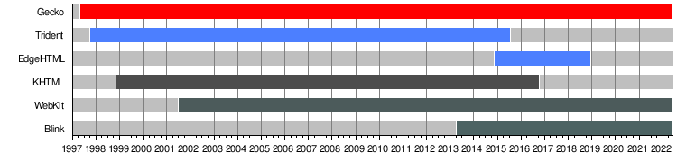

# 浏览器的前世今生

> 多年以后，当前端开发者们面对千奇百怪的问题的时候，仍会想起 javascript 问世的那个冬天

相信从远古时代走来的前端开发者对于以下 css 前缀一定不会感到陌生 `-ms-` `-o-` `-moz-` `-webkit-`

在 Node 出现以前，针对同一个 css 属性，我们可能需要如下代码才能够实现不同浏览器上的兼容性

```css
.compatible-transition {
  /** webkit 引擎的浏览器 */
  -webkit-transition: all 4s ease;
  /** firefox 渲染引擎的浏览器 */
  -moz-transition: all 4s ease;
  /** IE 和 旧版 Edge 引擎的浏览器 */
  -ms-transition: all 4s ease;
  /** 旧版 Opera 引擎 */
  -o-transition: all 4s ease;
  transition: all 4s ease;
}
```

直到 Node 兴起，前端迈向工程化，这些重复性极高、内容极多的兼容操作才被自动化打包工具所代替

当然，还有一些奇怪的兼容问题，仍然需要手动处理

::: details 远古时代一些关于 IE 的兼容问题

1. IE 的 inline 表现与 Chrome 的 inline 表现不完全一致。比如添加伪元素的时候，IE 会导致 inline 元素布局错乱
2. IE 下的 position: relative 会影响文件流的宽高，而 Chrome 则不会

:::

这些都源于互联网一路发展，浏览器百花齐放的历史轨迹

## 浏览器战争

1990 年，[Tim Berners-Lee](https://en.wikipedia.org/wiki/Tim_Berners-Lee) 用 Objective-C 编写了世界上的首个 WEB 浏览器 ———— [WorldWideWeb](https://en.wikipedia.org/wiki/WorldWideWeb)。这同时也是首个所见即所得 (WYSIWYG) 的 HTML 编辑器

谁也没有料到的是，随着万维网 (World Wide Web) 和 用户图形界面 (GUI) 的发展，或者说，随着时代的进步，前方等待着人们的，是一场持续数十年的 [浏览器战争 (Browser Wars)](https://en.wikipedia.org/wiki/History_of_the_World_Wide_Web#Browser_wars)，也是远古时代无数前端开发者深夜难眠的噩梦

### 第一次浏览器战争

- 1993年，[Mosaic](https://en.wikipedia.org/wiki/NCSA_Mosaic) 浏览器正式发布，创新性的 GUI, 首个公认的主流浏览器
- 1994 年，受到 Mosaic 项目的启发，网景 (Netscape) 公司成立
- 同年, [Netscape Navigator](https://en.wikipedia.org/wiki/Netscape_Navigator) 发布
- 1995 年，javascript 诞生
- 同年，[Netscape Navigator 2](https://en.wikipedia.org/wiki/Netscape_Navigator_2) 发布，成为首个支持 javascript 的浏览器
- 同年，js引擎 SpiderMonkey 的前身在网景公司的实验室中诞生
- 同年，[Opera](https://en.wikipedia.org/wiki/Opera_(web_browser)) 诞生
- 同年，微软推出 Internet Explorer (IE or MSIE)，第一次浏览器战争正式开始
- 1996年，[IE 3.0](https://en.wikipedia.org/wiki/Internet_Explorer_3) 与 Windows 95 OSR2 (OEM Service Release 2) 捆绑在一起。这标志着 IE 成为了 Windows 操作系统的一部分
- 同年，微软基于 ECMAScript 标准实现了 [JScript](https://en.wikipedia.org/wiki/JScript)，作为 IE 的内置脚本标准
- 同年，网景公司开发了
- 1997年，[IE 4.0](https://en.wikipedia.org/wiki/Internet_Explorer_4) 发布。IE 从此进入 [trident](https://en.wikipedia.org/wiki/Trident_(software)) 时代
- 1998年，网景公司开源了 Netscape Navigator 并且推出了 [Mozilla](https://en.wikipedia.org/wiki/Mozilla)。尽管这一举措让 Netscape Navigator 维持了一定的技术优势，但这并没有能够延缓 Navigator 降低市场份额
- 同年，网景公司被雅虎旗下的 America Online 收购

第一次浏览器战争以 IE 的全方面胜出结束。然而这短暂的第一次战争，只是第二次漫长战争的导火索

### 第二次浏览器战争

- 2003 年，苹果公司 CEO 乔布斯推出了基于 [Webkit](https://en.wikipedia.org/wiki/WebKit) 的浏览器 Safari
- 同年，Opera 7.0 发布，内置了全新的浏览器引擎 [Presto](https://en.wikipedia.org/wiki/Presto_(browser_engine))
- 同年，微软宣布 IE 不再单独维护，而是跟随 windows 系统迭代
- 2004 年，IE 的市场份额已经高达92%
- 同年，[Mozilla Firefox](https://en.wikipedia.org/wiki/Mozilla_Firefox) 正式发布。拉开了第二次浏览器战争的帷幕
- 2005 年，微软撤回了 IE 不再单独维护的声明
- 2008 年，Netscape Navigator 停止维护
- 同年，Google 推出了 Google Chrome，内置首个 JIT javascript 编译引擎，也就是大名鼎鼎的 [V8](https://en.wikipedia.org/wiki/V8_(JavaScript_engine))，并发布了开源的浏览器项目 [Chromium](https://en.wikipedia.org/wiki/Chromium_(web_browser))
- 2009年，微软发布了 JS 引擎 Chakra 的前身
- 同年，Firefox 3.5 发布。内置的 javascript 引擎 [TraceMonkey](https://en.wikipedia.org/wiki/SpiderMonkey#TraceMonkey) 引入了 JIT 编译
- 同年，苹果在 safari 4 中推出了 SquirrelFish 单独作为 javascript 引擎
- 2011 年, IE 9.0 发布，内置 Chakra 引擎
- 2013 年，IE 11.0 发布。这是最后一个 IE 版本，其市场份额降到 11.8%。尽管仍在 win10 被集成，但 win10 的默认浏览器已经换成了 [Edge(Legacy)](https://en.wikipedia.org/wiki/Microsoft_Edge#Edge_Legacy_(2014%E2%80%932019))
- 同年，Opera 放弃了 Presto，转向 Chromium
- 2015 年，微软推出基于 EdgeHTML 和 Chakra 的 Edge(legacy) 浏览器
- 2019 年，微软推出基于 Chromium 的 New Edge 替代 Edge(Legacy) 作为 windows 的默认浏览器

New Edge 的出现，标志着第二次浏览器战争的落幕

时至今日，当我们谈及浏览器的时候，通常指的就是 Blink + V8 的 Chrome 系浏览器


*浏览器发展时间线*

浏览器战争的发展与终结，也充分说明了“天下大势，分久必合，合久必分”的道理

到了今天，对于 `transition` 属性，已经不需要对其进行额外的 `prefix` 处理了

统一的最大的受益者，无疑是开发者。广大用户在战争中可以收获更多的选择，更便捷的技术，更友好的 UE

但屠龙者终成恶龙的故事我们也并不陌生。Chrome 会不会成为下一个 IE，还要交给时间去回答

## 浏览器的“内核”

尽管浏览器们早期各自实现了不同的浏览器内核，也有不同的渲染逻辑，但在“天下归魏”的趋势下，现代浏览器的表现已经趋于一致

在远古时代，浏览器主要使用“单核”统一负责 HTML CSS 和 javascript 的解析，原因主要有三点：

1. javascript 并不是网页开发的主要内容。当时的网页主要用于展示静态内容，可交互性不强
2. 受限于主机的处理性能，浏览器的处理能力有限
3. 历史原因：例如 IE 的浏览器内核还需要负责向后兼容一些古早标准

而随着互联网的发展，网页所展示的内容越来越丰富，交互也越来越复杂，使用单一引擎的弊端逐渐显现，最直接的感受就是：速度

如果你处于 13 年 IE 11.0 发布的时间节点，你选择上网的浏览器有

1. IE
2. Firefox
3. Chrome
4. Opera
5. 其他

尽管选择很多，但你仍有 [33% 左右的概率](https://www.w3counter.com/globalstats.php?year=2013&month=7) 会由于性能与交互而选择 Chrome

我们经常听到这样一种说法：Chrome 是 blink 内核；同时也会有另一种说法：谷歌是 v8 引擎

这里的 *内核* 和 *引擎* 其实指的就是 **渲染引擎** 和 **JS引擎**

对于 IE 这种复合型内核，他的内核/引擎就是 Trident，这种复合型引擎实现了对应的 javascript 解析器，也正是后来 javascript 引擎的雏形

正是由于 javascript 引擎的兴起，Node 与前端工程化才进入了人们的视野

::: details 常见的浏览器及其引擎

| Browser        | Rendering Engine | JavaScript Engine |
| -------------- | ---------------- | ----------------- |
| Chrome         | Blink            | V8                |
| Firefox        | Gecko            | SpiderMonkey      |
| Safari         | WebKit           | JavaScriptCore    |
| Edge (Legacy)  | EdgeHTML         | Chakra            |
| Edge (New)     | Blink            | V8                |
| Opera          | Blink            | V8                |
| Internet Explorer | Trident        | JScript(Trident-implemented)           |


*渲染引擎发展时间线*

:::

### 渲染引擎
