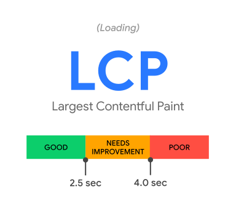
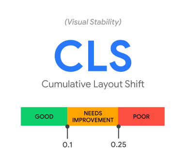

# 性能指标

`Web Vitals` 是 Google 提出的一项举措，旨在为质量提供统一指导，以形成一个良好的用户体验。但这些衡量性能的工具往往复杂且多样，因此 Google 提出了一个子集 `Core Web Vitals`，每个 `Core Web Vitals` 都代表了用户体验的一个独特方面，可以运行时进行衡量，并反映以 **用户为中心 user-centric** 的关键结果的现实体验

总的来说，Google 规定了包含 [Core Web Vitals](https://web.dev/articles/vitals#core_web_vitals) 在内的若干重要 [指标](https://web.dev/articles/user-centric-performance-metrics#important-metrics)，用于衡量用户为中心的网页性能

- Largest Contentful Paint ([LCP](https://web.dev/articles/lcp)): 测量从页面开始加载到最大 *文本块* / *图片元素* 渲染到屏幕上的时间

- Interaction to Next Paint ([INP](https://web.dev/articles/inp)): 测量页面上每次点击、轻触或者键盘交互的页面延迟，并且基于交互的数量，选择其中 **最差的** 的一次延迟作为唯一描述页面整体响应的代表性数值

- Cumulative Layout Shift ([CLS](https://web.dev/articles/cls)): 测量发生在页面开始加载到页面周期变为 `hidden` 之间中最大的一次 [session window](https://web.dev/articles/evolving-cls#why_a_session_window) 中所有意料外的布局偏移 (layout shifts) 的累计得分

- First Contentful Paint ([FCP](https://web.dev/articles/fcp)): 测量从页面开始加载到首次任意内容渲染到屏幕上的时间

- Time to Interactive ([TTI](https://web.dev/articles/tti)): 测量从页面开始加载到它的子资源加载完成，并且已经可以快速对用户输入进行可靠的响应的时间

- Total Blocking Time ([TBT](https://web.dev/articles/tbt)): 测量 `FCP` 和 `TTI` 之间的主线程被阻塞，无法响应用户输入的时间长度 (the total amount of time)

- Time to First Byte ([TTFB](https://web.dev/articles/ttfb)): 测量用户发出请求到网络响应资源的首个字符之间的时间。简而言之，TTFB 是 重定向时间、`Service Worker` 启动时间、 `DNS` 查询时间、`TCP / TLS` 协议时间以及请求时间的总和。详情可以查看 [Navigation Timing Level 2 规定的网络请求处理模型](#level-2-处理模型)

::: details 如何利用 `performance` 工具快速定位 TTI

一言以蔽之：从 `FCP` 到 持续 5 秒以上的 **静止窗口 quiet window** 之间的 **最后一个长任务** 的结束时间。如果没有找到长任务，那么 `TTI` 与 `FCP` 的值相同


两个关键概念：

- 长任务指的是持续 50 ms 以上的任务
- 静止窗口 quiet window 指的是：无长任务且进行中的 GET 请求少于两个的情况

:::

## Core Web Vitals

目前已经成为业界事实标准的是2020版本，主要从用户体验层面的三个方面衡量，即 [Core Web Vitals](https://web.dev/articles/vitals#core_web_vitals)：

1. 加载 loading - LCP
2. 交互性 interactivity - INP
3. 视觉稳定 visual stability - CLS

一个用户体验良好的页面应该至少保证核心指标达到良好

### LCP

`LCP` 标记了页面加载时间线中页面的主要内容可能已经加载完成的时间点。一个快速的 `LCP` 帮助用户保障页面的 **实用性 (useful)**

> 页面的实用性：有足够用户使用的内容 has enough content rendered that users can engage with it

::: details 为什么不使用 [Speed Index(SI)](https://developer.chrome.com/docs/lighthouse/performance/speed-index/) 或者 [First meaningful Patint (FMP)](https://developer.chrome.com/docs/lighthouse/performance/first-meaningful-paint/)

`SI` 和 `FMP` 都是 Google Lighthouse 中会追踪的指标项（`FMP` 在 Lighthouse 6.0+ 后被移除），但他们的问题在于他们过于复杂且难以解释，并且往往无法 *正确* 解释什么时候页面的 **主要内容 main content** 完成加载

:::



`LCP` 主要衡量以下内容

- ``
- `<svg>` 中的 `<image>`
- `<video>`
- 含有 `url()` 的元素
- 含有文字节点的块级元素 (Block-level element)

为了良好的用户体验，网站应该尽量在至少75%以上的页面保持少于 2.5s 的 LCP

很少有通过某个简单操作即可快速提升 `LCP` 的情况，提升 `LCP` 往往需要查看整个网页 loading 过程并且确保过程中的每一步都得到了优化。因此我们需要将 `LCP` 的过程划分为更细的子步骤

一个网页加载过程中往往伴随着一定数量的请求，其中与 `LCP` 高度相关的有两个

- 初始的 HTML docuemnt
- `LCP` 资源本身

因此 `LCP` 在加载过程中又有四个子步骤可以优化

- TTFB
- 资源加载延时: TTFB 之后浏览器开始加载 LCP 资源之前的耗时（如果是使用系统字体渲染的大段文本，本项耗时为0）
- 资源加载耗时: 加载 LCP 资源本身的耗时（如果不需要任何资源渲染，如系统字体，本项耗时为0）
- 元素渲染延时：LCP 资源完成后到完整渲染 LCP 元素的耗时

#### 消除资源加载延时

关于优化这一点有一个很好的切入口，理想情况下，`LCP` 资源应该在首个资源解析后立即开始


图中 `Stylesheet` 开始解析后，到 `LCP` 资源开始加载前的中间空余时间段，就是可优化的空间

对此，可以通过 `preload` 图片资源或者提高资源的优先级来优化加载延时

```html
<!-- Preload the LCP image with a high fetchpriority so it starts loading with the stylesheet. -->
<link rel="preload" fetchpriority="high" as="image" href="/path/to/hero-image.webp" type="image/webp">


```

#### 消除元素渲染延时

当 `LCP` 资源请求后，可能由于某些原因阻塞渲染

- `head` 中的 `script` 或者 `stylesheet` 仍处于加载中
- `LCP` 元素仍未被挂载至 `dom` 上
- 主线程被长任务阻塞

对应的优化策略如下

1. 通过 `minify` 或者 `compress` 以及删除无用的 css 优化 css 的加载；通过 defer 或者 `inline script` 优化 head 中 `script` 的加载
2. 尝试使用 `ssr`
3. 分割长任务。这一点尤为重要。现代浏览器基本都会在主线程渲染图片，因此任何阻塞主线程的长任务都会增加不必要的元素渲染延时

#### 减少资源加载时长

1. 降低资源大小
2. 降低资源周转距离
3. 减少带宽争夺
4. 优化 cache-control-policy，使用本地缓存

#### 降低 TTFB

良好的 `TTFB` 应该保持在 800ms 以内

，优化 `TTFB` 通常有以下 [几种方式](https://web.dev/articles/optimize-ttfb#ways_to_optimize_ttfb)

1. 使用 CDN
2. 减少页面重定向次数
3. 尽可能使用缓存内容，合理设置 Cache-Policy
4. 使用 Service Worker

### CLS

`CLS` 可以协助量化用户经历意料外的布局便宜的频率。较低的 `CLS` 可以一定程度上确保页面的 **舒适性 (delightful)**

> 页面的舒适性：交互是否流畅、自然、无滞后 Are the interactions smooth and natural, free of lag



意料外的页面变更通常发生在资源异步加载或者DOM元素动态添加的情况下

:::warning

CLS 只会在一个在视窗内可见的元素 **改变其初始位置** 时被计算。这样的元素被称作不稳定元素 unstable elements

如果一个新元素被添加到 DOM 内，或者一个已经存在的元素改变大小，这种变化不会被计入 CLS

CLS 关注的是 **shift** 而不是 **change**

:::

影响 CLS 的主要因素有

1. 缺少尺寸(dimensions)限制的图片
2. 没有尺寸(dimensions)限制的广告、`embeds` 或者 `iframes`
3. 动态嵌入的上述元素
4. 网络字体 web fonts

因此优化 CLS 指标也可以从以上几点入手

1. 对于 `image` `embeds` `iframes` 尽量增加尺寸限制
2. 尽量避免动态插入这些内容，如果必须动态插入，考虑增加预留空间 reserved space
3. 避免使用会导致 `re-layout` 的属性 如 `box-sizing` `box-shadow` `position`
4. 关于字体优化，又是另一个复杂的问题，可以参考 [这里](https://web.dev/articles/font-best-practices) ，通过 `font-display: optional` 或使用 `<link rel="preload">` 等方式进行优化

::: details `re-layout`, 而非 `reflow`

会影响 CLS 的严格来讲不是 `reflow`，而是 `re-layout`。两者概念有细微区别。

`re-layout` 更宽泛，而 `reflow` 一般情况下专指 [浏览器渲染](../engine/engine.md) 中的 **回流**

回流不一定会影响 CLS。例如改变某个已有元素的子元素的 `width` 属性，会触发浏览器的 `reflow`，但不会影响到 CLS 评分，因为该元素有对应的 reserved space，因而没有发生 layout shift

:::

### INP

INP 观察用户与页面进行的所有交互的延迟，并报告所有（或几乎所有）交互都低于的一个值。较低的 INP 意味着页面总体来说能够持续快速响应所有——或大多数——用户的交互


与 CLS 和 LCP 不同，通常情况下 INP 不是一个一次性测量行为，而是贯穿整个页面生命周期 page lifecycle 的测量行为。INP 无法通过 [PerformanceObserver](https://developer.mozilla.org/en-US/docs/Web/API/PerformanceObserver) 监听指标，也可以说无需。大多数测量 INP 都是页面出现显著延迟的时候

出于 INP 的目的考虑，目前主要需要监听的用户交互有三种

1. 鼠标点击 click
2. 触摸屏轻触 tap
3. 键盘或者虚拟键盘的敲击事件 press

其他用户交互如 `hover` `zoom` `scroll` 并不会作为 INP 的监听事件，尽管这些事件的部分变体在某些情况下可能会触发类似 `click` 的行为，从而被 INP 监听

一旦定位到了 slow interaction 并且可以手动复现，就可以将交互行为 interaction 细分为三个部分进行分析：

1. 输入延迟 input delay
2. 处理用时 processing duration
3. 展示延迟 presentation delay

影响上述三个部分的主要因素有两个：

1. 主线程占用情况会影响输入延迟和处理用时
2. 布局优化情况会影响展示延迟

因此在所有优化中最重要的，首先是避免长任务 long task。不仅有利于用户输入的快速响应，而且有利于响应脚本的执行

```typescript
// 通过合理的任务调度，让出主线程
function splitTasks(){
  task1();
  setTimeout(()=>{
    task2();
  }, 0)
}
function yieldToMainThread(){
  return new Promise(resolve=>{
    setTimeout(resolve, 0);
  })
}
// 通过合理的 code-splitting 将大脚本解析为小模块，减少解析时间 Evaluating Time
// 使用Web Worker再主线程之外运行脚本
```

其次，尽管使用 `setTimeout` 让出主线程是一种合理的任务调度策略，仍然应该尽量避免在主线程上启动过多的计时器，因为只有主线程及时响应，才能优化**输入延迟**

最后，展示层面的优化也往往占据大头。在实际的应用场景中，许多 INP 的表现不佳，往往是由于页面展示耗费了大量时间

```typescript
// 避免大型、复杂的布局和布局抖动
function largeLayoutThrashing(){
  const testEl = document.getElementById('test-el');
  const style = testEl.style; // should be {width: 20px; height: 20px}
  testEl.style.width = '200px';
  testEl.style.height = '350px';
}
// 避免强制reflow
function logBoxHeight () {
  box.classList.add('super-big');
  // 为了正确返回元素的offsetHeight，页面必须先进行一次reflow
  console.log(box.offsetHeight);
}
// 避免连续快速地进行布局
function loopResize(){
  // 把浏览器置于读写循环中
  for (let i = 0; i < paragraphs.length; i++) {
    paragraphs[i].style.width = `${box.offsetWidth}px`;
  }
}
```

另外，`Blink` 计算元素样式的总时间大约有一半用于匹配选择器，因此降低选择器的复杂性和减少要设置样式的元素数量。因此 CSS 的优化也有利于提高 INP

```css
.title {
  /* styles */
}
.box:nth-last-child(-n+1) .title {
  /* styles */
}
```
