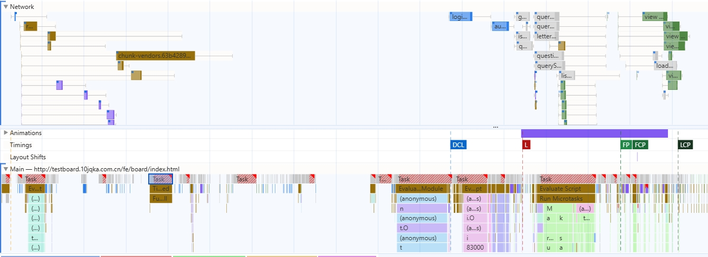
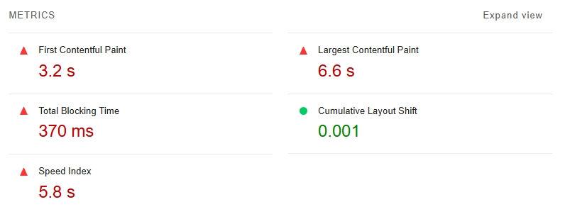
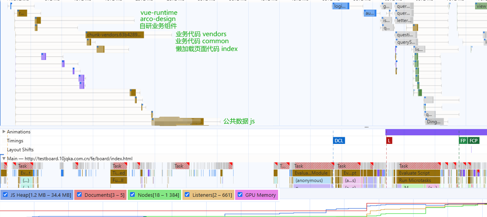
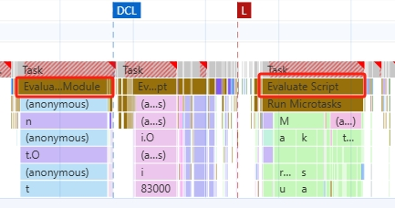

# Web Performance

Web 性能是 Web 开发的一个重要议题，主要聚焦于一个关键词 **速度 Speed** 两个方面：

1. 网页加载速度 at which pages load
2. 用户输入响应速度 how responsive they are to *user input*

优化网站的性能可以为用户带来更好的体验。而更好的用户体验，可以提升用户的留存率和转换率，进而提升产品质量

:::info 补充阅读

[网页性能指标 web vitals](./core-web-vitals/index.md)

[Performance 规范](./specifications/index.md)

:::

## 收集指标数据

改进网页性能的第一步是收集指标数据

目前业内主要关注的指标主要有 `FCP` `LCP` `CLS` 和 `INP`，具体可以参考 [网页性能指标 web vitals](./core-web-vitals/index.md)

一个良好的性能评测会从 现实环境 和 实验室环境 两个维度收集数据

### 使用 Field Tools

通常来讲，测量 RUM 数据最好的方式自然是使用 Real User Monitoring (RUM) 技术。但如果网页上没有部署相关的监控，Field Tools 也可以达到相同的目的

> [Real User Monitoring (RUM)](https://en.wikipedia.org/wiki/Real_user_monitoring) 数据，也就是 实测数据 field data，是来自真实用户性能体验的数据

目前较为流行的工具有以下两种：

- [PageSpeed Insights (PSI)](https://pagespeed.web.dev): PSI 会报告过去 28 天内网页级和源级的汇总效果。此外，它还会提供有关如何提升效果的建议。数据集主要来自 [Chrome 用户体验报告](https://developer.chrome.com/docs/crux)
- [Search Console](https://search.google.com/search-console/welcome): Search Console 与 PageSpeed Insights 不同，Search Console 报告包含历史效果数据。Search Console 只能用于归您所有且已验证所有权的网站
- [Web Vitals Lib](https://github.com/GoogleChrome/web-vitals) 在业务中自主搭建性能监控平台。本质上是使用 Google 封装好的基于 [Performance Observer](https://developer.mozilla.org/en-US/docs/Web/API/PerformanceObserver) 的 javascript 库。（参考 [前端数据统计实战](../data-analytics/index.md)，可以自主开发一个性能监控平台）

事实上，尽管实测数据可以捕捉到用户的真实体验，但目前流行的 Field Tools 都有一定的限制：

1. 网页必须可公开发现 (PSI) 或者 网页必须认证所有权 (Search Console)
2. 可衡量的指标类型和调试功能受限

所以对于对外不公开的项目，或者用户基数不大的项目，可能可以选择的 Field Tools 只有 web-vitals 一种

::: info 参考阅读

- [Chrome用户体验报告 Chrome User Experience Report - CrUX](https://developer.chrome.com/docs/crux/methodolog)
- [关于速度工具 web.dev - speed-tools](https://web.dev/articles/speed-tools)

:::

### 使用 Lab Tools

与 实测数据 field data 不同，实验室数据是在受控环境下收集分析的数据，因此可以被整合到开发者工作流当中

类似的 Lab Tools 有很多

- [Web Vitals Chrome 扩展程序](https://github.com/GoogleChrome/web-vitals-extension)
- [Lighthouse](https://developer.chrome.com/docs/lighthouse/overview)
- [Performance Panel](https://developer.chrome.com/docs/devtools/performance-monitor)

实验室数据尽管有助于调试性能问题，能够测量的指标也更多，但归根到底无法覆盖真实的用户使用场景

真实的用户场景可能受到浏览器、网络环境、甚至硬件设备等种种因素的影响。因此实验室数据主要是用于分析用户体验，提供一个可重现的性能问题环境

#### Lighthouse

Lighthouse 是一款自动化的 [开源工具](https://github.com/GoogleChrome/lighthouse)。它提供了对于性能、可访问性、SEO 等内容的审计

通过 Lighthouse 分析页面性能主要分为以下几步

1. 在 Chromium-based 浏览器中 (如 Microsoft Edge，Chrome)，打开控制台
2. 选择要审计的 mode, device 和 categories
3. 点击 page analyze


4. 保持页面在前台运行，Lighthouse 工具会自动刷新页面并开始分析页面数据，最终展示分析数据

5. 根据页面内容评估分数并针对性地进行优化

假设有这样一个页面：[Hosts 插件开发从入门到放弃](https://x-sky.github.io/X-press/coding/frontend/auto-hosts/auto-hosts.html)，在执行如上操作后，我们关心的 Performance Panel 将主要由三个部分组成

- **Overall Score**

Performance 概览评分 (overall score): 展示了初始化时选择的审计内容的总体评分，可以通过总体评分大致评估页面的综合性能

总体评分不应该作为衡量网页性能的唯一指标，一方面是因为这个评分可能会由于网络、设备等原因上下浮动，另一方面是因为 [用户为中心的的性能指标 user-centric metrics](./core-web-vitals/index.md#性能指标) 应该是多元的，而非一元的


- **Metrics**

Metrics 面板展示了每项指标的具体评分以及对应的指标概念链接。通过该面板，熟练的工程师可以大改猜测到性能瓶颈是由哪方面内容造成的

:::warning

lighthouse 统计的指标并非一成不变的，在不同版本的 lighthouse 中，Performance 面板统计了不同维度的指标。Google 会根据 CrUX 统计数据变更这些指标。例如在 v10 版本中移除了 TTI，在 v6 版本中移除了 FMP


:::


- **Diagnostics**

事实上，如果使用了 lighthouse 工具，即使并不擅长分析，优化也是相对简单的，因为在 DIAGNOSTICS 面板中，lighthouse 会将可优化项以及这些可优化项关联了哪些指标逐一列举出来，开发者也可以根据网站实际的关心的指标进行定向优化


::: info 参考阅读

[google lighthouse](https://developer.chrome.com/docs/lighthouse/performance/performance-scoring)

:::

#### Performance

Lighthouse 是 Chromium-based 浏览器的特有功能，假设问题场景出现在 firefox 等浏览器上，我们似乎只能考虑使用 PSI 或者内置的 web-vitals，事实上，当性能问题出现的时候，更常用的选择是各大浏览器 devtools 内置的 **performance**

如 [Firefox](https://profiler.firefox.com/docs/#/) 和 [Chrome](https://developer.chrome.com/docs/devtools/performance#get-started)


*Firefox performance - LCP*


*Microsoft Edge performance - LCP*

Firefox 中的 performance 是作为插件存在，需要手动开启。而 Chromium-based 的浏览器 (Chrome / Edge) 只需要打开控制台，基本都内置了 performance

相对而言，Firefox的 performance 比 Chrome 要更加细致，但聚合度就会因此稍差一些

对于上图中的 performance 结果，针对不同的性能问题，Firefox 与 Chrome 是有着不痛的工作流的。以 LCP 为例：

1. Chrome 中标注了 LCP 的开始和结束时间，展开 main thread 就可以知道当前主线程被那些任务占用，而 Firefox 则需要根据 Marker Chart 定位 LCP 位置，再从时间轴上确定当前浏览器执行了哪些任务

2. Chrome 仅标注了当前网页线程及其相关线程池，而 Firefox 会标注浏览器整体的性能概况 (参考 [浏览器原理](../engine/engine.md))

## 问题定位与优化

无论是使用 Field Tools 还是使用 Lab Tools，最终都会有一个针对网页各项指标的评估数据

当页面逻辑较为简单时，根据评估的指标数据很容易可以定位到具体的性能瓶颈，但对于实际的生产项目来说，由于使用了框架和 minify，问题定位将变得较为复杂

::: warning

由于浏览器之间或多或少存在差异，以下数据非真实项目线上数据，仅作参考，具体实验环境如下

1. 基于虚拟机容器 win10 系统
2. 测试环境网络
3. 浏览器版本 Edge 126.0.2592.87 (64bit)

:::

假设有如下分析某页面从 navigate 到 静止窗口 quiet window 的 performance 数据



滑动 network 面板和点击 long task 内容，结合图中信息可知

1. FCP 为 4.37s，LCP 为 5.13s，性能较差，需要优化
2. 大量的长任务 long task 阻塞了主线程，其中部分长任务时长高达数百毫秒
3. 主线程上多数 long task 的组成为 scripting 而非 rendering
4. network waterfall 中有大量请求，部分 js 请求与解析耗费了大量时间

因此对于该页面而言，性能问题的主要瓶颈来源于

1. long task (mainly script)
2. network duration

查看 lighthouse 会发现 CLS 指标处于优秀状态，而 FCP LCP SI 等指标显示亟需优化，符合我们之前的分析


*注：该面板采集环境为 虚拟机容器 与 测试网络，仅做参考，非真实数据*

回到 performance 面板，根据对项目以及现代开发模式的了解，我们不难将 long task 划分为以下阶段



1. 外部仓库加载
2. 业务代码加载
3. 其余业务 js 加载

其中第1点可优化的空间很小，都是第三方资源的加载，占用总 waterfall 的比例也几乎可以忽略

第2点是主要的 long task 来源，现代前端开发中，使用 `npm` 仓库工程化开发已经成为主流。因此对于 `chunks` 的优化是无法避免的

第3点的 js 主要是业务相关的全局变量注入 js。由于这些js内部只有全局变量注入，因此实际上这一点影响的主要是 network waterfall。当开始加载后只会影响到 `js heap` 的大小，对主线程 main thread 的影响可以忽略不计

::: details 关于 Evaluate Script

观察上述 performance，在DCL 之前的 long task 下方显示的是 **Evaluate Module**，load 之后的又是 **Evaluate Script**

这两者之间有什么区别呢



由于 javascript 是一种解释型的语言 ([compiled just-in-time](https://en.wikipedia.org/wiki/Just-in-time_compilation))，因此脚本评估 (Script evaluation) 是浏览器执行 javascript 必需的部分

脚本被评估 evaluated 的时候，首先会被解析 parsed 以排除错误。如果解析器 parser 没有发现错误，脚本就会被编译为[字节码 ByteCode](https://en.wikipedia.org/wiki/Bytecode)，然后才能被执行

通常来讲，一个 `<script>` 标签就会产生一个 `evaluate - parse - execute` 任务。这一点对于所有 Chromium-based 浏览器、Safari 和 Firefox 中都是适用的

但在 *现代工程化实践* 中情况又有所不同

现代浏览器已经支持了本地的 [type=module attribute](https://web.dev/articles/serve-modern-code-to-modern-browsers#use_lessscript_type=modulegreater)。而前端工程中的脚本往往依赖多个模块包，因此打包为多个 `<script type="module">` 也是 `webpack` 等打包工具的默认操作

当 `<script type="module">` 出现的时候，Chrome 会将这个脚本标记为 `Compile module`，一旦脚本在 Thread Pool Worker 编译完毕，就会开始一个 **Evaluate module** 任务

:::

### 优化 `chunks`

优化 `chunks` 是一个高度定制化的问题，`chunks` 的大小和数量不仅取决于业务代码的组织方式，也取决于 `webpack` 或者 `rollup` 等打包工具的打包方式

一个比较通用的方式是使用类似 `webpack-bundler-analyzer` 的工具，分析 `chunks` 中占用体积较大的包文件，之后再有针对性地进行优化

比如一个常用的大包，如果将其作为单独的 chunk 从 `vendors` 中分离出来，那么懒加载的模块可能会重复加载该 chunk

但如果放在公共的 `vendors` 中，则很可能造成首屏 `vendors` 过大，进而影响初次进入页面的用户体验

说到底，工程化的关键问题就在于 **妥协**。实际的项目还是需要根据使用场景对各项指标进行平衡和妥协

## 优化思路

《程序员的修炼之道》中提到过一个 tip

> 没有银弹 no silver bullet

生活里没有一个万能的药方，开发中也没有一试百应的解决方案

尤其对于性能优化这种复杂问题，往往需要根据性能工具给出的提示，见微知著，推断出代码中可能的问题进行优化

如果使用了 lighthouse 工具，参考lighthouse 结果中的 [Optimization Opportunities](https://developer.chrome.com/docs/lighthouse/performance/render-blocking-resources) 是一个很好的性能优化的突破口

尽管如此，掌握一些常见的性能瓶颈问题及其解决方案对于“具体问题具体分析”有着重要的参考意义

前端层面性能优化的思路答题可以分为四个方面

1. 资源传递阶段优化
2. CSS 优化
3. JS 优化
4. 特定元素定向优化

### 资源传递阶段优化

这部分的优化思路主要分为以下三个方面

1. 基于资源大小优化 [minify css](https://developer.chrome.com/docs/lighthouse/performance/unminified-css) / [remove unused css](https://developer.chrome.com/docs/lighthouse/performance/unused-css-rules) / [minify js](https://developer.chrome.com/docs/lighthouse/performance/unminified-javascript)
2. 基于网络传输速度 [cdn](https://web.dev/articles/content-delivery-networks) / [host](https://web.dev/articles/optimize-ttfb#hosting_hosting_hosting) / [cache source](https://developer.chrome.com/docs/lighthouse/performance/uses-long-cache-ttl) / [service worker](https://web.dev/articles/optimize-ttfb#use_a_service_worker) / [adaptive serving](https://web.dev/articles/adaptive-serving-based-on-network-quality)
3. 基于利用浏览器机制 [rel-preload](https://web.dev/articles/preload-critical-assets) / [rel-preconnect](https://developer.chrome.com/docs/lighthouse/performance/uses-rel-preconnect/)

::: details preload and preconnect

[preload](https://developer.mozilla.org/en-US/docs/Web/HTML/Attributes/rel/preload) 旨在给浏览器提供一个 *按序发现 (naturally discover)* **关键资源 (critical resources)** 的信息之前的加载机会，在加载诸如 `font` `css` `images` `script` 等信息时候尤其有用

而 [preconnect](https://developer.mozilla.org/en-US/docs/Web/HTML/Attributes/rel/preconnect) 一般用于与 **跨域服务器 (cross-origin servers)** 沟通时的预热，并且可以显著提高 [TTFB](./core-web-vitals/index.md#ttfb) 等指标。主要适用于的知道 域名 (origin) 但不知道准确的 URL 的目标资源

对于现代前端开发来说， `js` 和 `css` 资源名往往带着哈希编码的版本号 (如 `chunk.db265f32.js`) 分发在固定的 cdn 上。在这种情况下 preconnect 显然是更好的选择

:::

众所周知，js 是单线程的。每一个页面有一个 main thread 用于解析和加载

因此，浏览器在加载页面资源的时候会阻塞页面进程。例如在 Chrome 中，有五种资源标签会阻塞页面渲染

1. `<head>` 中的 `<script>`
2. 没有 `defer` 的 `<script>`
3. 没有 `async` 的 `<script>`
4. 没有 `disabled` 属性的 `<link rel="stylesheet">`
5. 没有准确匹配用户设备的 `media` 属性的 `<link rel="stylesheet">`

如前文所述，在现代工程化中，由于 `javascript` 被前端框架打包后，往往以一个或多个 `defer` 标签的形式动态插入页面，因此这部分内容主要需要在 `style` 层面优化

### 特定资源优化

这方面的优化主要集中在比如 `images` `videos` `web fonts` 等方面

这些资源是网络请求和页面渲染的性能消耗大头，因此如果页面中包含了这类元素，对其进行定向优化，可以显著提高 FCP LCP 甚至 CLS 和 INP 指标

页面中的图片资源可以从以下几个角度考虑进行优化：

1. [format](https://web.dev/articles/choose-the-right-image-format)
2. [level of compression](https://web.dev/articles/compress-images)
3. [replace gif with videos](https://web.dev/articles/replace-gifs-with-videos)
4. [responsive sizes](https://web.dev/articles/serve-responsive-images)
5. [use webp](https://web.dev/articles/serve-images-webp)
6. [lazy-load images](https://web.dev/articles/lazy-loading-images)
7. [lazy-load video](https://web.dev/articles/lazy-loading-video)
8. [optimize font loading and rendering](https://web.dev/articles/optimize-webfont-loading)

### CSS 优化

关于 CSS 优化最重要的思路就是 **提取页面必需的 CSS (critical CSS)**

无论是 延迟非必需 CSS 的加载，还是 minify CSS，都要求我们尽量减小页面必须解析的样式的大小及其复杂度

1. 减少行内样式的应用。行内样式不仅会影响浏览器解析 [CSSOM](https://developer.mozilla.org/en-US/docs/Web/API/CSS_Object_Model)，而且会拖慢整个 Document 的解析速度
2. 利用 lighthouse 解析页面 viewport 内的 css 样式
3. 利用 `preconnect` `preload` 以及 `mediaquery` 优化 css 中的 font image 等资源

### JS 优化

一些比较常用的优化思路是

#### remove unused code

> 删除未使用的代码

这一步工作在现在前端开发中往往已经被打包框架实现。如 [webpack](https://webpack.js.org/guides/tree-shaking/) [rollup](https://rollupjs.org/introduction/#tree-shaking) 都内置了 `tree-shaking`

tree-shaking 不仅可以帮助移除未使用的代码，也可以用于 [减少公共代码的大小](https://web.dev/articles/commonjs-larger-bundles#tree-shaking_with_commonjs)

#### serve modern code

> 为现代浏览器提供现代代码

随着 ES6 逐步普及，应该根据项目实际的应用场景，确定实际输出的 target 版本

在部分业务中，为了实现古早版本浏览器的兼容 (Android 5 / Chrome 49)，项目中往往使用 [babel](https://babeljs.io/docs/) 或 [swc](https://swc.rs/docs/getting-started) 将代码编译输出为 ES5-compatible

但这种方式往往意味着放弃现在浏览器对 ES6 语法做的底层优化

一个比较好的解决方法是 dynamic serve

```html
<!DOCTYPE html>
<html lang="en">
<head>
    <meta charset="UTF-8">
    <meta name="viewport" content="width=device-width, initial-scale=1.0">
    <title>ES5 and ES6 Example</title>
    <script>
        function loadScript(src) {
            var script = document.createElement('script');
            script.src = src;
            script.async = false;
            document.head.appendChild(script);
        }

        // Check if the browser supports ES6
        try {
            new Function("() => {}");
            loadScript('dist/bundle.es6.js');
        } catch (err) {
            loadScript('dist/bundle.es5.js');
        }
    </script>
</head>
<body>
</body>
</html>
```

使用打包工具打包两个产物，再在页面中通过对 [`type=module`](https://developer.mozilla.org/en-US/docs/Web/HTML/Element/script#browser_compatibility) 的判定，不支持的浏览器 (Chrome < 61) 上会自动执行降版本的 `script`

*注: 其实对于 vue3 项目，由于其自带 `Proxy` 的最低限制 (Chrome 49)，因此大部分 ES6 的代码其实都不需要转义*

#### optimize long task

> 优化长任务

关于 js 的优化尤为重要，其中最重要的就是 long task 的优化。可以说如果页面不是产生了渲染瓶颈，那么最大的可能就是 long task 阻塞了主线程

```typescript
// 通过合理的任务调度，让出主线程
function splitTasks(){
  task1();
  setTimeout(()=>{
    task2();
  }, 0)
}
function yieldToMainThread(){
  return new Promise(resolve=>{
    setTimeout(resolve, 0);
  })
}
// 通过合理的 code-splitting 将大脚本解析为小模块，减少解析时间 Evaluating Time
// 使用Web Worker再主线程之外运行脚本
```

#### code splitting

code splitting 在现代前端开发中几乎是绕不开的一个问题

现代网站无论是单页或是多页模式，其复杂的交互与场景以及该业务逻辑往往会带来大量的 javascript

尤其是如果页面采用了单页模式，没有合理的代码分割，首页加载速度将是一个 nightmare

code splitting 可以将一个 large script 分割为多个子脚本

通过分批加载、懒加载，可以显著提升页面的加载速度，进而带来更好的交互性和用户体验

::: info

可以参考上文的 [优化 chunks](#优化-chunks) 或者 [webpack lazy loading](https://webpack.js.org/guides/lazy-loading/)

:::
