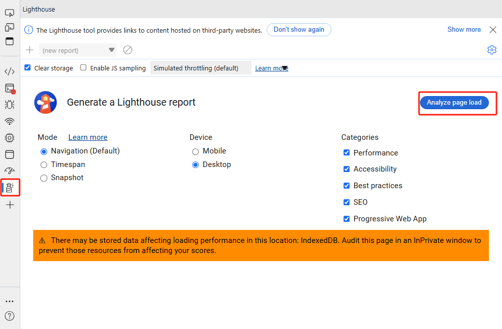
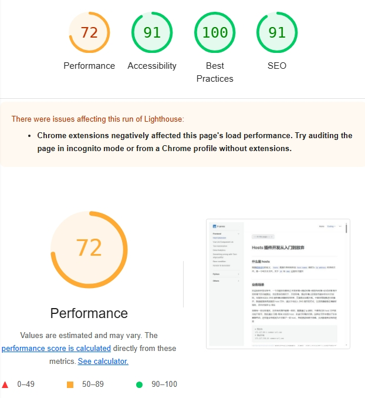
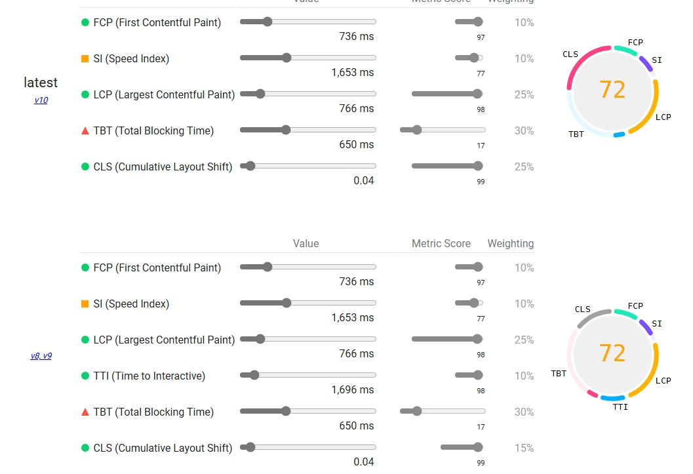
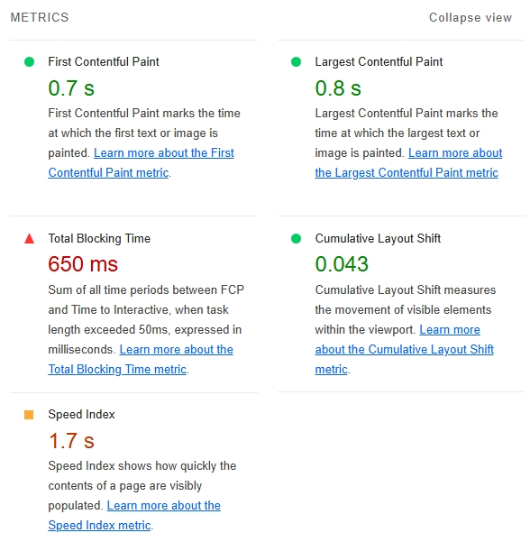
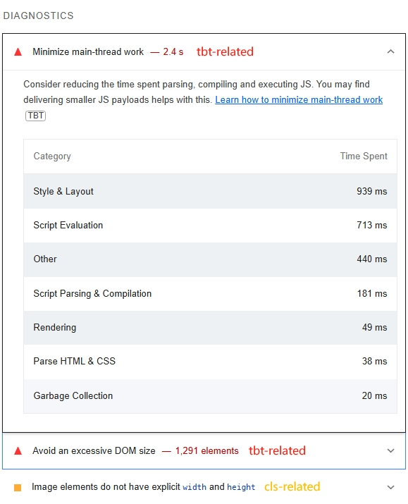
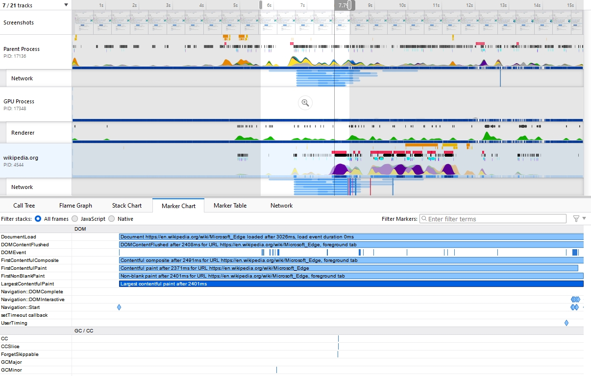
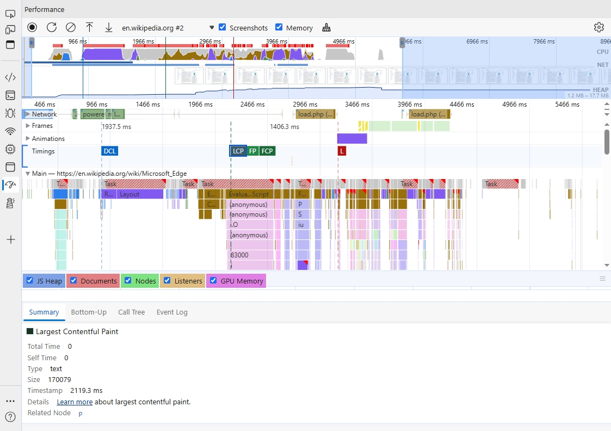

# Web Performance

Web 性能是 Web 开发的一个重要议题，主要聚焦于一个关键词 **速度 Speed** 两个方面：

1. 网页加载速度 at which pages load
2. 用户输入响应速度 how responsive they are to *user input*

优化网站的性能可以为用户带来更好的体验。而更好的用户体验，可以提升用户的留存率和转换率，进而提升产品质量

:::info 补充阅读

[网页性能指标 web vitals](./core-web-vitals/index.md)

[Performance 规范](./specifications/index.md)

:::

## 收集指标数据

改进网页性能的第一步是收集指标数据

目前业内主要关注的指标主要有 `FCP` `LCP` `CLS` 和 `INP`，具体可以参考 [网页性能指标 web vitals](./core-web-vitals/index.md)

一个良好的性能评测会从 现实环境 和 实验室环境 两个维度收集数据

### 使用 Field Tools

通常来讲，测量 RUM 数据最好的方式自然是使用 Real User Monitoring (RUM) 技术。但如果网页上没有部署相关的监控，Field Tools 也可以达到相同的目的

> [Real User Monitoring (RUM)](https://en.wikipedia.org/wiki/Real_user_monitoring) 数据，也就是 实测数据 field data，是来自真实用户性能体验的数据

目前较为流行的工具有以下两种：

- [PageSpeed Insights (PSI)](https://pagespeed.web.dev): PSI 会报告过去 28 天内网页级和源级的汇总效果。此外，它还会提供有关如何提升效果的建议。数据集主要来自 [Chrome 用户体验报告](https://developer.chrome.com/docs/crux)
- [Search Console](https://search.google.com/search-console/welcome): Search Console 与 PageSpeed Insights 不同，Search Console 报告包含历史效果数据。Search Console 只能用于归您所有且已验证所有权的网站
- [Web Vitals Lib](https://github.com/GoogleChrome/web-vitals) 在业务中自主搭建性能监控平台。本质上是使用 Google 封装好的基于 [Performance Observer](https://developer.mozilla.org/en-US/docs/Web/API/PerformanceObserver) 的 javascript 库。（参考 [前端数据统计实战](../data-analytics/index.md)，可以自主开发一个性能监控平台）

事实上，尽管实测数据可以捕捉到用户的真实体验，但目前流行的 Field Tools 都有一定的限制：

1. 网页必须可公开发现 (PSI) 或者 网页必须认证所有权 (Search Console)
2. 可衡量的指标类型和调试功能受限

所以对于对外不公开的项目，或者用户基数不大的项目，可能可以选择的 Field Tools 只有 web-vitals 一种

::: info 参考阅读

- [Chrome用户体验报告 Chrome User Experience Report - CrUX](https://developer.chrome.com/docs/crux/methodolog)
- [关于速度工具 web.dev - speed-tools](https://web.dev/articles/speed-tools)

:::

### 使用 Lab Tools

与 实测数据 field data 不同，实验室数据是在受控环境下收集分析的数据，因此可以被整合到开发者工作流当中

类似的 Lab Tools 有很多

- [Web Vitals Chrome 扩展程序](https://github.com/GoogleChrome/web-vitals-extension)
- [Lighthouse](https://developer.chrome.com/docs/lighthouse/overview)
- [Performance Panel](https://developer.chrome.com/docs/devtools/performance-monitor)

实验室数据尽管有助于调试性能问题，能够测量的指标也更多，但归根到底无法覆盖真实的用户使用场景

真实的用户场景可能受到浏览器、网络环境、甚至硬件设备等种种因素的影响。因此实验室数据主要是用于分析用户体验，提供一个可重现的性能问题环境

#### Lighthouse

Lighthouse 是一款自动化的 [开源工具](https://github.com/GoogleChrome/lighthouse)。它提供了对于性能、可访问性、SEO 等内容的审计

通过 Lighthouse 分析页面性能主要分为以下几步

1. 在 Chromium-based 浏览器中 (如 Microsoft Edge，Chrome)，打开控制台
2. 选择要审计的 mode, device 和 categories
3. 点击 page analyze

4. 保持页面在前台运行，Lighthouse 工具会自动刷新页面并开始分析页面数据，最终展示分析数据

5. 根据页面内容评估分数并针对性地进行优化

假设有这样一个页面：[Hosts 插件开发从入门到放弃](https://x-sky.github.io/X-press/coding/frontend/auto-hosts/auto-hosts.html)，在执行如上操作后，我们关心的 Performance Panel 将主要由三个部分组成

- **Overall Score**

Performance 概览评分 (overall score): 展示了初始化时选择的审计内容的总体评分，可以通过总体评分大致评估页面的综合性能

总体评分不应该作为衡量网页性能的唯一指标，一方面是因为这个评分可能会由于网络、设备等原因上下浮动，另一方面是因为 [用户为中心的的性能指标 user-centric metrics](./core-web-vitals/index.md#性能指标) 应该是多元的，而非一元的

- **Metrics**

Metrics 面板展示了每项指标的具体评分以及对应的指标概念链接。通过该面板，熟练的工程师可以大改猜测到性能瓶颈是由哪方面内容造成的

:::warning

lighthouse 统计的指标并非一成不变的，在不同版本的 lighthouse 中，Performance 面板统计了不同维度的指标。Google 会根据 CrUX 统计数据变更这些指标。例如在 v10 版本中移除了 TTI，在 v6 版本中移除了 FMP

:::

- **Diagnostics**

事实上，如果使用了 lighthouse 工具，即使并不擅长分析，优化也是相对简单的，因为在 DIAGNOSTICS 面板中，lighthouse 会将可优化项以及这些可优化项关联了哪些指标逐一列举出来，开发者也可以根据网站实际的关心的指标进行定向优化

::: info 参考阅读

[google lighthouse](https://developer.chrome.com/docs/lighthouse/performance/performance-scoring)

:::

#### Performance

Lighthouse 是 Chromium-based 浏览器的特有功能，假设问题场景出现在 firefox 等浏览器上，我们似乎只能考虑使用 PSI 或者内置的 web-vitals，事实上，当性能问题出现的时候，更常用的选择是各大浏览器 devtools 内置的 **performance**

如 [Firefox](https://profiler.firefox.com/docs/#/) 和 [Chrome](https://developer.chrome.com/docs/devtools/performance#get-started)

*Firefox performance - LCP*

*Microsoft Edge performance - LCP*

Firefox 中的 performance 是作为插件存在，需要手动开启。而 Chromium-based 的浏览器 (Chrome / Edge) 只需要打开控制台，基本都内置了 performance

相对而言，Firefox的 performance 比 Chrome 要更加细致，但聚合度就会因此稍差一些

对于上图中的 performance 结果，针对不同的性能问题，Firefox 与 Chrome 是有着不痛的工作流的。以 LCP 为例：

1. Chrome 中标注了 LCP 的开始和结束时间，展开 main thread 就可以知道当前主线程被那些任务占用，而 Firefox 则需要根据 Marker Chart 定位 LCP 位置，再从时间轴上确定当前浏览器执行了哪些任务

2. Chrome 仅标注了当前网页线程及其相关线程池，而 Firefox 会标注浏览器整体的性能概况 (参考 [浏览器原理](../engine/engine.md))
