# Web Performance

Web performance is an important topic in web development, primarily focusing on one keyword — **Speed** — across two aspects:

1. Page loading speed (at which pages load)
2. User input responsiveness (how responsive they are to *user input*)

Optimizing website performance delivers a better user experience. Better user experience improves user retention and conversion rates, ultimately enhancing product quality.

:::info Further Reading

[Web Performance Metrics (Web Vitals)](./core-web-vitals/index.md)

[Performance Specifications](./specifications/index.md)

:::

## Collecting Metrics Data

The first step in improving web performance is collecting metrics data.

The main metrics currently focused on in the industry are `FCP`, `LCP`, `CLS`, and `INP`. For details, see [Web Performance Metrics (Web Vitals)](./core-web-vitals/index.md).

A good performance assessment collects data from both real-world and lab environments.

### Using Field Tools

Generally speaking, the best way to measure RUM data is naturally through Real User Monitoring (RUM) technology. But if no monitoring is deployed on the page, Field Tools can achieve the same purpose.

> [Real User Monitoring (RUM)](https://en.wikipedia.org/wiki/Real_user_monitoring) data, also known as field data, is data from real users' performance experiences.

Currently, two popular tools are:

- [PageSpeed Insights (PSI)](https://pagespeed.web.dev): PSI reports aggregated page-level and origin-level performance over the past 28 days. It also provides suggestions for improvement. The dataset primarily comes from the [Chrome User Experience Report](https://developer.chrome.com/docs/crux).
- [Search Console](https://search.google.com/search-console/welcome): Unlike PageSpeed Insights, Search Console reports include historical performance data. Search Console can only be used for sites you own and have verified ownership of.
- [Web Vitals Lib](https://github.com/GoogleChrome/web-vitals): Build your own performance monitoring platform in your business. Essentially a JavaScript library based on [Performance Observer](https://developer.mozilla.org/en-US/docs/Web/API/PerformanceObserver) wrapped by Google. (Refer to [Frontend Data Analytics in Practice](../data-analytics/index.md) to build your own performance monitoring platform.)

In fact, although field data captures real user experiences, currently popular Field Tools all have certain limitations:

1. Pages must be publicly discoverable (PSI) or ownership must be verified (Search Console)
2. Measurable metric types and debugging capabilities are limited

So for projects that aren't publicly accessible or have a small user base, the only Field Tool option may be web-vitals.

::: info Further Reading

- [Chrome User Experience Report - CrUX](https://developer.chrome.com/docs/crux/methodolog)
- [About Speed Tools - web.dev](https://web.dev/articles/speed-tools)

:::

### Using Lab Tools

Unlike field data, lab data is collected and analyzed in controlled environments, so it can be integrated into developer workflows.

There are many similar Lab Tools:

- [Web Vitals Chrome Extension](https://github.com/GoogleChrome/web-vitals-extension)
- [Lighthouse](https://developer.chrome.com/docs/lighthouse/overview)
- [Performance Panel](https://developer.chrome.com/docs/devtools/performance-monitor)

Although lab data helps debug performance issues and can measure more metrics, it ultimately cannot cover real user scenarios.

Real user scenarios may be affected by browsers, network environments, hardware devices, and many other factors. Therefore, lab data is mainly used for analyzing user experience and providing a reproducible performance issue environment.

#### Lighthouse

Lighthouse is an automated [open-source tool](https://github.com/GoogleChrome/lighthouse). It provides audits for performance, accessibility, SEO, and more.

Analyzing page performance with Lighthouse involves the following steps:

1. In a Chromium-based browser (e.g., Microsoft Edge, Chrome), open DevTools
2. Select the mode, device, and categories to audit
3. Click page analyze
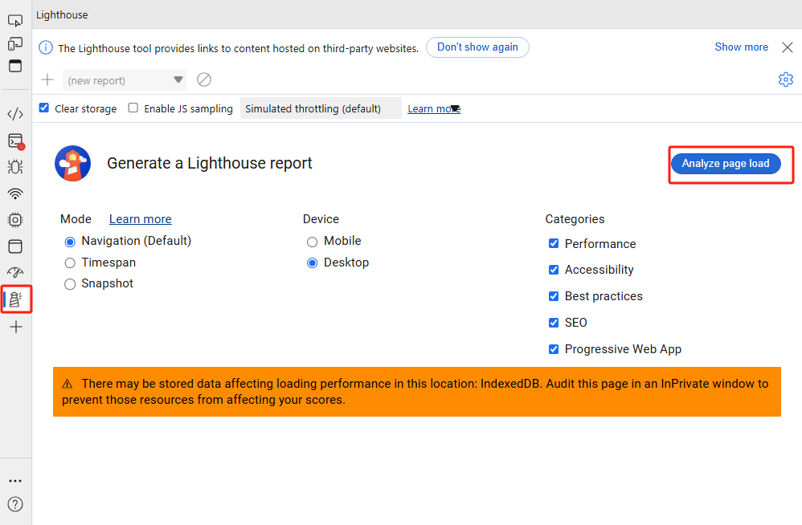

4. Keep the page in the foreground. The Lighthouse tool will automatically refresh the page and begin analyzing page data, ultimately displaying the analysis results.

5. Evaluate scores based on page content and optimize accordingly.

Suppose we have a page: [Hosts Extension Development: From Start to Finish](https://x-sky.github.io/X-press/coding/frontend/auto-hosts/auto-hosts.html). After performing the above operations, the Performance Panel we care about will mainly consist of three parts:

- **Overall Score**

Performance overall score: Shows the overall score for the audit content selected during initialization. The overall score can roughly assess the page's comprehensive performance.

The overall score should not be the sole metric for measuring web performance. On one hand, this score may fluctuate due to network, device, and other factors. On the other hand, [user-centric performance metrics](./core-web-vitals/index.md#性能指标) should be multidimensional, not unidimensional.

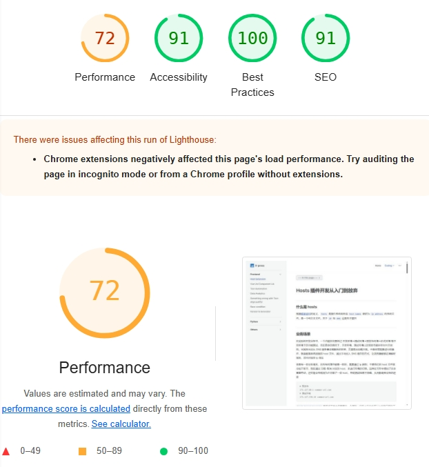

- **Metrics**

The Metrics panel shows specific scores for each metric along with links to the corresponding metric concepts. Through this panel, experienced engineers can roughly guess which aspect is causing the performance bottleneck.

:::warning

Lighthouse metrics are not static. Different versions of Lighthouse track different metrics in the Performance panel. Google updates these metrics based on CrUX statistics. For example, TTI was removed in v10, and FMP was removed in v6.
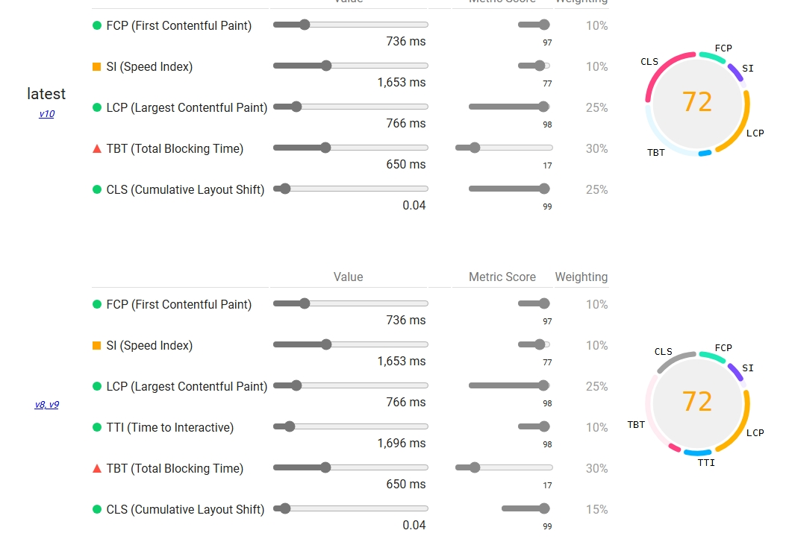

:::

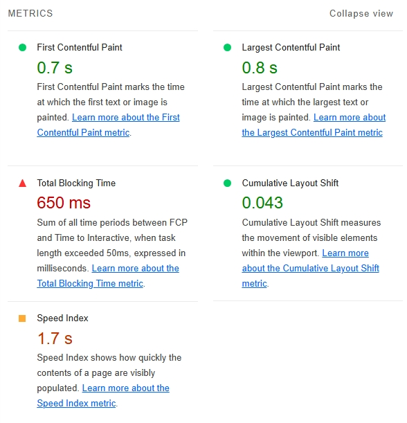

- **Diagnostics**

In fact, if you use the Lighthouse tool, optimization is relatively straightforward even without strong analytical skills, because the DIAGNOSTICS panel lists optimizable items and which metrics they're associated with. Developers can also perform targeted optimization based on the metrics their site actually cares about.

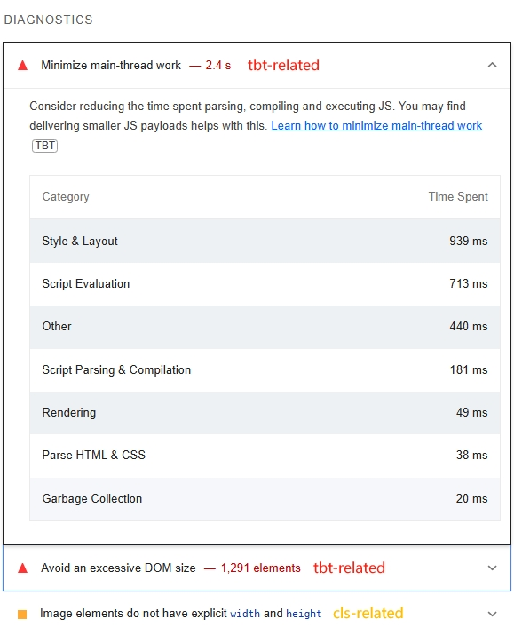

::: info Further Reading

[Google Lighthouse](https://developer.chrome.com/docs/lighthouse/performance/performance-scoring)

:::

#### Performance

Lighthouse is a Chromium-based browser-specific feature. If the problem scenario occurs in browsers like Firefox, we seemingly can only use PSI or built-in web-vitals. In fact, when performance issues arise, the more common choice is the **performance** tool built into each browser's DevTools.

Such as [Firefox](https://profiler.firefox.com/docs/#/) and [Chrome](https://developer.chrome.com/docs/devtools/performance#get-started)

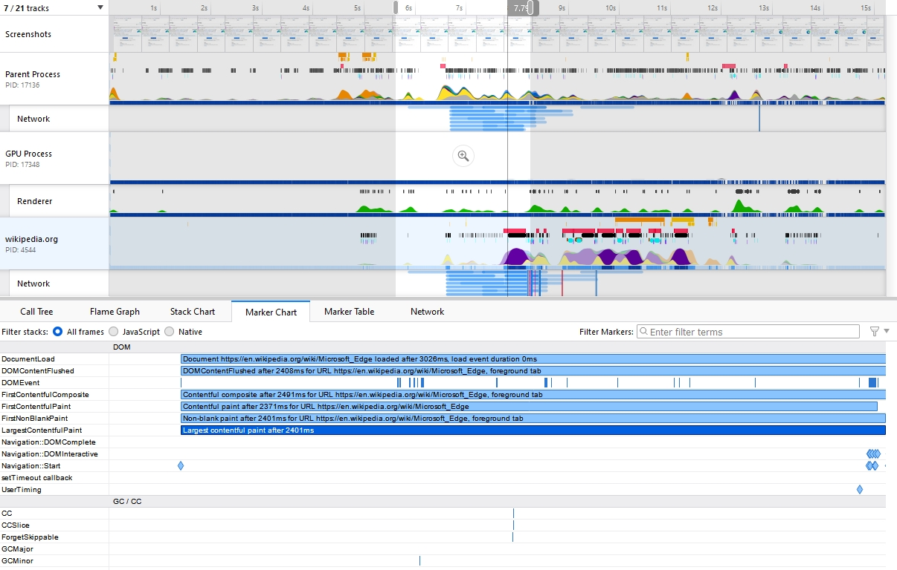
*Firefox performance - LCP*

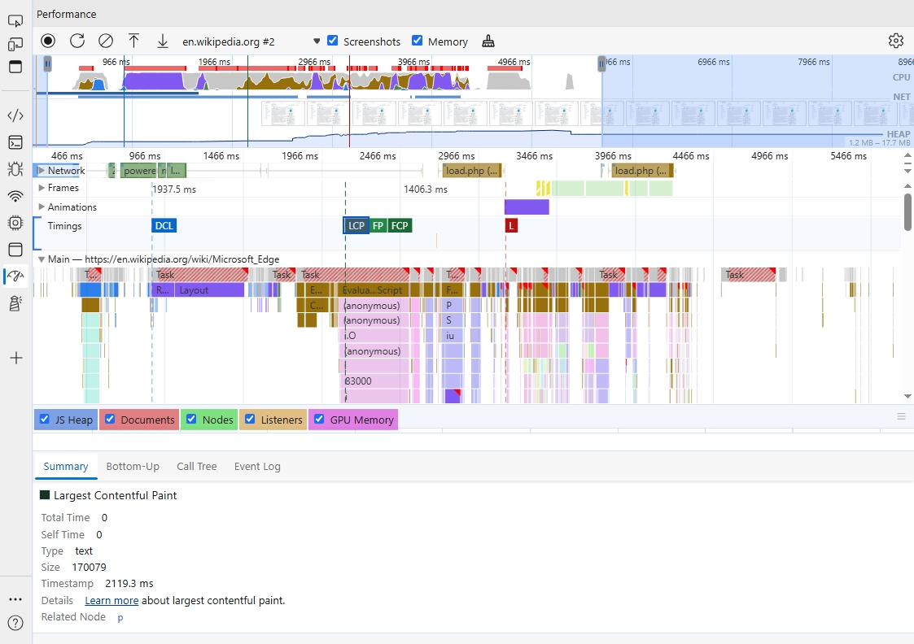
*Microsoft Edge performance - LCP*

Firefox's performance exists as a plugin that needs to be manually enabled. Chromium-based browsers (Chrome / Edge) have performance built into DevTools by default.

Comparatively, Firefox's performance is more detailed than Chrome's, but aggregation is slightly less cohesive.

For the performance results shown above, Firefox and Chrome have different workflows for different performance issues. Taking LCP as an example:

1. Chrome marks the LCP start and end times. Expanding the main thread shows which tasks are occupying it. Firefox requires locating the LCP position from the Marker Chart, then determining what tasks the browser is executing from the timeline.

2. Chrome only marks the current web page thread and its related thread pools, while Firefox marks the browser's overall performance overview (see [Browser Engine Principles](../engine/engine.md)).

## Problem Diagnosis and Optimization

Whether using Field Tools or Lab Tools, the end result is assessment data for various page metrics.

When page logic is simple, it's easy to pinpoint specific performance bottlenecks from the assessment data. But for real production projects, due to framework usage and minification, problem diagnosis becomes more complex.

::: warning

Due to differences between browsers, the following data is not from real production environments and is for reference only. The specific test environment is:

1. Based on a VM container with Windows 10
2. Test environment network
3. Browser version: Edge 126.0.2592.87 (64bit)

:::

Suppose we have the following performance data analyzing a page from navigation to quiet window:

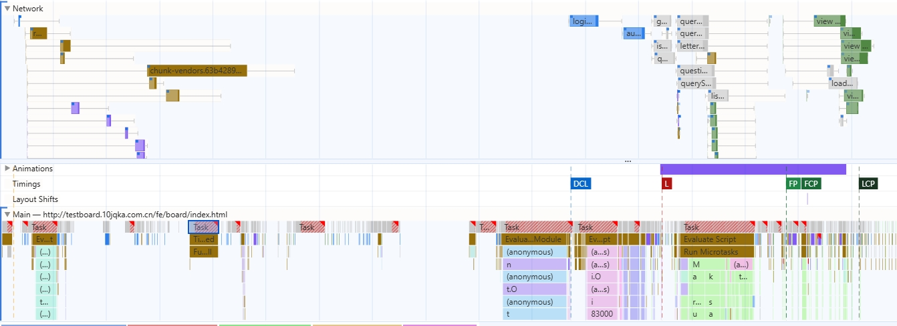

Scrolling through the network panel and clicking on long task content, combined with the information in the figure:

1. FCP is 4.37s, LCP is 5.13s — poor performance that needs optimization
2. Numerous long tasks block the main thread, with some lasting hundreds of milliseconds
3. Most long tasks on the main thread consist of scripting rather than rendering
4. The network waterfall shows many requests, with some JS requests and parsing consuming significant time

Therefore, for this page, the main performance bottleneck sources are:

1. Long tasks (mainly script)
2. Network duration

Checking Lighthouse reveals that the CLS metric is in excellent condition, while FCP, LCP, SI, and other metrics urgently need optimization — consistent with our earlier analysis.

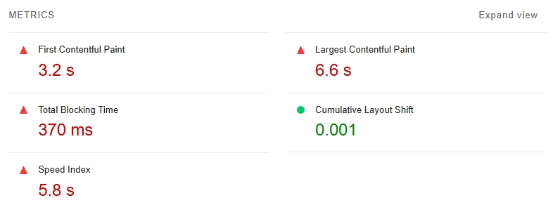
*Note: This panel was captured in a VM container with test network — for reference only, not real data*

Returning to the performance panel, based on our understanding of the project and modern development patterns, we can easily categorize long tasks into the following phases:

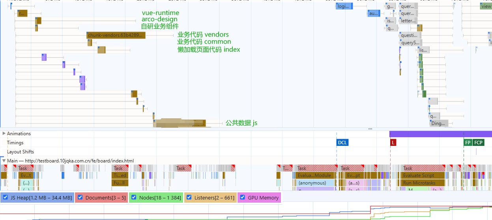

1. External repository loading
2. Business code loading
3. Other business JS loading

Point 1 has minimal optimization space — these are third-party resource loads that account for a negligible proportion of the total waterfall.

Point 2 is the main source of long tasks. In modern frontend development, engineering with `npm` packages has become mainstream. Therefore, optimizing `chunks` is unavoidable.

Point 3's JS mainly consists of business-related global variable injection scripts. Since these scripts only contain global variable injection, they mainly affect the network waterfall. Once loading begins, they only affect `JS heap` size, with negligible impact on the main thread.

::: details About Evaluate Script

Observing the above performance, long tasks before DCL show **Evaluate Module** below, while those after load show **Evaluate Script**.

What's the difference between these two?

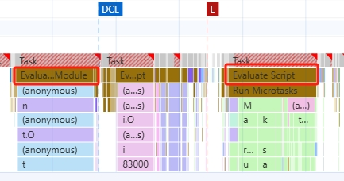

Since JavaScript is an interpreted language ([compiled just-in-time](https://en.wikipedia.org/wiki/Just-in-time_compilation)), script evaluation is a necessary part of browser JavaScript execution.

When a script is evaluated, it's first parsed to check for errors. If the parser finds no errors, the script is compiled into [ByteCode](https://en.wikipedia.org/wiki/Bytecode) before execution.

Typically, a `<script>` tag produces one `evaluate - parse - execute` task. This applies to all Chromium-based browsers, Safari, and Firefox.

But in *modern engineering practice*, things are different.

Modern browsers already support native [type=module attribute](https://web.dev/articles/serve-modern-code-to-modern-browsers#use_lessscript_type=modulegreater). Frontend engineering scripts often depend on multiple module packages, so bundling into multiple `<script type="module">` tags is the default behavior of bundlers like `webpack`.

When `<script type="module">` appears, Chrome marks the script as `Compile module`. Once the script is compiled in the Thread Pool Worker, an **Evaluate module** task begins.

:::

### Optimizing `chunks`

Optimizing `chunks` is a highly customized problem. The size and number of `chunks` depend not only on how business code is organized but also on how bundlers like `webpack` or `rollup` package the code.

A fairly universal approach is to use tools like `webpack-bundler-analyzer` to analyze packages that occupy large volumes in `chunks`, then optimize accordingly.

For example, a commonly used large package — if separated as an individual chunk from `vendors`, lazy-loaded modules might redundantly load that chunk.

But if kept in the common `vendors`, it's likely to cause an oversized initial `vendors` bundle, affecting the first-visit user experience.

Ultimately, the key issue in engineering is **compromise**. Real projects need to balance and compromise on various metrics based on use cases.

## Optimization Strategies

"The Pragmatic Programmer" mentions a tip:

> No silver bullet

There's no universal remedy in life, and no one-size-fits-all solution in development.

Especially for complex problems like performance optimization, you often need to infer possible code issues from hints provided by performance tools and optimize accordingly.

If using the Lighthouse tool, referencing the [Optimization Opportunities](https://developer.chrome.com/docs/lighthouse/performance/render-blocking-resources) in Lighthouse results is a great starting point for performance optimization.

Nevertheless, mastering common performance bottleneck problems and their solutions provides important reference for "case-by-case analysis."

Frontend-level performance optimization strategies can be broadly divided into four areas:

1. Resource delivery optimization
2. CSS optimization
3. JS optimization
4. Targeted optimization for specific elements

### Resource Delivery Optimization

Optimization strategies in this area mainly fall into three categories:

1. Size-based optimization: [minify CSS](https://developer.chrome.com/docs/lighthouse/performance/unminified-css) / [remove unused CSS](https://developer.chrome.com/docs/lighthouse/performance/unused-css-rules) / [minify JS](https://developer.chrome.com/docs/lighthouse/performance/unminified-javascript)
2. Network speed-based: [CDN](https://web.dev/articles/content-delivery-networks) / [hosting](https://web.dev/articles/optimize-ttfb#hosting_hosting_hosting) / [cache source](https://developer.chrome.com/docs/lighthouse/performance/uses-long-cache-ttl) / [service worker](https://web.dev/articles/optimize-ttfb#use_a_service_worker) / [adaptive serving](https://web.dev/articles/adaptive-serving-based-on-network-quality)
3. Browser mechanism-based: [rel-preload](https://web.dev/articles/preload-critical-assets) / [rel-preconnect](https://developer.chrome.com/docs/lighthouse/performance/uses-rel-preconnect/)

::: details preload and preconnect

[preload](https://developer.mozilla.org/en-US/docs/Web/HTML/Attributes/rel/preload) aims to give the browser a loading opportunity before it *naturally discovers* **critical resources**. It's especially useful when loading `font`, `css`, `images`, `script`, and similar resources.

[preconnect](https://developer.mozilla.org/en-US/docs/Web/HTML/Attributes/rel/preconnect) is generally used for warming up communication with **cross-origin servers** and can significantly improve metrics like [TTFB](./core-web-vitals/index.md#ttfb). It's mainly suitable for target resources where you know the domain (origin) but not the exact URL.

For modern frontend development, `JS` and `CSS` resource names often carry hash-encoded version numbers (e.g., `chunk.db265f32.js`) distributed on fixed CDNs. In this case, preconnect is clearly the better choice.

:::

As we know, JS is single-threaded. Each page has one main thread for parsing and loading.

Therefore, the browser blocks page processes when loading page resources. For example, in Chrome, five types of resource tags block page rendering:

1. `<script>` in `<head>`
2. `<script>` without `defer`
3. `<script>` without `async`
4. `<link rel="stylesheet">` without the `disabled` attribute
5. `<link rel="stylesheet">` with a `media` attribute that doesn't accurately match the user's device

As mentioned earlier, in modern engineering, since `JavaScript` is bundled by frontend frameworks and often dynamically inserted as one or more `defer` script tags, this area mainly needs optimization at the `style` level.

### Targeted Resource Optimization

Optimization in this area mainly focuses on `images`, `videos`, `web fonts`, and similar resources.

These resources are major consumers of network requests and page rendering performance. If a page contains such elements, targeted optimization can significantly improve FCP, LCP, and even CLS and INP metrics.

Image resources on a page can be optimized from the following angles:

1. [format](https://web.dev/articles/choose-the-right-image-format)
2. [level of compression](https://web.dev/articles/compress-images)
3. [replace gif with videos](https://web.dev/articles/replace-gifs-with-videos)
4. [responsive sizes](https://web.dev/articles/serve-responsive-images)
5. [use webp](https://web.dev/articles/serve-images-webp)
6. [lazy-load images](https://web.dev/articles/lazy-loading-images)
7. [lazy-load video](https://web.dev/articles/lazy-loading-video)
8. [optimize font loading and rendering](https://web.dev/articles/optimize-webfont-loading)

### CSS Optimization

The most important strategy for CSS optimization is **extracting critical CSS for the page**.

Whether deferring non-essential CSS loading or minifying CSS, the goal is to minimize the size and complexity of styles the page must parse.

1. Reduce inline style usage. Inline styles not only affect browser [CSSOM](https://developer.mozilla.org/en-US/docs/Web/API/CSS_Object_Model) parsing but also slow down the entire Document parsing speed.
2. Use Lighthouse to analyze CSS styles within the page viewport.
3. Use `preconnect`, `preload`, and `media queries` to optimize font, image, and other resources in CSS.

### JS Optimization

Some commonly used optimization strategies:

#### Remove Unused Code

This step is often already handled by bundling frameworks in modern frontend development. Both [webpack](https://webpack.js.org/guides/tree-shaking/) and [rollup](https://rollupjs.org/introduction/#tree-shaking) have built-in `tree-shaking`.

Tree-shaking not only helps remove unused code but can also [reduce the size of common code](https://web.dev/articles/commonjs-larger-bundles#tree-shaking_with_commonjs).

#### Serve Modern Code

As ES6 gradually becomes widespread, the actual output target version should be determined based on the project's real use cases.

In some businesses, to achieve compatibility with legacy browsers (Android 5 / Chrome 49), projects often use [babel](https://babeljs.io/docs/) or [swc](https://swc.rs/docs/getting-started) to compile output to ES5-compatible code.

But this approach often means giving up the underlying optimizations modern browsers have made for ES6 syntax.

A good solution is dynamic serving:

```html
<!DOCTYPE html>
<html lang="en">
<head>
    <meta charset="UTF-8">
    <meta name="viewport" content="width=device-width, initial-scale=1.0">
    <title>ES5 and ES6 Example</title>
    <script>
        function loadScript(src) {
            var script = document.createElement('script');
            script.src = src;
            script.async = false;
            document.head.appendChild(script);
        }

        // Check if the browser supports ES6
        try {
            new Function("() => {}");
            loadScript('dist/bundle.es6.js');
        } catch (err) {
            loadScript('dist/bundle.es5.js');
        }
    </script>
</head>
<body>
</body>
</html>
```

Use bundling tools to produce two artifacts, then in the page, through [`type=module`](https://developer.mozilla.org/en-US/docs/Web/HTML/Element/script#browser_compatibility) detection, browsers that don't support it (Chrome < 61) will automatically execute the downgraded `script`.

*Note: For Vue 3 projects, due to the minimum `Proxy` requirement (Chrome 49), most ES6 code actually doesn't need transpilation.*

#### Optimize Long Tasks

JS optimization is particularly important, and the most critical aspect is long task optimization. If a page isn't experiencing a rendering bottleneck, the most likely cause is long tasks blocking the main thread.

```typescript
// Yield to the main thread through proper task scheduling
function splitTasks(){
  task1();
  setTimeout(()=>{
    task2();
  }, 0)
}
function yieldToMainThread(){
  return new Promise(resolve=>{
    setTimeout(resolve, 0);
  })
}
// Split large scripts into smaller modules through proper code-splitting to reduce Evaluating Time
// Use Web Workers to run scripts outside the main thread
```

#### Code Splitting

Code splitting is an almost unavoidable topic in modern frontend development.

Modern websites, whether single-page or multi-page, often bring large amounts of JavaScript due to complex interactions, scenarios, and business logic.

Especially if a page uses single-page mode, without proper code splitting, initial page load speed becomes a nightmare.

Code splitting can divide a large script into multiple sub-scripts.

Through batch loading and lazy loading, page load speed can be significantly improved, leading to better interactivity and user experience.

::: info

See [Optimizing chunks](#optimizing-chunks) above or [webpack lazy loading](https://webpack.js.org/guides/lazy-loading/).

:::
