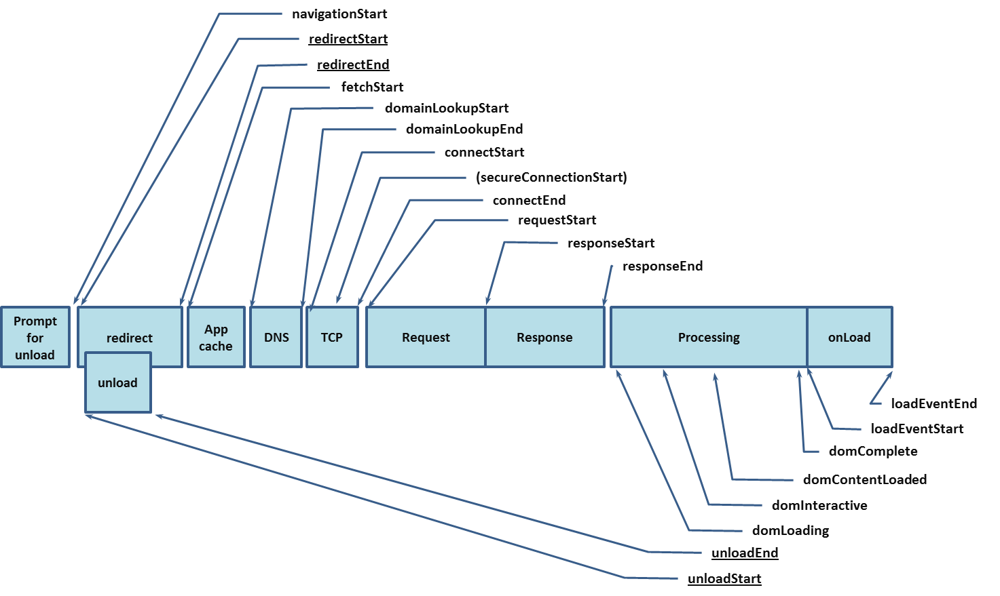
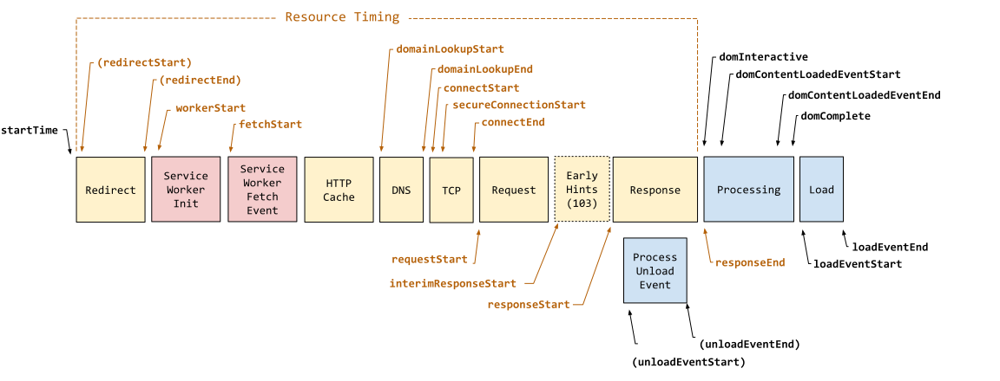

# Web Performance Specifications

## Navigation Timing - 2012

To help developers better measure page performance, `W3C` proposed [Navigation Timing](https://www.w3.org/TR/navigation-timing) in 2012.

This standard provides the `PerformanceTiming` and `PerformanceNavigation` interfaces, offering complete client-side latency measurements through read-only properties. For details, see [MDN](https://developer.mozilla.org/zh-CN/docs/Web/API/PerformanceTiming) or the [W3C Recommendation](https://www.w3.org/TR/navigation-timing/#sec-navigation-timing-interface).

The detailed metrics defined by the standard are stored on the global `performance` object and can be read directly via `const {navigation, timing} = window.performance`.

### Why Navigation Timing is Needed

Consider the following code, intended to measure page load time:

```html
<html>
  <head>
    <script type="text/javascript">

    var start = new Date().getTime();
    function onLoad() {
      var now = new Date().getTime();
      var latency = now - start;
      alert("page loading time: " + latency);
    }

    </script>
  </head>
  <body onload="onLoad()">
  <!-- Main page body goes from here. -->
  </body>
</html>
```

This script has an obvious problem: it only starts measuring when the `script` executes, without accounting for any time spent *fetching the page from the server*.

For this reason, `W3C` defined properties including `navigationStart` in `PerformanceTiming` and `NavigationTiming` based on the page lifecycle, making it convenient to measure various page loading metrics throughout the entire page cycle starting from the previous page's unload.

### Navigation Timing Processing Model

`Performance Timing` and `Navigation Timing` are not direct measurement metrics per se, but rather **time points** based on the page lifecycle.

As shown in the diagram below, the entire lifecycle goes through the following phases:

1. Navigation start: Records the `navigationStart` time point
2. Redirect processing: If redirects exist, records `redirectStart` and `redirectEnd` time points
3. `DNS` lookup: Records `domainLookupStart` and `domainLookupEnd` time points
4. `TCP` connection: Records `connectStart` and `connectEnd` time points
5. Request sent: Records the `requestStart` time point
6. Response received: Records `responseStart` and `responseEnd` time points
7. `DOM` processing: Records `domLoading`, `domInteractive`, `domContentLoadedEventStart`, `domContentLoadedEventEnd`, and `domComplete` time points
8. Page load: Records `loadEventStart` and `loadEventEnd` time points

During different phases, user agents (mostly browsers) write the corresponding time points to the `window.performance.timing` and `window.performance.navigation` objects for subsequent use.



*Image source: <https://www.w3.org/TR/navigation-timing/#processing-model>*

::: warning

1. `window.performance.timing` and `window.performance.navigation` can only be written after the `window` object is created
2. `window.performance.timing` and `window.performance.navigation` may be disabled by the browser, in which case both return `null`

:::

### Properties

Access corresponding content `timing` and `navigation` through `window.performance`:

```typescript
interface PerformanceTiming {
  readonly navigationStart: number;
  readonly unloadEventStart: number;
  readonly unloadEventEnd: number;
  readonly redirectStart: number;
  readonly redirectEnd: number;
  readonly fetchStart: number;
  readonly domainLookupStart: number;
  readonly domainLookupEnd: number;
  readonly connectStart: number;
  readonly connectEnd: number;
  readonly secureConnectionStart: number;
  readonly requestStart: number;
  readonly responseStart: number;
  readonly responseEnd: number;
  readonly domLoading: number;
  readonly domInteractive: number;
  readonly domContentLoadedEventStart: number;
  readonly domContentLoadedEventEnd: number;
  readonly domComplete: number;
  readonly loadEventStart: number;
  readonly loadEventEnd: number;
}
enum NavigationType {
  TYPE_NAVIGATE = 0;
  TYPE_RELOAD = 1;
  TYPE_BACK_FORWARD = 2;
  TYPE_RESERVED = 255;
}
interface PerformanceNavigation {
  readonly type: NavigationType;
  readonly redirectCount: number;
};
interface Performance {
  readonly timing: PerformanceTiming;
  readonly navigation: PerformanceNavigation
}
interface Window {
  readonly performance: Performance
}
```

::: warning

Note that the `Navigation Timing` feature has been marked as [deprecated](https://w3c.github.io/navigation-timing/#obsolete) and is not recommended for use. However, due to its excellent compatibility (Chrome 6), it's still worth understanding.

:::

## Navigation Timing Level 2

Currently on the `W3C` agenda is the latest [Navigation Timing Level 2 standard](https://www.w3.org/TR/navigation-timing-2/#abstract). In short, compared to `Navigation Timing - 2012`, this standard mainly introduces:

1. More time points and properties
2. Protocol support

The usage also differs from `Navigation Timing - 2012`. You can obtain corresponding properties through [performance.getEntriesByType](https://developer.mozilla.org/en-US/docs/Web/API/Performance/getEntriesByType) or [PerformanceObserver](https://developer.mozilla.org/en-US/docs/Web/API/PerformanceObserver).

`performance.getEntriesByType` supports [multiple resource types](https://developer.mozilla.org/en-US/docs/Web/API/PerformanceEntry/entryType). By specifying `type`, you can retrieve the corresponding `performance` data:

``` typescript
const [navigationTl] = performance.getEntriesByType("navigation");
const srcTimelines = performance.getEntriesByType("resource");
```

Note that `performance.getEntriesByType` does not notify changes to `performanceNavigationTiming` properties. It returns a `FrozenArray` format of the **current** `performance timeline` at the time of the call. To dynamically monitor changes, use `PerformanceObserver`:

```typescript
function perfObserver(list, observer) {
  list.getEntries().forEach((entry) => {
    if (entry.entryType === "mark") {
      console.log(`${entry.name}'s startTime: ${entry.startTime}`);
    }
    if (entry.entryType === "measure") {
      console.log(`${entry.name}'s duration: ${entry.duration}`);
    }
  });
}
const observer = new PerformanceObserver(perfObserver);
observer.observe({ entryTypes: ["measure", "mark"] });

```

::: details Change details, excerpted from [W3C Editor's Draft](https://w3c.github.io/navigation-timing/#introduction)

1. `Performance interface` moved to a separate [PERFORMANCE-TIMELINE-2](https://www.w3.org/TR/performance-timeline/) standard
2. Built on [RESOURCE-TIMING-2](https://www.w3.org/TR/resource-timing/)
3. Supports [HR-TIME-2](https://www.w3.org/TR/hr-time-2/)
4. Supports [RESOURCE-HINTS] prerendering technology
5. Exposes redirect count since the last non-redirect navigation
6. Exposes [next hop network protocol](https://www.w3.org/TR/resource-timing/#dom-performanceresourcetiming-nexthopprotocol)
7. Exposes `transfer` and encoded/decoded request body sizes
8. Mandates the `secureConnectionStart` property

:::

### Level 2 Processing Model



1. Navigation start: Records `startTime` and `navigationStart` time points
2. `Service Worker`: If a Service Worker exists, records the `workerStart` time point
3. Redirect processing: If redirects exist, records `redirectStart` and `redirectEnd` time points, and updates the `redirectCount` property
4. `DNS` lookup: Records `domainLookupStart` and `domainLookupEnd` time points
5. `TCP` connection: Records `connectStart`, `secureConnectionStart` (if applicable), and `connectEnd` time points
6. Request sent: Records the `requestStart` time point
7. Response received: Records `responseStart`, `responseEnd`, `transferSize`, `encodedBodySize`, and `decodedBodySize` time points
8. Underlying protocol: Records the `nextHopProtocol` property
9. `DOM` processing: Records `domInteractive`, `domContentLoadedEventStart`, `domContentLoadedEventEnd`, and `domComplete` time points
10. Page load: Records `loadEventStart` and `loadEventEnd` time points
11. Prerendering: If prerendering exists, records `prerenderStart` and `prerenderEnd` time points

Comparing with [Navigation Timing 2012](#navigation-timing---2012), `Navigation Timing Level 2` clearly has finer granularity and adds features like `Service Worker` support.

### Properties

```typescript
/** Navigation type */
enum NavigationTimingType {
    "navigate",
    "reload",
    "back_forward",
    "prerender"
};
/** Not restored reasons */
interface NotRestoredReasons {
  readonly src?: string;
  readonly id?: string;
  readonly name?: string;
  readonly url?: string;
  readonly reasons?: {reason: string}[];
  readonly children?: {reason: string}[];
}
interface PerformanceNavigationTiming {
    readonly unloadEventStart: number;
    readonly unloadEventEnd: number;
    readonly domInteractive: number;
    readonly domContentLoadedEventStart: number;
    readonly domContentLoadedEventEnd: number;
    readonly domComplete: number;
    readonly loadEventStart: number;
    readonly loadEventEnd: number;
    readonly type: NavigationTimingType;
    readonly redirectCount: number;
    readonly criticalCHRestart: number;
    readonly NotRestoredReasons?  notRestoredReasons?: ;
}
```
