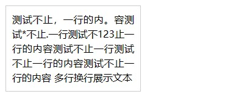
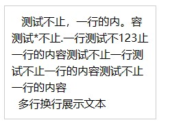

# 关于文本内容两端对齐

`text-align:justify` 这个 css 属性是用来将盒子内部的行内内容相对父元素两端对齐。一般情况下，直接使用即可达到效果。但有两点需要注意：

- 单行文本时无法两端对齐
- ios 下可能会无法生效

## 单行文本对齐

文本内容仅一行时，`text-align`不会处理最后一行的行内元素。因此 `text-align: justify` 看起来就像是没有生效一样。

### text-align-last 属性

这时可以增加 `text-align-last: justify`强制让最后一行也两端对齐。


**缺点**：`text-align-last: justify` 在 safari 16 以下(Released 2022-09-12)以下是[**不支持**](https://developer.mozilla.org/en-US/docs/Web/CSS/text-align-last#browser_compatibility)的

### 伪元素

要实现类似 `text-align-last: justify` 的效果也可以通过补充一个伪元素，来让文本强制换行，变为多行文本

```html
<style>
  .test-div {
    margin: 10px;
    text-align: justify;
    border: 1px solid #ccc;
    width: 200px;
    line-height: 1.5;
    padding: 10px;
  }
  .test-div::after {
    display: inline-block;
    content: '';
    width: 100%;
    height: 0;
  }
</style>
<div class="test">测试只有单行的内容 </div>
```

**缺点**：这样会导致容器多出一行文本的高度（如下图），需要做额外的处理。


所以实际上这种情况用处有限，基本上只有在表单内容的 label 需要两端对齐的时候才会出现。对于多行文本展示，强制让所有文本拉伸的视觉效果并不好（如下图）


### js 实现

如果不嫌麻烦或者不愿意处理伪元素兼容法带来的副作用，还有一种解法是如下所示，将所有文本全部分开，再用`span`包裹，令父元素为`flex`布局，设置`justify-content: space-between`，同样可以实现效果。

```html
<style>
  form {
    margin: 10px;
    padding: 10px;
    width: 300px;
    border: 1px solid #ccc;
  }
  .form-item {
    display: flex;
    align-items: center;
  }
  .form-item-label {
    display: flex;
    align-items: center;
    justify-content: space-between;
    width: 80px;
    margin-right: 10px;
  }
</style>
<form>
  <div class="form-item">
    <label class="form-item-label align-justify" for="user-name">姓名</label>
    <input id="user-name" />
  </div>
  <div class="form-item">
    <label class="form-item-label align-justify" for="address">居住地</label>
    <input id="address" />
  </div>
</form>
<script>
  const elList = Array.prototype.slice.call(
    document.getElementsByClassName('align-justify')
  );
  elList.forEach((el) => {
    const wrappedContent = el.textContent
      .split('')
      .map((char) => `<span>${char}</span>`);
    el.innerHTML = wrappedContent.join('');
  });
</script>
```

**缺点**：最主要的缺点在于浪费性能且场景有限。因为使用的前提条件就是需要额外的脚本计算与元素变动，在文本内容非常多的情况下无论是计算还是再插入都会带来页面的负担

## 多行文本 ios 下的问题

实际业务中经常有一种场景，用户在后台管理页面中上传了一段长文本，文本内容中包含`\n` `\r` `空格`等特殊内容，而在实际的页面展示中需要正确进行换行展示。

```html
<style>
  .test {
    margin: 10px;
    text-align: justify;
    border: 1px solid #ccc;
    width: 200px;
    line-height: 1.5;
    padding: 10px;
  }
</style>
<div class="test" id="test"></div>
<script>
  const serverData =
    '   测试不止，一行的内。容测试*不止.一行测试不123止一行的内容测试不止一行测试不止一行的内容测试不止一行的内容\n  多行换行展示文本';
  document.getElementById('test').textContent = serverData;
</script>
```

可以看到，的确是两端对齐的，但是没有正确展示换行和空格符。



这时候很容易想到 `white-space: pre-wrap` 这个属性。

```css
.test {
     margin: 10px;
     text-align: justify;
+    white-space: pre-wrap;
	/*省略代码*/
}
```

然后 *换行* 以及 *两侧对齐* 都可以实现。的确，在 web 端这样似乎确实解决了问题。既保证了两端对齐，又保证了文本内容格式正确（如下图）。


**但是，如果这样处理，在 ios 下是无法实现两端对齐的**（如下图）



网上大多数问题回答都描述的是第一种情况下的问题，无论是添加伪元素还是增加 text-align-last，都 **无法** 让 ios 能够实现“两端对齐，最后一行不拉伸”的最佳情况。

### ios 中的 white-space

> TLDR: pre、pre-wrap、break-spaces 都会影响到 text-align:justify 的生效

在 stackoverflow 上找到了一篇回答 [如何在火狐和 safari 上两端对齐文本](https://stackoverflow.com/questions/51664036/how-to-justify-text-in-firefox-and-safari-with-css)。回答中说是 `white-space:pre-wrap` 会跟 `text-align: justify` 冲突，导致无法文本两端对齐。

那么这里就产生了一系列新的问题：为什么安卓没有问题，而 ios 下 `white-space:pre-wrap` 会跟 `text-align: justify` 冲突呢？如果 `text-align: justify` 和 `white-space: pre-wrap` 这个属性冲突，那么 `white-space` 下的其他属性是不是也会冲突呢？

于是我选择了三种[近似的属性](https://developer.mozilla.org/zh-CN/docs/Web/CSS/white-space)进行对比测试(保留换行/保留空格)：

1. pre-wrap
2. pre-line
3. break-spaces

之所以不测试其他的属性原因如下：

1. `pre` 是因为 `pre` 不会进行 [inline-formatting](https://www.w3.org/TR/CSS2/visuren.html#inline-formatting)，也就是不会进行行内文本自动换行，这种情况下讨论两端对齐是没有意义的。
2. `nowrap` 同理
3. `normal`作为默认值在最开始没有添加`pre-wrap`属性

从测试结果上来看，当且仅当 `white-space: pre-line` 时，`text-align: justify` 才能够正常生效，当然这种情况下又产生了新的问题：那就是原本数据中的空格没有正确展示（如下图）。 

现在先把这个空格的问题放在一边。首先需要考虑的是，为什么在众多 `white-space` 的可选属性中，只有 `pre-line` 可以生效。参考 [W3C Draft](https://w3c.github.io/csswg-drafts/css-text/#white-space-property)：

> `pre-wrap`：Like `pre`, this value preserves white space; but like normal, it allows wrapping;

> `break-spaces`: The behavior is identical to that of `pre-wrap`, except...

> `pre-line`: Like `normal`, this value collapses consecutive white space characters and allows wrapping, but it preserves segment breaks in the source as forced line breaks

从定义很容易就可以看出来，`pre-line` 和 `pre-wrap` 虽然都是 `pre-*` 的前缀，但他们的表现方式显然截然不同。`pre-line` 更接近 `normal`，而 `pre-wrap` 和 `break-spaces` 更接近 `pre`。

于是可以发现，之前将属性修改为 `white-space: pre-line` 之后出现的 _空格消失_ 的原因也就找到了。既然 `pre-line` 是 'like normal' 的，那么根据 `normal`的定义：

> This value directs user agents to collapse sequences of white space into a single character (or in some cases, no character)

所以根据 w3c 的定义，`pre-line` 下空白消失是必然的表现。而要在 ios 上实现 `text-align: justify` ，只能将问题转换为 “如何在 `white-space: normal` 的情况下保留空白与换行”

### 兼容 ios 的文本对齐实现

对于简单需求（非富文本无交互纯展示）的实现方法，其实就是将空白和换行符替换为 html 标签，然后页面生成方式从渲染文本`textContent`变为渲染内容`innerHTML`。

```html
<style>
  .test {
    margin: 10px;
+   white-space: pre-line;
    text-align: justify;
    border: 1px solid #ccc;
    width: 200px;
    line-height: 1.5;
    padding: 10px;
  }
+ .whitespace-pre-wrap {
+   white-space: pre-wrap;
+ }
</style>
<div class="test" id="test"></div>
<script>
  const serverData =
    '      测试不止，一行的内。容测试*不止.一行测试不123止一行的内容测试不止一行测试不止一行的内容测试不止一行的内容\n    多行换行展示文本';
  /**删除所有tag */
+ const stripAllTags = (str) => {
+   if (!str) return '';
+   return str.replace(/<.*?>/g, '');
+ };
  /**将空格替换为带span标签的空格 */
+ const placeWhiteSpaceSpan = (str) => {
+   if (!str) return '';
+   // 注意这里的span又带上了white-space: pre-wrap的属性
+    return str.replace(/x20/g, '<span class="whitespace-pre-wrap"> </span>');
+ };
-  document.getElementById('test').textContent = serverData;
+  document.getElementById('test').innerHTML = placeWhiteSpaceSpan(
    stripAllTags(serverData)
  );
</script>
```

对比最初的[问题代码](./#多行文本 ios 下的问题)，需要注意的有三个地方：

1. 将空格替换为 `<span>` 的时候，中间的字符 **必须** 是空格，并且需要给 span 补充 `white-space: pre-wrap` 属性。这样做是为了保证浏览器对于空格解释是正确的。如果我们替换为 `<span style="opacity: 0">1</span>` ，最终的空白区域与用户侧真正输入的空格是对不上的，因为浏览器对于长文本中空格的解释并非一个空格一个半角字符，而我们全都填充半角字符后，浏览器会展示为实际的文本，而非`white-space`。尤其如果涉及到空格换行等情况，可能会产生意想不到的问题。因此 `<span>` 内部仍保留空格，并且将`span` 本身设置 `white-space: pre-wrap` 以保留空格。
2. 在 `style` 中补充了 `white-space: pre-line` 这条属性。事实上当我们开始用js替换空白符、换行符的时候，完全可以不设置这个属性，将换行符替换为 `<br />`，也可以实现相同的效果
3. 在 `placeWhiteSpaceSpan` 之前，调用了 `stripAllTags` 这个方法。因为直接使用用户输入的文本作为 `innerHTML` 是有很大的 xss 风险的，这里添加的函数可以把所有包含\<\>的文本都去掉，可以防止xss攻击。当然这个方法只是最简单粗暴的一种，在实际的业务情况下可能会“误伤”用户输入文本，但这里只是举个例子，xss 是另一个话题，这里暂不展开

综上所述，如果是非常复杂的文本，涉及 `\n` `\r` `\t` `空格` 等多种符号，或者文本内容多语种夹杂，那么需要估计开发成本和回报，因为移动端的兼容是个复杂问题，如果按照上述我的 `span代替法` 进行处理，在空格过多的时候还可能影响渲染性能。因此如果非强需求，尽量*避免两端对齐*。但两端不对齐需要额外注意要在曲面屏上留够`padding`，避免出现文字超出边缘的情况。

如果有复杂文本输入并且输出侧有特殊样式、交互等的强需求，可以考虑富文本开发，专门实现一套系统。
