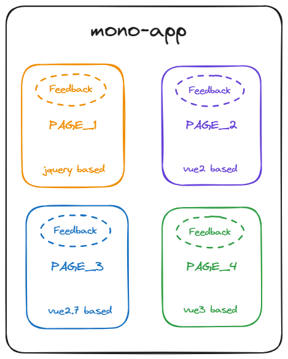
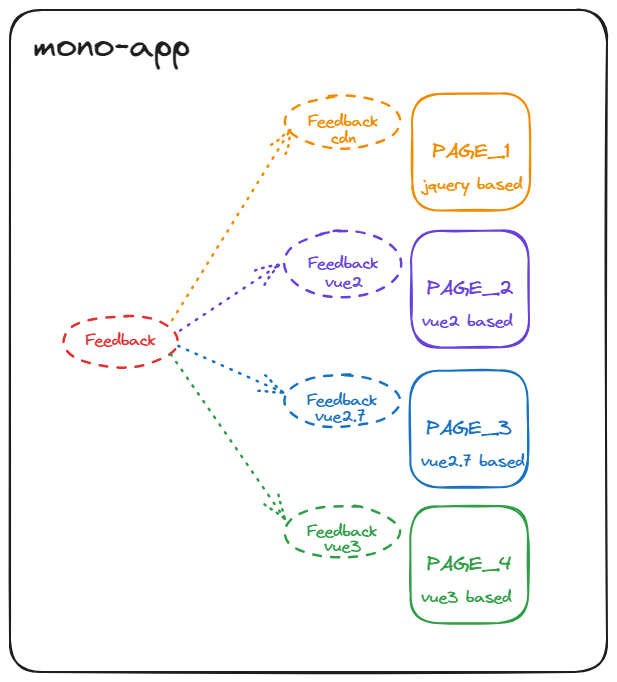
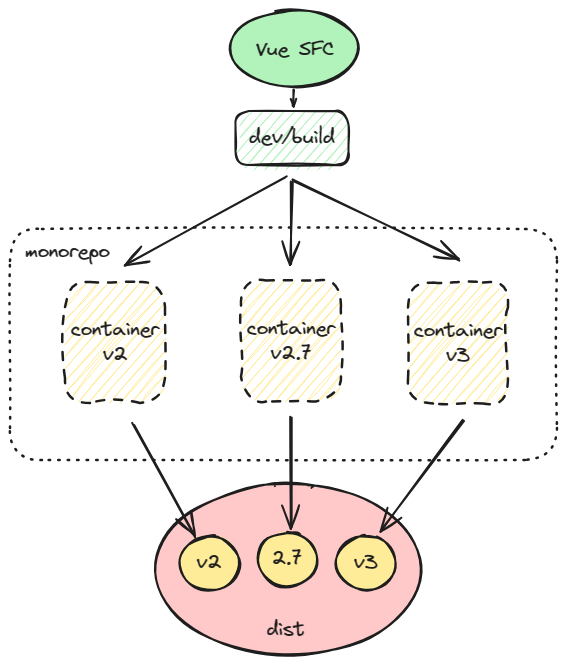

# vue 通用组件库开发

代码开源地址 <https://github.com/X-sky/vue-uni-component>

## 开发背景

在日常的 `2B` 业务开发中，我们不可避免的会遇到一个系统内部出现跨版本框架————甚至跨时代框架的使用。以我之前碰到的一个项目而言，项目横跨 `jquery+LayUI` ，`vue2`，`vue2.7`, `vue3`。但作为同一个项目，难免会有部分业务组件有所重合。

以往的做法是，将原有的业务组件迁移至新项目中。但考虑以下场景，有一个通用组件 `反馈按钮 FeedbackDialog`，目前已经完成了迁移，在该项目所有版本的代码中都有应用。也就是说，一个相同逻辑的业务，出现在四种不同的框架中。现在产品需求要求优化反馈弹窗。那么可想而知这个开发和测试的成本都是巨大的，开发需要在四个框架中分别进行该组建的修改，而测试也需要熟悉不同的框架出现在系统的哪个部分，并针对性的进行测试



_一个跨框架的巨石应用_

而如果这种时候，我们的 `FeedbackDialog` 组件可以避免在不同框架中重复开发，那么开发和测试都能够节约极大的工作量，如下图所示



_使用跨框架通用组件的跨框架巨石应用_

## 组件库开发

### vue 组件库原理

在开发组件库之前，我们需要先搞清楚两个问题：

1. 什么是组件
2. 什么是组件库

尽管我们在开发过程中更多的仍然是扮演“调包工程师”的身份，但只有搞清楚这两个问题，我们才能知道自己要开发什么，自己在开发什么

#### 什么是组件

我们日常开发中最常接触的就是组件开发。但这里首先需要澄清一个概念：组件 ≠ SFC。根据 `vue` 官网的[定义](https://vuejs.org/guide/scaling-up/sfc.html)

> SFC 是一种特殊的文件格式，允许我们 Vue 组件的把模板、逻辑和样式聚合在一个文件中。Vue SFC 是一种框架特定(framework-specific)类型文件，因此必须被 `@vue/compiler-sfc` 预编译成标准的 javascript 和 css。

因此，SFC 只是 vue 组件的一种表现形式，jsx，h 函数无不如是。但 SFC 是一个帮助我们理解组件的很好的切口————它最终会被编译为标准的 javascript。一个编译后的 SFC 是标准的 ES 模块，`vue`官网也提供了 [SFC-playfround](https://play.vuejs.org/)，可以更直观的看到它们是如何被编译的。

于是我们的第一个问题【什么是组件？】就得到了很好的回答：

**Nothing magic, just javascript**

#### app.use 的时候发生了什么

当我们使用各种基于 `vue` 的插件/组件的时候，我们熟悉了这样的用法：

```typescript
// 摘自element-plus官网 https://element-plus.org/zh-CN/guide/quickstart.html
// main.ts
import { createApp } from 'vue';
import ElementPlus from 'element-plus';
import 'element-plus/dist/index.css';
import App from './App.vue';

const app = createApp(App);

app.use(ElementPlus);
app.mount('#app');
```

或者是 `vue2` 版本的

```javascript
// 摘自element-ui官网 https://element.eleme.cn/2.0/#/zh-CN/component/installation
import Vue from 'vue';
import ElementUI from 'element-ui';
import 'element-ui/lib/theme-chalk/index.css';
import App from './App.vue';

Vue.use(ElementUI);

new Vue({
  el: '#app',
  render: (h) => h(App)
});
```

那么 `.use()` 到底做了哪些事情？查阅 [vue2 版本的`.use`api](https://v2.vuejs.org/v2/api/#Vue-use) 以及 [vue3 版本的`.use`api](https://vuejs.org/api/application.html#app-use)，我们不难理解，神奇的 `.use` 归根到底只做了一件事：安装插件(Plugins)

`.use` 接收一个为 带有 `install` 方法的 `Object`，或者是作为 `install` 方法本身的 `Function`。而 `install` 方法接收两个参数：应用实例`App` 和 插件选项`Options`。在 `vue2`中，第一个参数是全局 `Vue` 对象

以 `vue3` 为例，我们可以在 [runtime-core 源码](https://github.com/vuejs/core/blob/638a79f64a7e184f2a2c65e21d764703f4bda561/packages/runtime-core/src/apiCreateApp.ts#L158) 中找到对应的类型定义

```ts
type PluginInstallFunction<Options = any[]> = Options extends unknown[]
  ? (app: App, ...options: Options) => any
  : (app: App, options: Options) => any;
```

所以当我们在说“`vue` 组件库开发”的时候，这种说法或许太过特化。更通用的说法应该是：vue 插件开发。

至此，最开始提出的第二个问题我们也已经得到了解答：

**组件库是一种插件**

### 常用打包工具

目前前端社区流行的打包库主要有三种：[webpack](https://webpack.js.org/), [rollup](https://rollupjs.org/), [esbuild](https://esbuild.github.io/)。当然近期还有 [rspack](https://www.rspack.dev/) [rolldown](https://rolldown.rs/) 等基于 `Rust` 的打包库兴起。但由于生态和稳定性的原因，不适合用于企业生产。也正是由于这个原因，也应该放弃 `esbuild`。尽管它基于 `go` 开发，速度非常快，但生态并不完善，对于我们接下去要做的项目来说，灵活度也稍显不足

尽管说起稳定性我们应该优先选择 `webpack`，但 `webpack` 其实并不适合作为组件库打包的工具。或者说，使用 `webpack` 打包组件库会较为麻烦，因为 `webpack` 会默认将所有依赖项打包进产物当中，为了得到合适的分发结果，需要做出很多额外的配置

并且就 `vue` 的生态发展趋势而言，拥抱 `vite` 几乎是不可避免的。而 `vite` 天然基于 `rollup`。因此最终选定 `rollup` 作为打包工具

### 方案决策

在选择方案的时候有两条路摆在我们面前：

1. dispatch 模式
2. adaptor 模式

#### dispatch 模式

> 使用 Vue SFC 进行开发，在编译阶段通过 monorepo/container 中不同版本的 template compiler 进行编译。最终由各个容器输出不同版本的产物

理论上来说，`vue2` 和 `vue3` 的模板语法差距其实并不大。`vue2.7` 不仅内置了 `setup` 支持，`vue2` 也可以通过 `@vue/composition-api` 结合 `unplugin-vue2-script-setup` 来进行语法层面的抹平。



这种模式的优点在于：

1. 开发成本较低，不需要改变原有开发习惯。后续交付团队后，团队成员不需要了解实现细节即可开发
2. 针对不同的版本进行编译。有一定优化机制
3. 使用不同的 `container` 进行分发编译，方便进行定制化配置，
4. 将不同版本 `vue` 的代码进行了隔离

缺点：

1. 舍弃了其他组件库的复用，所有组件都需要手撸
2. 组件间引用的时候，需要放弃部分语法糖
3. 后续如果出现破坏当前 SFC 模式的 `vue` 版本，或者出现了新特性，仓库将无法持续更新（比如 `defineOptions` 语法糖由于 `unplugin-vite-script-setup` 没有提供，我们只能选择放弃该语法糖，或者对该仓库进行 `PR`）

:::tip

相较于我的这个 [demo](https://github.com/X-sky/vue-uni-component) 示例，目前已经有相对更成熟的开源库使用了类似的思想，详见 [tiny-vue](https://github.com/opentiny/tiny-vue/blob/dev/README.md)。虽然不是使用 `monorepo` 进行分发，但也是使用了类似的思想，对不同版本的 `vue` 进行了编译层的分发转译

:::

#### adaptor 模式

> 定义内置 adaptor-runtime 语法，使用自定义的模板语法 template syntax 进行开发，最终打包一套产物与不同版本的 runtime-adaptor，在应用中利用 adaptor 对不同版本的 vue 进行适配

初步考虑是类似当时最开始做小程序转 ArkUI 的思路，使用类 `vue` 的模板语法进行开发，单独开发一层`adaptor-runtime`，最终根据用户侧的 `vue` 版本不同使用不同的 `runtime`。

优点：

1. 不需要多次编译，多版本 `vue` 使用相同的产物，进一步减小业务层代码差异
2. 使用 `runtime-adaptor` 方式，**可扩展性极强**。理论上这种方式甚至可以通过对不同其他组件库如 `element-plus` 的适配，甚至其他框架如 `react`，实现一套代码，处处使用的结果
3. 从编译层到运行时都由组件库内部控制，相较于 `dispatch` 模式委托 `vue/template-compiler` 和 `runtime/core` 更可控

缺点：

1. 开发成本**极高**。需要团队实现 `dsl`，如果使用标准 `tsx`，则需要团队成员开发时学习 `tsx`。同时还需要根据目标产物实现不同的 `adaptor-runtime`
2. `runtime-adaptor` 的存在会导致运行时有性能损耗

毫无疑问，作为独立开发而言，这个模式下的通用组件库开发无疑是地狱难度

PS. 看到[这篇文章](https://juejin.cn/post/7243413934765916219#heading-0)的时候组件库已经使用 dispatch 模式基本搭建完毕，而且其使用的 jsx transform 模式，不仅需要对 `vue` 不同版本差距有所了解，而且需要对 `tsx` 流程和产物有所了解，一开始就不在选择范围内

#### 选择

考虑到组件库的使用场景，综合团队规模和后期维护的复杂度，最终选择了 `dispatch 模式` 进行开发

### 仓库结构

> 使用 `monorepo` 实现 `dispatch` 模式

#### 多版本模板编译支持

提到多版本 `vue` 的支持，自然绕不开 `vue-demi`。`vue-demi` 是 Vue 核心团队成员 antfu 开发的一个小工具，能够支持对 `vue` 代码引用的转发。[Vueuse](https://vueuse.org/)内部就是用了 `vue-demi`，从而实现对多版本的 `vue` 的支持。

但由于 `vue-demi` 只是对 `vue` 版本做了转发，因此如果是纯 js 库开发(例如 `@vueuse/core`)之类的库，不必关心_模板解析器冲突_的问题。而开发组件库则必须关注这个问题。因为不同版本的 `vue` 使用了不同版本的模板编译：

- vue3.x: vue/compiler-sfc
- vue2.7.x: vue/compiler-sfc@2.7
- vue2.x: vue-template-compiler

可以预见的是，即使使用`render`函数，我们也无法绕开版本问题。因此不如将这个问题提前到编译阶段解决。借助 `pnpm` 的 `monorepo` 模式，我们可以分别创建三个不同的 `vue` 仓库，利用各自不同的 `package.json` `vite.config.ts` 配置，编译多个版本的 `vue` 组件产物。

- containers/v2 -> @vue-uni-ui/v2
- containers/v2.7 -> @vue-uni-ui/v2.7
- containers/v3 -> @vue-uni-ui/v3

通过在 `vite.config.ts` 中配置 `resolve.alias` ，手动将 `vue` 以及 `vue-demi` 版本映射到对应的仓库内，例如`containers/v3`中的`vite.config.ts`需要配置的 alias 如下：

```js
export default {
  resolve: {
    alias: {
      vue: resolve(
        __dirname,
        'node_modules/vue3/dist/vue.runtime.esm-browser.js'
      ),
      'vue-demi': resolve(ROOT_DIR, 'node_modules/vue-demi/lib/v3/index.mjs')
    }
  }
};
```

理论上这样我们就暂时实现了不同的容器隔离。

但是实际上这里有一个潜在的问题，那就是 `vue-template-compiler` 的 `vue` 依赖是没有显性的规定在 `peerDependencies` 中的。因为 `vue` 的版本需要与 `vue-template-compiler` 的版本 **完全一致**，因此 `vue-template-compiler` 只是在其 `index.js` 的头部做了一次检测:

```js
try {
  var vueVersion = require('vue').version;
} catch (e) {}

var packageName = require('./package.json').name;
var packageVersion = require('./package.json').version;
if (vueVersion && vueVersion !== packageVersion) {
  var vuePath = require.resolve('vue');
  var packagePath = require.resolve('./package.json');
  throw new Error(
    '\n\nVue packages version mismatch:\n\n' +
      '- vue@' +
      vueVersion +
      ' (' +
      vuePath +
      ')\n' +
      '- ' +
      packageName +
      '@' +
      packageVersion +
      ' (' +
      packagePath +
      ')\n\n' +
      'This may cause things to work incorrectly. Make sure to use the same version for both.\n' +
      'If you are using vue-loader@>=10.0, simply update vue-template-compiler.\n' +
      'If you are using vue-loader@<10.0 or vueify, re-installing vue-loader/vueify should bump ' +
      packageName +
      ' to the latest.\n'
  );
}
```

这就导致我们如果在安装了多个 `vue` 仓库，那么 `vue-template-compiler` 实际引用的 `vue` 包将是不可控的。以 `pnpm` 为例，由于 `vue-template-compiler` 内部没有相关依赖声明，因此 `pnpm-lock.yaml` 也就没有相关的依赖绑定，则 `require('vue')` 完全依赖于 `.pnpm` 仓库内的 vue 版本。我的测试结果是 windows 下基本会报错，而 mac 下则不会报错。但开发环境不能依靠运气，这时候可以用 `pnpm` 提供的一个设置项 [pnpm.packageExtensions](https://pnpm.io/package_json#pnpmpackageextensions) 强制设置依赖。在根目录的 `package.json` 下添加如图所示的代码，给 `vue-template-compiler` 添加依赖项

```json
"pnpm": {
  "packageExtensions": {
    "vue-template-compiler": {
      "peerDependencies": {
        "vue": "~2.6.14"
      }
    }
  }
}
```

注：这里的 `~2.6.14` 需要与 `containers/v2` 中的`vue-template-compiler` 版本一致

同时，我们修改 `path.ts` 中的相关 `VUE_LIB` 代码，将 `alias` 映射为 `containers` 内部的 `vue`，将 `vue-demi` 直接映射为对应 `vue-demi/lib` 内部的 `index.mjs`。这样我们就实现了依赖的完全解耦。根目录的 `vue` 仅负责 `@vue-uni-components` 相关仓库的开发，而 `dev` 以及 `build` 则由 `containers` 的内部依赖负责。

#### style 支持

通过在不同容器内部编译对应的模板，我们已经可以实现通过对应的 compiler 编译 `style` 文件。通常设计组件库样式时需要的问题有两个：

1. 如何设计统一的样式，以：
1. 方便组件间的样式共享
1. 保证组件的样式不受外部环境 css-reset 的影响
1. 如何设计结构，使得用户可以自定义样式

目前市面上主流的组件库样式设计都会影响到全局。比如:

- `Vuetify` 中的 [\_reset.scss](https://github.com/vuetifyjs/vuetify/blob/master/packages/vuetify/src/styles/generic/_reset.scss)
- `element-plus` 中的 [reset.scss](https://github.com/element-plus/element-plus/blob/dev/packages/theme-chalk/src/reset.scss)
- `arco-design` 中的 [normalize.less](https://github.com/arco-design/arco-design-vue/blob/main/packages/web-vue/components/style/normalize.less) 而且这些组件库都全局使用，且可能与其他组件库互斥。而 `vuetify` 通过提供对应的 scss 变量以供手动关闭 reset。

但按照当前所要实现的 `vue`通用组件库的使用场景，很可能是无法使用全局`reset-css`的，因此同样需要考虑提供配置项，在使用阶段判断是否需要重置。

另外，上述几个库都使用了 css 变量进行组件样式的统一，在使用阶段也使用 css 变量进行自定义主题设置。

- `Vuetify`
- [arco-design](https://arco.design/react/docs/theme)

但是有几个缺点：

1. 无法与 js 结合。如果 UI 涉及 `echarts` 等图标库的使用，则无法避免在 js 额外维护主题色变量
2. 覆写与重设涉及多个配置，较为复杂，其中 `Vuetify` 还有 `config` 和 `scss` 两套主题色需要维护
3. 如果不需要使用组件库，但是想要使用组件库的样式设计规范时（如调色板 palette, 文本规范 font 等），我们必须深入到 `node_modules` 或者**源码**内部了解各个 css 变量名

因此我们考虑一套流程

1. 开发时通过 js 定义 css 变量，组件内部使用变量名开发
2. 使用时，在 hook 初始化的时候进行 css 变量注册，同时暴露变量提供给诸如 `echarts` 等库使用。如果项目有 ts 支持，甚至可以提供变量名提示

## 组件库调试

### 源码调试

`pnpm dev:3` `pnpm dev:27` `pnpm dev:2` 三个脚本可以同时执行。在各自的 `container` 内部，`resolve` 会将依赖解析为正确的地址。

注意：在编写测试用例以及开发的时候，部分语法由于 `vue2` 与 `vue3` 的解析不同，因此需要使用更为通用的写法。例如 **属性的双向绑定** 操作，在 `vue2` 中，模板语法糖为 `:visible.sync` ； 而在 `vue3` 中，语法糖则为 `v-model:visible`，因此需要使用通用写法：

```vue
<script>
import { ref } from 'vue-demi';
const visible = ref('false');
const updateVisible = (v) => {
  visible.value = v;
};
</script>
<template>
  <uni-dialog :visible="visible" @update:visible="updateVisible"> </uni-dialog>
</template>
```

如果每次都需要在 `container` 容器内部手写一个测试组件，那么加上 `cdn` 调试，我们会需要编写四次近似的组件。因此通过上述 _通用写法_ ，我们可以考虑新增一个测试组件仓库 `@vue-uni-ui/components-test`。在仓库内编写测试组件，然后取消 `containers` 中每个容器对 `@vue-uni-ui/components` 的依赖，修改为对测试仓库的依赖，然后引用对应的测试组件即可。因此我们也需要补充脚本，在 `ui:create` 的时候，补充自动新增对应的测试组件模板，避免免手动创建的心智负担

::: details 关于 `@vue-uni-ui/components-test`

尽管为了减小后续开发时候的心智负担，补充了 `ui:create` 命令进行自动化创建。但在实际开发中，会出现开发不按照开发文档进行开发的问题。过度依赖脚本命令，也是团队协作中的一个错误实践。或许需要通过在提交时补充校验，或者简化开发流程的方式，避免不同开发经手过的项目结构完全不同的问题

在后续集成了 `unit-test` 以及 `e2e test` 后，`components-test` 包将从代码中移除

:::

### 产物调试

此调试仅需要在开发阶段进行。理论上框架搭建完成后，无需每次都进行所有产物的调试。只要编译成功，产物都将包含相同的业务逻辑

#### mjs

`link:local` 脚本。先在产物内部 link 对应的依赖，再全局 link 对应依赖。

#### cdn

cdn 形式的产物调试则相对来说简单很多。在 `pnpm build` 之后执行 `pnpm dev:cdn` 即可。`pnpm dev:cdn` 命令会自动执行复制 `iife.js` `style.css` 等文件至对应文件夹的命令，并执行 `vite` 调试。通过注释 `cdn-playground/index.html` 文件中不同版本的 `vue` 及其对应的内容。进行多版本产物的调试。

⚠Attention 注意：cdn 模式调试下，自定义组件有两点注意事项，这两点同时也是 [html 标准的限制](https://v2.vuejs.org/v2/style-guide/#Self-closing-components-strongly-recommended)：

- 不能使用自闭合标签

```html
<!-- 可以，但只会渲染第一个自定义组件 -->
<uni-template />
<!-- 会无效 -->
<uni-dialog />
```

- 不能使用大驼峰形式组件

```html
<!-- html会默认转化组件名，等效于 unitemplate。由于我们的注册名为 UniTemplate，因此 UniTemplate 或 uni-template 都是可行的。而unitemplate无法匹配到 -->
<UniTemplate />
```

## 问题记录

### 关于模块化

```javascript
// exportLib.js 导出
const foo = () => {};
export { foo };
// 使用
import { foo } from 'exportLib.js';
foo();
// 使用2
import * as exportLib from 'exportLib.js';
exportLib.foo();
```

```javascript
// 导出
const foo = () => {};
export { foo };
export default {
  foo
};
// 使用
import exportLib, { foo } from 'exportLib.js';
exportLib.foo === foo; // true
```

如果是第一种方式，在 import 引入的时候会显得有些啰嗦；但如果是第二种导出方式，在进行 cdn 或者 umd 方式导出的时候，如果我们要使用整体对象，就必须使用 `.default` 的方式获取默认导出

```html
<script src="./exportLib.iife.js"></script>
<script>
  __GLOBAL_EXPORT_LIB__.default.foo();
  __GLOBAL_EXPORT_LIB__.foo();
</script>
```

因此我们在第一种导出方式的基础上进行优化

```javascript
// exportLib.js 导出
const foo = () => {};
const defaultExport = {
  foo
};
export { defaultExport as default, foo };
// 使用
import exportLib, { foo } from 'exportLib.js';
foo();
```

当然这样在 `import * as exportLib from ‘exportLib.js’` 的时候就会出现 default 了。没有全部兼顾的方法，只能根据使用场景具体优化

### 关于创建服务式组件

vue2 和 vue3 的 render 模式不同。`vue3` 每一个组件都有对应的 appContext，可以通过 [customRender](https://vuejs.org/api/custom-renderer.html#createrenderer) 创建自定义渲染。`element-plus` 中的 [MessageBox](https://github.com/element-plus/element-plus/blob/dev/packages/components/message-box/src/messageBox.ts) 就是使用了对应的方式，利用 `render` 函数实现 api 调用时，挂载组件。(`render` 就是 `vue` 内部利用 `createRenderer`创建的函数)。

但是 `vue2` 单实例的模式决定了 `vue2` 不会有所谓的 `appContext`，也不会有 `render` 这样的 api。因此只能通过 `Vue.extend(comp)` 的方式创建新的实例。因此我们的 `util` 中的 `useComponentService` 函数就不得不使用 `vue-demi` 的 `isVue2` 字段进行判断，造成输出代码的冗余。
