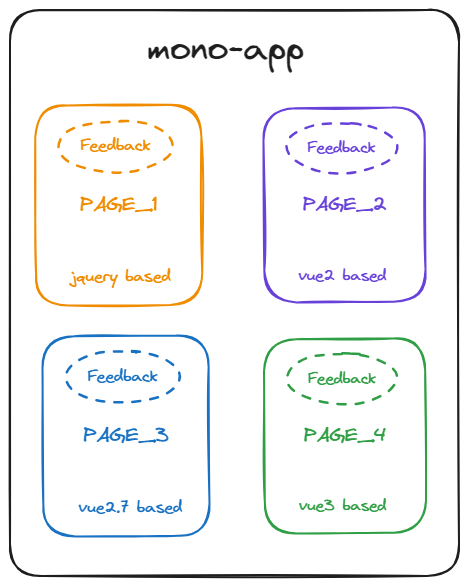
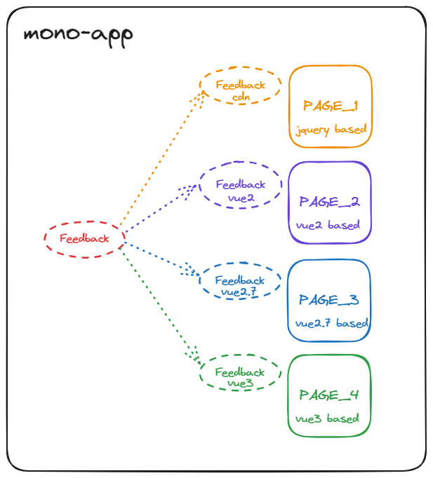
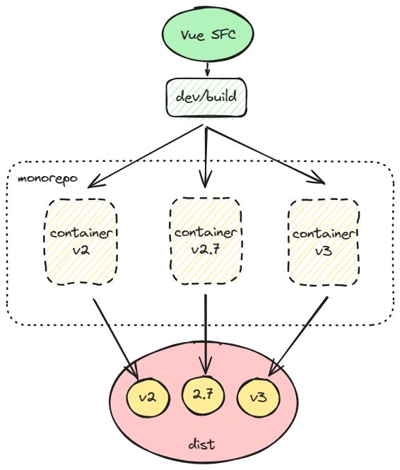

# Vue Universal Component Library Development

Open source code at <https://github.com/X-sky/vue-uni-component>

## Background

In daily `2B` business development, it's inevitable to encounter cross-version frameworks — or even cross-generation frameworks — within a single system. Take a project I previously worked on: it spanned `jQuery+LayUI`, `Vue 2`, `Vue 2.7`, and `Vue 3`. But as part of the same project, some business components inevitably overlap.

The traditional approach is to migrate existing business components to the new project. But consider this scenario: there's a universal component `FeedbackDialog` that has already been migrated and is used across all framework versions in the project. That means identical business logic exists in four different frameworks. Now when the product team requests an optimization of the feedback dialog, the development and testing costs are enormous — developers need to modify the component in four frameworks, and testers need to understand which parts of the system use which framework and test accordingly.



_A cross-framework monolith application_

If our `FeedbackDialog` component could avoid redundant development across different frameworks, both development and testing could save tremendous effort, as shown below:



_A cross-framework monolith application using universal components_

## Component Library Development

### Vue Component Library Principles

Before developing a component library, we need to understand two questions:

1. What is a component?
2. What is a component library?

Although we mostly play the role of "package consumer" during development, only by understanding these two questions can we know what we're building.

#### What is a Component?

The most common thing we work with daily is component development. But first, a clarification: component ≠ SFC. According to the `Vue` official [definition](https://vuejs.org/guide/scaling-up/sfc.html):

> SFC is a special file format that allows us to encapsulate the template, logic, and styling of a Vue component in a single file. Vue SFC is a framework-specific file format and must be pre-compiled by `@vue/compiler-sfc` into standard JavaScript and CSS.

Therefore, SFC is just one representation of a Vue component — JSX and render functions are others. But SFC is a great entry point for understanding components — it ultimately gets compiled into standard JavaScript. A compiled SFC is a standard ES module, and Vue's official site also provides an [SFC Playground](https://play.vuejs.org/) for a more intuitive view of how they're compiled.

So our first question — "What is a component?" — gets a clear answer:

**Nothing magic, just JavaScript**

#### What Happens During app.use?

When using various `Vue`-based plugins/components, we're familiar with this pattern:

```typescript
// From element-plus docs https://element-plus.org/zh-CN/guide/quickstart.html
// main.ts
import { createApp } from 'vue';
import ElementPlus from 'element-plus';
import 'element-plus/dist/index.css';
import App from './App.vue';

const app = createApp(App);

app.use(ElementPlus);
app.mount('#app');
```

Or the `Vue 2` version:

```javascript
// From element-ui docs https://element.eleme.cn/2.0/#/zh-CN/component/installation
import Vue from 'vue';
import ElementUI from 'element-ui';
import 'element-ui/lib/theme-chalk/index.css';
import App from './App.vue';

Vue.use(ElementUI);

new Vue({
  el: '#app',
  render: (h) => h(App)
});
```

So what exactly does `.use()` do? Checking the [Vue 2 `.use` API](https://v2.vuejs.org/v2/api/#Vue-use) and the [Vue 3 `.use` API](https://vuejs.org/api/application.html#app-use), we can understand that the magical `.use` ultimately does one thing: install plugins.

`.use` accepts either an `Object` with an `install` method, or a `Function` that serves as the `install` method itself. The `install` method receives two parameters: the application instance `App` and plugin options `Options`. In `Vue 2`, the first parameter is the global `Vue` object.

Using `Vue 3` as an example, we can find the corresponding type definition in the [runtime-core source code](https://github.com/vuejs/core/blob/638a79f64a7e184f2a2c65e21d764703f4bda561/packages/runtime-core/src/apiCreateApp.ts#L158):

```ts
type PluginInstallFunction<Options = any[]> = Options extends unknown[]
  ? (app: App, ...options: Options) => any
  : (app: App, options: Options) => any;
```

So when we say "Vue component library development," this phrasing might be too specific. A more general description would be: Vue plugin development.

With that, our second question is also answered:

**A component library is a type of plugin**

### Common Build Tools

Currently, the popular bundling tools in the frontend community are mainly: [webpack](https://webpack.js.org/), [rollup](https://rollupjs.org/), and [esbuild](https://esbuild.github.io/). Recently, Rust-based bundlers like [rspack](https://www.rspack.dev/) and [rolldown](https://rolldown.rs/) have also emerged. However, due to ecosystem and stability concerns, they're not suitable for enterprise production. For the same reason, `esbuild` should also be ruled out — despite being very fast (built with `Go`), its ecosystem isn't mature enough and lacks flexibility for our upcoming project.

Although `webpack` should be the priority for stability, it's actually not ideal for component library bundling. Or rather, using `webpack` to bundle component libraries is cumbersome because `webpack` bundles all dependencies into the output by default, requiring many extra configurations to get proper distribution results.

Moreover, given the Vue ecosystem's development trend, embracing `vite` is almost inevitable, and `vite` is natively based on `rollup`. Therefore, `rollup` was chosen as the build tool.

### Approach Decision

Two paths lay before us when choosing an approach:

1. Dispatch mode
2. Adaptor mode

#### Dispatch Mode

> Develop using Vue SFC, compile through different version template compilers in the monorepo/container during the build phase. Each container outputs artifacts for different versions.

Theoretically, the template syntax differences between `Vue 2` and `Vue 3` aren't that large. `Vue 2.7` has built-in `setup` support, and `Vue 2` can also achieve syntax-level alignment through `@vue/composition-api` combined with `unplugin-vue2-script-setup`.



Advantages of this mode:

1. Lower development cost — no need to change existing development habits. Team members don't need to understand implementation details to develop
2. Compilation targets different versions, with some optimization mechanisms
3. Using different `containers` for distribution compilation makes customized configuration convenient
4. Isolates code for different `Vue` versions

Disadvantages:

1. Abandons reuse of other component libraries — all components must be built from scratch
2. Some syntactic sugar must be abandoned when referencing between components
3. If a future `Vue` version breaks the current SFC mode or introduces new features, the repository cannot continue updating (e.g., the `defineOptions` syntactic sugar isn't provided by `unplugin-vite-script-setup`, so we can only abandon it or submit a PR to that repository)

:::tip

Compared to my [demo](https://github.com/X-sky/vue-uni-component) example, there are now more mature open-source libraries using similar ideas. See [tiny-vue](https://github.com/opentiny/tiny-vue/blob/dev/README.md). Although it doesn't use `monorepo` for distribution, it uses a similar concept of compile-level distribution and transpilation for different `Vue` versions.

:::

#### Adaptor Mode

> Define a built-in adaptor-runtime syntax, develop using custom template syntax, and finally bundle a single set of artifacts with different version runtime-adaptors. In the application, use the adaptor to adapt to different Vue versions.

The initial idea was similar to the approach used when converting mini-programs to ArkUI — develop using Vue-like template syntax, separately develop an `adaptor-runtime` layer, and ultimately use different `runtimes` based on the user's `Vue` version.

Advantages:

1. No need for multiple compilations — multiple Vue versions use the same artifacts, further reducing business-layer code differences
2. The `runtime-adaptor` approach has **extremely strong extensibility**. Theoretically, this approach could even adapt to other component libraries like `element-plus`, or even other frameworks like `react`, achieving "write once, use everywhere"
3. Both the compilation layer and runtime are controlled internally by the component library, offering more control compared to the dispatch mode's delegation to `vue/template-compiler` and `runtime/core`

Disadvantages:

1. **Extremely high** development cost. The team needs to implement a `DSL`; if using standard `TSX`, team members need to learn `TSX`. Additionally, different `adaptor-runtimes` need to be implemented for different target outputs
2. The `runtime-adaptor` introduces runtime performance overhead

Undoubtedly, for independent development, building a universal component library in this mode is nightmare difficulty.

PS. By the time I saw [this article](https://juejin.cn/post/7243413934765916219#heading-0), the component library was already basically built using the dispatch mode. Moreover, the JSX transform mode it uses requires understanding both the differences between `Vue` versions and the `TSX` workflow and output, so it was never in the selection range.

#### Decision

Considering the component library's use cases, combined with team size and long-term maintenance complexity, the `dispatch mode` was ultimately chosen for development.

### Repository Structure

> Using `monorepo` to implement the `dispatch mode`

#### Multi-Version Template Compilation Support

When it comes to multi-version `Vue` support, `vue-demi` is unavoidable. `vue-demi` is a small utility developed by Vue core team member antfu that supports forwarding `Vue` code references. [VueUse](https://vueuse.org/) internally uses `vue-demi` to support multiple `Vue` versions.

However, since `vue-demi` only forwards `Vue` versions, pure JS library development (like `@vueuse/core`) doesn't need to worry about _template parser conflicts_. Component library development, however, must address this issue because different `Vue` versions use different template compilers:

- vue3.x: vue/compiler-sfc
- vue2.7.x: vue/compiler-sfc@2.7
- vue2.x: vue-template-compiler

Predictably, even using `render` functions, we can't avoid version issues. So it's better to solve this problem at the compilation stage. Using `pnpm`'s `monorepo` mode, we can create three different `Vue` repositories, each with their own `package.json` and `vite.config.ts` configurations, compiling component artifacts for multiple Vue versions.

- containers/v2 -> @vue-uni-ui/v2
- containers/v2.7 -> @vue-uni-ui/v2.7
- containers/v3 -> @vue-uni-ui/v3

By configuring `resolve.alias` in `vite.config.ts`, we manually map `vue` and `vue-demi` versions to the corresponding repositories. For example, the alias configuration in `containers/v3`'s `vite.config.ts`:

```js
export default {
  resolve: {
    alias: {
      vue: resolve(
        __dirname,
        'node_modules/vue3/dist/vue.runtime.esm-browser.js'
      ),
      'vue-demi': resolve(ROOT_DIR, 'node_modules/vue-demi/lib/v3/index.mjs')
    }
  }
};
```

Theoretically, this achieves container isolation for different versions.

However, there's a potential issue: `vue-template-compiler`'s `vue` dependency isn't explicitly specified in `peerDependencies`. Because the `vue` version must **exactly match** the `vue-template-compiler` version, `vue-template-compiler` only performs a check at the top of its `index.js`:

```js
try {
  var vueVersion = require('vue').version;
} catch (e) {}

var packageName = require('./package.json').name;
var packageVersion = require('./package.json').version;
if (vueVersion && vueVersion !== packageVersion) {
  var vuePath = require.resolve('vue');
  var packagePath = require.resolve('./package.json');
  throw new Error(
    '\n\nVue packages version mismatch:\n\n' +
      '- vue@' +
      vueVersion +
      ' (' +
      vuePath +
      ')\n' +
      '- ' +
      packageName +
      '@' +
      packageVersion +
      ' (' +
      packagePath +
      ')\n\n' +
      'This may cause things to work incorrectly. Make sure to use the same version for both.\n' +
      'If you are using vue-loader@>=10.0, simply update vue-template-compiler.\n' +
      'If you are using vue-loader@<10.0 or vueify, re-installing vue-loader/vueify should bump ' +
      packageName +
      ' to the latest.\n'
  );
}
```

This means that if multiple `vue` repositories are installed, the `vue` package actually referenced by `vue-template-compiler` is uncontrollable. With `pnpm`, since `vue-template-compiler` has no internal dependency declaration, `pnpm-lock.yaml` has no related dependency binding, so `require('vue')` entirely depends on the vue version in the `.pnpm` store. My testing showed that Windows basically throws errors while Mac doesn't. But development environments can't rely on luck. You can use `pnpm`'s [pnpm.packageExtensions](https://pnpm.io/package_json#pnpmpackageextensions) setting to force dependencies. Add the following code to the root `package.json` to add a dependency to `vue-template-compiler`:

```json
"pnpm": {
  "packageExtensions": {
    "vue-template-compiler": {
      "peerDependencies": {
        "vue": "~2.6.14"
      }
    }
  }
}
```

Note: The `~2.6.14` here must match the `vue-template-compiler` version in `containers/v2`.

Additionally, we modify the related `VUE_LIB` code in `path.ts`, mapping `alias` to the internal `vue` of `containers` and mapping `vue-demi` directly to the corresponding `vue-demi/lib` internal `index.mjs`. This achieves complete dependency decoupling. The root-level `vue` is only responsible for `@vue-uni-components` related repository development, while `dev` and `build` are handled by `containers`' internal dependencies.

#### Style Support

By compiling corresponding templates within different containers, we can already compile `style` files through the corresponding compiler. There are typically two issues when designing component library styles:

1. How to design unified styles to:
   1. Facilitate style sharing between components
   2. Ensure component styles aren't affected by external CSS resets
2. How to design the structure so users can customize styles

Currently, mainstream component library style designs all affect the global scope. For example:

- `Vuetify`'s [\_reset.scss](https://github.com/vuetifyjs/vuetify/blob/master/packages/vuetify/src/styles/generic/_reset.scss)
- `element-plus`'s [reset.scss](https://github.com/element-plus/element-plus/blob/dev/packages/theme-chalk/src/reset.scss)
- `arco-design`'s [normalize.less](https://github.com/arco-design/arco-design-vue/blob/main/packages/web-vue/components/style/normalize.less)

These component libraries are used globally and may be mutually exclusive. `Vuetify` provides corresponding SCSS variables for manually disabling the reset.

However, given the use case of our Vue universal component library, global `reset-css` may not be usable, so we also need to consider providing configuration options to determine whether reset is needed during usage.

Additionally, the above libraries all use CSS variables for unified component styling and custom theme settings during usage.

- `Vuetify`
- [arco-design](https://arco.design/react/docs/theme)

But there are several drawbacks:

1. Cannot integrate with JS. If the UI involves chart libraries like `echarts`, theme color variables must be additionally maintained in JS
2. Overwriting and resetting involve multiple configurations, and `Vuetify` even has two sets of theme colors (`config` and `scss`) to maintain
3. If you want to use the component library's design specifications (like palette, font specs, etc.) without using the components themselves, you must dive into `node_modules` or **source code** to understand each CSS variable name

Therefore, we consider a workflow:

1. During development, define CSS variables through JS, and use variable names internally in components
2. During usage, register CSS variables during hook initialization while exposing variables for libraries like `echarts`. With TypeScript support, variable name hints can even be provided

## Component Library Debugging

### Source Code Debugging

The three scripts `pnpm dev:3`, `pnpm dev:27`, and `pnpm dev:2` can run simultaneously. Within each `container`, `resolve` will resolve dependencies to the correct addresses.

Note: When writing test cases and during development, some syntax differs between `Vue 2` and `Vue 3` parsing, so more universal syntax is needed. For example, **two-way attribute binding**: in `Vue 2`, the template syntactic sugar is `:visible.sync`; in `Vue 3`, it's `v-model:visible`. Therefore, the universal approach is:

```vue
<script>
import { ref } from 'vue-demi';
const visible = ref('false');
const updateVisible = (v) => {
  visible.value = v;
};
</script>
<template>
  <uni-dialog :visible="visible" @update:visible="updateVisible"> </uni-dialog>
</template>
```

If we need to hand-write a test component inside the `container` every time, including `CDN` debugging, we'd need to write nearly identical components four times. Therefore, using the _universal syntax_ above, we can consider adding a test component repository `@vue-uni-ui/components-test`. Write test components in this repository, then remove each container's dependency on `@vue-uni-ui/components` in `containers`, replacing it with the test repository dependency, and reference the corresponding test components. We also need to supplement scripts to automatically create corresponding test component templates during `ui:create`, avoiding the mental burden of manual creation.

::: details About `@vue-uni-ui/components-test`

Although the `ui:create` command was added for automated creation to reduce mental burden during subsequent development, in practice, developers may not follow the development documentation. Over-reliance on script commands is also a bad practice in team collaboration. Perhaps commit-time validation or simplified development workflows are needed to prevent different developers from leaving completely different project structures.

After integrating `unit-test` and `e2e test`, the `components-test` package will be removed from the codebase.

:::

### Artifact Debugging

This debugging is only needed during the development phase. Theoretically, once the framework is set up, not every artifact needs to be debugged. As long as compilation succeeds, all artifacts will contain the same business logic.

#### mjs

`link:local` script. First link the corresponding dependencies inside the artifact, then globally link the corresponding dependencies.

#### CDN

CDN artifact debugging is relatively simpler. After `pnpm build`, execute `pnpm dev:cdn`. The `pnpm dev:cdn` command automatically copies `iife.js`, `style.css`, and other files to the corresponding folders and runs `vite` for debugging. Debug multiple version artifacts by commenting different versions of `vue` and their corresponding content in the `cdn-playground/index.html` file.

⚠Attention: In CDN mode debugging, custom components have two caveats, which are also [HTML standard limitations](https://v2.vuejs.org/v2/style-guide/#Self-closing-components-strongly-recommended):

- Self-closing tags cannot be used

```html
<!-- Works, but only renders the first custom component -->
<uni-template />
<!-- Won't work -->
<uni-dialog />
```

- PascalCase component names cannot be used

```html
<!-- HTML will convert the component name by default, equivalent to unitemplate. Since our registered name is UniTemplate, both UniTemplate and uni-template work. But unitemplate won't match -->
<UniTemplate />
```

## Issue Log

### About Modularization

```javascript
// exportLib.js export
const foo = () => {};
export { foo };
// Usage
import { foo } from 'exportLib.js';
foo();
// Usage 2
import * as exportLib from 'exportLib.js';
exportLib.foo();
```

```javascript
// Export
const foo = () => {};
export { foo };
export default {
  foo
};
// Usage
import exportLib, { foo } from 'exportLib.js';
exportLib.foo === foo; // true
```

With the first approach, imports become somewhat verbose. But with the second export approach, when exporting as CDN or UMD, accessing the overall object requires using `.default`:

```html
<script src="./exportLib.iife.js"></script>
<script>
  __GLOBAL_EXPORT_LIB__.default.foo();
  __GLOBAL_EXPORT_LIB__.foo();
</script>
```

So we optimize based on the first export approach:

```javascript
// exportLib.js export
const foo = () => {};
const defaultExport = {
  foo
};
export { defaultExport as default, foo };
// Usage
import exportLib, { foo } from 'exportLib.js';
foo();
```

Of course, this means `import * as exportLib from 'exportLib.js'` will include `default`. There's no way to accommodate everything — optimization must be based on specific use cases.

### About Creating Service-Style Components

Vue 2 and Vue 3 have different render modes. `Vue 3` has a corresponding appContext for each component, and you can create custom rendering through [customRender](https://vuejs.org/api/custom-renderer.html#createrenderer). `element-plus`'s [MessageBox](https://github.com/element-plus/element-plus/blob/dev/packages/components/message-box/src/messageBox.ts) uses this approach, mounting components via the `render` function when called through API. (`render` is a function created internally by `Vue` using `createRenderer`).

However, `Vue 2`'s single-instance mode means it won't have `appContext` or APIs like `render`. Therefore, new instances can only be created through `Vue.extend(comp)`. As a result, the `useComponentService` function in our `util` must use `vue-demi`'s `isVue2` field for conditional logic, causing output code redundancy.
