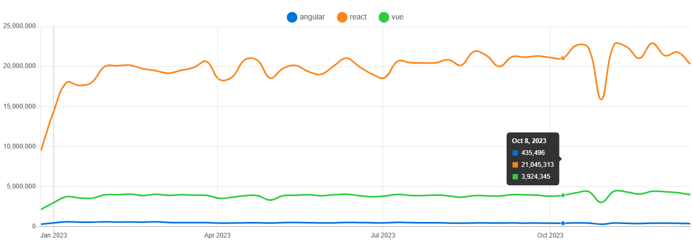
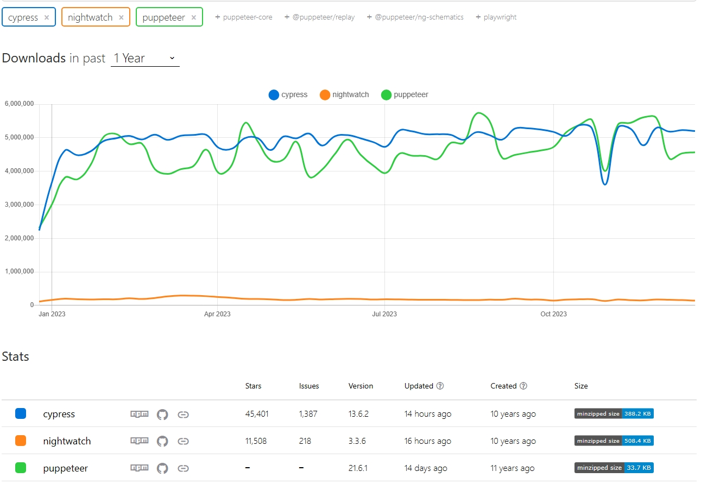

# Frontend Automated Testing

::: tip Wiki

In software testing, automated testing refers to the process of using software separate from the software under test to automatically execute tests, compare actual results with expected results, and generate test reports. Once the testing process is established, test automation can automatically perform some repetitive but necessary testing work. It can also accomplish tests that are nearly impossible to do manually. For continuous delivery and continuous integration development approaches, test automation is crucial.

:::

For developers, _unit testing_ and _test coverage_ are important means of ensuring code quality, and during the testing process, _automated testing_ is the most efficient method.

From the perspective of testing form, tests are divided into:

- Black-box testing (only concerned with input and output)
- White-box testing (concerned with specific code logic)

From the perspective of testing levels, tests are divided into three dimensions:

- Unit Testing (UT) — typically verifies functions, methods, classes, etc.
- Component Testing (CT) — typically verifies the functionality and correctness of individual components
- Integration Testing (IT) — verifies the collaborative work between different components, modules, or services

[Vue official docs](https://vuejs.org/guide/scaling-up/testing.html#testing) divide testing into three levels:

- Unit Testing
- Component Testing
- End-to-End Testing

This classification basically aligns with our discussion above. The addition of end-to-end testing is because unit and component testing have limited coverage, while E2E can test what actually happens when users use the application.

## Unit Testing & Integration Testing

> Unit tests are written to verify that small, isolated units of code work as expected. A unit test typically covers a single function, class, composable, or module. Unit tests focus on logical correctness and only concern a small part of the application's overall functionality.

In automated testing, unit testing is considered a form of _white-box testing_. That is, the test case writer needs complete understanding of the code logic.

**Unit tests** verify that a specific aspect of a function works correctly.

**Test cases** generally refer to a group of unit tests. Good test cases consider the various inputs a function might receive.

**Full coverage tests** include a complete set of unit tests covering all possible ways a function can be used.

For large projects, full coverage testing can be difficult. Therefore, initially it's sufficient to write tests for the most important code, and consider full coverage when the project is widely used.

### What to Do When Tests Fail

1. Check the test conditions. If the conditions are correct, the code has a bug — don't modify the unit test; fix the code that doesn't meet expectations.
2. If there are new feature iterations, supplement the corresponding unit tests with new scenarios after completion.

Only modify related business test cases when **business behavior changes are confirmed**.

### How to Perform Unit Testing

Common test runners:

1. [Jest (Star 43.1k)](https://jestjs.io/)
2. [vitest (Star 10.9k)](https://vitest.dev/)
3. [Mocha (Star 22.3k)](https://mochajs.org/)



Test runners provide the execution environment and runtime features, relying on assertion APIs (`assertions`) for assertion testing.

Unit testing libraries generally have built-in `assertion APIs`. For example, `Jest` independently implements [Jest expect](https://jestjs.io/docs/expect) [(Source Code)](https://github.com/jestjs/jest/blob/2f5ace515455ce0211605a4c835b4491348fbaf5/packages/expect/src/index.ts#L102) for assertions; `vitest` uses [`Chai`](https://www.chaijs.com/api/) as its assertion library while being compatible with `Jest expect`; and `Mocha` can even [use any assertion library](https://mochajs.org/#assertions).

#### Assertion Styles

Using [`Chai`](https://www.chaijs.com/api/) as an example, it supports two assertion styles:

##### BDD

> Behavior-Driven Development. This is also the style used by `Jest expect` assertions. It uses a series of chainable `assert APIs` in a near-natural-language way to describe expected behavior and code output.

```javascript
// Jest expect
// expect(variable).modifiers.matchers
expect(foo).not.toBe('coconut');
```

```javascript
// BDD style example in Chai
var expect = require('chai').expect,
  foo = 'bar',
  beverages = { tea: ['chai', 'matcha', 'oolong'] };

expect(foo).to.be.a('string');
expect(foo).to.equal('bar');
expect(foo).to.have.lengthOf(3);
expect(beverages).to.have.property('tea').with.lengthOf(3);
```

##### assert

> Similar to `node.js`'s `assert` package, exposed through the `assert` interface. Provides the classic `assert.` approach.

```javascript
// assert style example in Chai
var assert = require('chai').assert,
  foo = 'bar',
  beverages = { tea: ['chai', 'matcha', 'oolong'] };

assert.typeOf(foo, 'string'); // without optional message
assert.typeOf(foo, 'string', 'foo is a string'); // with optional message
assert.equal(foo, 'bar', 'foo equal `bar`');
assert.lengthOf(foo, 3, 'foo`s value has a length of 3');
assert.lengthOf(beverages.tea, 3, 'beverages has 3 types of tea');
```

#### Unit Testing Workflow

Includes two steps: test case design and test case execution.

##### Building Test Cases

Using `Jest` as an example, a unit test generally consists of:

1. Test block
2. Assertions

A test block is a `test` function call. The `test` function accepts three parameters in order:

1. `name` — the unit test description
2. `fn` — the unit test execution, which can contain multiple assertion statements
3. [`timeout`] — optional timeout option, defaults to 5s

```javascript
import { expect, test } from '@jest/globals';
test('did not rain', () => {
  expect(inchesOfRain()).toBe(0);
});
```

:::tip

You may see `it` calls in some code. `it` is just an alias for `test`, with only semantic differences.

:::

You can use `describe` to wrap a group of unit tests into a test suite:

```javascript
const myBeverage = {
  delicious: true,
  sour: false
};

describe('my beverage', () => {
  test('is delicious', () => {
    expect(myBeverage.delicious).toBeTruthy();
  });

  test('is not sour', () => {
    expect(myBeverage.sour).toBeFalsy();
  });
});
```

::: info Conclusion

Unit testing is typically suitable for independent business logic, components, classes, modules, or functions that don't involve UI rendering, network requests, or other environmental concerns — these are usually pure JavaScript/TypeScript modules unrelated to Vue. But there are two cases where you must unit test Vue-specific features:

1. Composables
2. Components

These will be covered in detail in the [Component Library Testing Workflow](#component-library-testing-workflow) section.

:::

##### Executing Test Cases

Simply run `jest` from the command line to automatically run all files ending with `.test.{t|j}s` or `.spec.{t|j}s`. You can also execute commands based on [configuration options](https://jestjs.io/docs/cli).

## End-to-End Testing (E2E Test)

> E2E testing, or end-to-end testing, is a software testing method that falls under black-box testing. It simulates real user scenarios, relying entirely on browsing the entire page in a real browser to test the application. Its testing focus is on multi-page application behavior, targeting network requests in production environments.

End-to-end testing doesn't import any Vue application code and validates based on the browser. It can typically catch issues with routing, state management libraries, top-level components (commonly App or Layout), public resources, or any request handling.

Common tools:

1. [Cypress (Star 45.4k)](https://docs.cypress.io/guides/overview/why-cypress)
2. [NightWatch (Star 11.5k)](https://nightwatchjs.org/)
3. [Puppeteer (Star 85.4k)](https://pptr.dev/)



## Component Library Testing Workflow

When combined with component-oriented frameworks like `Vue` and `React` in the frontend domain, automated testing often becomes complex and ambiguous. Therefore, in practice, multiple aspects need to be considered for automated testing design.

When we talk about unit testing in daily work, it actually encompasses unit testing, component testing, and integration testing in frontend development. At the same time, due to the complexity of business components, multiple testing approaches often need to work together.

Using a `vite` + `vue3` project as an example, when designing unit tests, we must consider test case design for `composables` and `components`.

- For simple functions, methods, and classes, we perform unit testing: via `Jest` or `Vitest` etc.
- For component logic, we perform component testing: via `Vitest` or `Cypress` etc.
- If business workflow testing is needed, E2E testing solutions should also be supplemented

### Test Case Design

When designing test cases, consider four aspects:

1. Default behavior
2. Edge cases of default behavior
3. Combined behavior
4. Edge cases of combined behavior

### Test Cases

After installing `vitest`, for composables or regular functions and classes, testing is as simple as:

```javascript
// useCalc.ts
import { ref } from 'vue';
function useCalc() {
  const num = ref(0);
  const increase = () => {
    num.value++;
  };
  const decrease = () => {
    num.value--;
  };
  return {
    num,
    increase,
    decrease
  };
}

// useCalc.test.ts
import { test, expect } from 'vitest';
import { useCalc } from './index';

test('useCalc hook test', () => {
  const { num, increase, decrease } = useCalc();
  expect(num.value).toBe(0);
  increase();
  expect(num.value).toBe(1);
  decrease();
  expect(num.value).toBe(0);
});
```

For a simple component, you can use `@vue/test-utils` for testing. Since component testing requires mounting logic, the `jsdom` library is needed for simulation, and it must be [configured](https://vitest.dev/config/#environment) in `vitest`:

```vue
<script lang="ts" setup>
// UniTemplate.vue
import { computed, version } from 'vue';
import { useCalc, useUniTheme } from '@vue-uni-ui/utils';

const props = withDefaults(
  defineProps<{
    msg: string;
  }>(),
  {
    msg: 'Hello'
  }
);
const { num, increase, decrease } = useCalc();

const title = computed(() => `${props.msg}, Vue@${version}`);
</script>
<template>
  <div class="uu-template">
    <h1 class="uu-template__header">
      {{ title }}
    </h1>
    <div>
      <button @click="increase" data-test="increase">+</button>
      <span data-test="num">{{ num }}</span>
      <button @click="decrease" data-test="decrease">-</button>
    </div>
  </div>
</template>
```

The corresponding test code:

```javascript
// index.test.ts
/**
 * @vitest-environment jsdom
 */
describe('test UniTemplate', () => {
  const incBtnSelector = '[data-test=increase]';
  const decBtnSelector = '[data-test=decrease]';
  const numContentSelector = '[data-test=num]';
  test('test default', async () => {
    const wrapper = mount(UniTemplate);
    const title = wrapper.find('.uu-template__header');
    const incBtn = wrapper.find(incBtnSelector);
    const decBtn = wrapper.find(decBtnSelector);
    const num = wrapper.find(numContentSelector);
    // default show hello
    expect(title.text()).toContain('Hello');
    expect(parseInt(num.text())).toBe(0);
    await incBtn.trigger('click');
    expect(parseInt(num.text())).toBe(1);
    await decBtn.trigger('click');
    expect(parseInt(num.text())).toBe(0);
  });
  test('test with props', () => {
    const testMsg = 'test message';
    const wrapper = mount(UniTemplate, {
      props: {
        msg: testMsg
      }
    });
    expect(wrapper.text()).toContain(testMsg);
  });
});
```

This completes a simple interactive component test. Of course, a component may also have slots, event emitting, and other inter-component interaction events, but they basically won't stray from the testing trio: `describe`, `test`, `expect`.

### About vitest

In the example `monorepo` project, since different `Vue` versions have different usage patterns, after introducing `vitest`, `Vue 3` tests passed normally but `Vue 2` tests failed. This issue can be reproduced in another [universal component library template](https://github.com/X-sky/vue-uni-component) for `Vue 2` and `Vue 3`. That repository uses the `resolve` approach to redirect `vue` and `vue-demi` to different `containers`, solving compilation errors.

For unit testing, since it depends on template compilation, the template compilation testing library `@vue/test-utils` also needs to be redirected to different `containers` based on the `Vue` version to avoid conflicts and compilation errors.

Theoretically, at this point, running `vitest` should enable single-codebase unit testing for both `Vue 2` and `Vue 3` versions. However, running `vitest run` actually produces the error `SyntaxError: The requested module 'vue' does not provide an export named 'default'`. This error frequently appeared during multi-version `Vue` component library development in `monorepo`. Clearly, the `resolve` dependency isn't taking effect — when `import Vue from 'vue'`, it's not using the corresponding `vue` from the `container`.

`vitest` relies on `vite` under the hood to start services, so dependency resolution should theoretically follow `vite`'s logic. But `vite dev` works normally. Therefore, we can conclude that `vitest` uses a different dependency resolution approach than `vite dev`. `vitest`'s `node_modules` dependency resolution doesn't follow `vite`'s configuration.

Checking the `vitest` documentation on [external dependency resolution](https://vitest.dev/config/#server-deps-external) reveals that `vitest`'s underlying runtime logic doesn't resolve external dependencies but passes them directly to `node` for resolution. Examining the [vitest source code](https://github.com/vitest-dev/vitest/blob/413ec5e6fc0addb2216db6104228138f8027f392/packages/vitest/src/node/config.ts#L204) also shows that `vitest` doesn't directly call `vite` during resolution but uses `vitenode`. To fix this inconsistency, simply specify dependencies that need special `vite` resolution in `server.deps.inline`:

```typescript
// vite.config.ts
export default {
  test: {
    server: {
      deps: {
        inline: ['vue', 'vue-demi']
      }
    }
  }
};
```

Related code examples can be found at [vue-uni-ui](https://github.com/X-sky/vue-uni-component/tree/unit-test).
