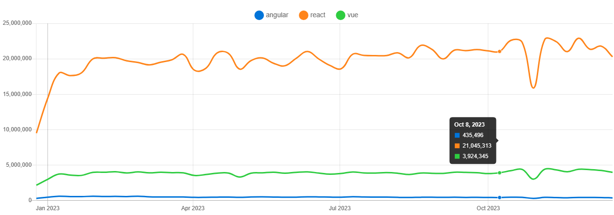

# 前端自动化测试

::: tip Wiki

在软件测试中，自动化测试指的是使用独立于待测软件的其他软件来自动执行测试、比较实际结果与预期并生成测试报告这一过程。在测试流程已经确定后，测试自动化可以自动执行的一些重复但必要的测试工作。也可以完成手动测试几乎不可能完成的测试。对于持续交付和持续集成的开发方式而言，测试自动化是至关重要的

:::

对于研发人员来说，_单元测试_ 和 _测试覆盖率_ 是保证自身代码质量的重要手段，而在进行测试过程中，_自动化测试_ 又是效率最高的一种方法。

从测试形式来看，测试又分为

- 黑盒测试 (只关心输入输出)
- 白盒测试 (关心具体代码逻辑)

从测试层次来看，测试分为以下三种维度：

- 单元测试 UT (通常验证函数、方法、类等)
- 组件测试 CT (通常验证单个组件地功能性和正确性)
- 集成测试 IT (验证不同组件、模块或服务之间地协同工作)

[Vue 官方](https://vuejs.org/guide/scaling-up/testing.html#testing) 把测试分为了三个层次

- 单元测试
- 组件测试
- 端到端测试

这种分类与我们上方讨论的分类基本吻合。之所以多了一个端到端测试，是因为单元测试和组件测试的覆盖能力有限，而 E2E 可以测试当用户实际使用应用时发生了什么

## 单元测试（Unit）与 集成测试 (Integration)

> 编写单元测试是为了验证小的、独立的代码单元是否按预期工作。一个单元测试通常覆盖一个单个函数、类、组合式函数或模块。单元测试侧重于逻辑上的正确性，只关注应用整体功能的一小部分

在自动化测试中，单元测试被认为是 _白盒测试_ 的一种。即测试用例的编写者，需要对代码逻辑有完全的掌握。

**单元测试**用于核实函数的某个方面没有问题。

**测试用例**一般指的是一组单元测试，良好的测试用例考虑到了函数可能收到的各种输入。

而**全覆盖的测试**用例包含一整套单元测试，涵盖了各种可能的函数使用方式

对于大型项目，全覆盖测试可能很难。因此通常，最初只要针对代码的重要性为进行编码测试即可，等项目广泛使用时再考虑全覆盖。

### 测试未通过怎么办

1. 查看检查条件，如果条件正确，则代码有误，不要修改单元测试，而应修复不符合预期的代码表现。
2. 如果有新功能的迭代，修改完成后在对应单元测试中补充新的情况

如果**确定业务表现需要变更**，再进行相关业务测试用例的修改

### 如何进行单元测试

常用测试库 (test runner)

1. [Jest (Star 43.1k)](https://jestjs.io/)
2. [vitest (Star 10.9k)](https://vitest.dev/)
3. [Mocha (Star 22.3k)](https://mochajs.org/)



test runner 提供了运行环境与运行时特性，依赖断言 api `assertions` 进行断言测试

单元测试库一般内置了 `断言API(assertions)` ，比如 `Jest` 内部单独实现了 [Jest expect](https://jestjs.io/docs/expect) [(Source Code)](https://github.com/jestjs/jest/blob/2f5ace515455ce0211605a4c835b4491348fbaf5/packages/expect/src/index.ts#L102) 进行断言操作；`vitest` 使用 [`Chai`](https://www.chaijs.com/api/) 作为断言库，同时兼容了 `Jest expect`；而 `Mocha` 更是可以[自定义使用任何断言库](https://mochajs.org/#assertions)。

#### 断言风格

以 [`Chai`](https://www.chaijs.com/api/) 为例，支持两种风格的断言

##### BDD

> Behavior-Driven Development aka 行为驱动开发。也是 `Jest expect` 断言采用的风格。通过近似自然语言的方式，使用一系列可链式调用的 `assert api` 来描述期望的表现以及代码的输出

```javascript
// Jest expect
// expect(variable).modifiers.matchers
expect(foo).not.toBe('coconut');
```

```javascript
// chai 中 BDD style 的示例代码
var expect = require('chai').expect,
  foo = 'bar',
  beverages = { tea: ['chai', 'matcha', 'oolong'] };

expect(foo).to.be.a('string');
expect(foo).to.equal('bar');
expect(foo).to.have.lengthOf(3);
expect(beverages).to.have.property('tea').with.lengthOf(3);
```

##### assert

> 与 `node.js` 的 `assert` 包类似，通过 `assert` 接口暴露。提供了经典的 `assert.` 方式

```javascript
// chai 中 assert style 的示例代码
var assert = require('chai').assert,
  foo = 'bar',
  beverages = { tea: ['chai', 'matcha', 'oolong'] };

assert.typeOf(foo, 'string'); // without optional message
assert.typeOf(foo, 'string', 'foo is a string'); // with optional message
assert.equal(foo, 'bar', 'foo equal `bar`');
assert.lengthOf(foo, 3, 'foo`s value has a length of 3');
assert.lengthOf(beverages.tea, 3, 'beverages has 3 types of tea');
```

#### 单元测试流程

包含用例设计与用例执行两个步骤。

##### 构建测试用例

以 `Jest` 为例，一个单元测试一般由一下几个部分组成

1. 单元测试块 (block)
2. 断言 (assertions)

单元测试块即一个 `test` 函数调用，`test` 函数依次接收三个参数：

1. `name` 作为单元测试描述
2. `fn` 作为单元测试执行，内部可以包含多个 断言语句 `assertions`
3. [`timeout`] 可选的超时选项，默认为 5s

```javascript
import { expect, test } from '@jest/globals';
test('did not rain', () => {
  expect(inchesOfRain()).toBe(0);
});
```

:::tip

部分代码中可能出现 `it` 调用，`it` 只是 `test` 函数的一个别名，只有语义上的区别

:::

可以用 `describe` 可以将一组单元测试包裹进来形成一个测试用例

```javascript
const myBeverage = {
  delicious: true,
  sour: false
};

describe('my beverage', () => {
  test('is delicious', () => {
    expect(myBeverage.delicious).toBeTruthy();
  });

  test('is not sour', () => {
    expect(myBeverage.sour).toBeFalsy();
  });
});
```

::: info Conclusion

单元测试通常适用于独立的业务逻辑、组件、类、模块或函数，不涉及 UI 渲染、网络请求或其他环境问题，这些通常是与 Vue 无关的纯 JavaScript/TypeScript 模块。但有两种情况，你必须对 Vue 的特定功能进行单元测试：

1. 组合式函数
2. 组件

在 [组件库测试流程](#组件库测试流程) 中将会详细展开

:::

##### 执行测试用例

直接命令行运行 `jest` 即可自动运行所有 `.test.{t|j}s` 或 `.spec.{t|j}s` 结尾的文件，也可以根据 [配置项](https://jestjs.io/docs/cli) 执行命令

## 端对端测试（E2E Test）

> E2E 测试，或者端到端测试，是一种软件测试方法，属于黑盒测试的一种。它模拟了用户使用时的真实场景，完全依靠在真实浏览器中浏览整个页面来测试应用。其测试的重点是多页面的应用表现，针对应用在生产环境下进行网络请求。

端到端测试不导入任何 Vue 应用的代码，基于浏览器进行验证。通常可以捕捉到路由、状态管理库、顶级组件（常见为 App 或 Layout）、公共资源或任何请求处理方面的问题

常用工具

1. [Cypress (Star 45.4k)](https://docs.cypress.io/guides/overview/why-cypress)
2. [NightWatch (Star 11.5k)](https://nightwatchjs.org/)
3. [Puppeteer (Star 85.4k)](https://pptr.dev/)


## 组件库测试流程

如果在前端领域，与 `Vue` `React` 等面向组件的框架结合起来，自动化测试又往往会变得复杂而模糊。因此在实际操作中往往需要考虑多个方面进行自动化测试的设计。

当我们日常在说单元测试时，其实是涵盖了前端开发中的单元测试、组件测试以及集成测试的。与此同时，由于业务组件具有复杂性，所以往往需要通过多种方式协同测试。

以一个基于 `vite` + `vue3` 的项目为例。我们在设计单元测试时，就必须考虑到 `组合式函数` 和 `组件` 的测试用例设计。

- 对于简单的函数、方法、类，我们进行单元测试: via `Jest` or `Vitest` etc.
- 对于组件逻辑，我们进行组件测试：via `Vitest` or `Cypress` etc.
- 如果需要进行业务流程上的测试，还需要补充 E2E 测试方案

### 用例设计

在设计用例的时候需要从四个方面考虑设计：

1. 默认行为
2. 默认行为的边界情况
3. 组合行为
4. 组合行为的边界情况

### 测试用例

在安装了 `vitest` 后，针对组合式函数或者普通的函数、类等，只需要进行类似如下代码即可进行测试

```javascript
// useCalc.ts
import { ref } from 'vue';
function useCalc() {
  const num = ref(0);
  const increase = () => {
    num.value++;
  };
  const decrease = () => {
    num.value--;
  };
  return {
    num,
    increase,
    decrease
  };
}

// useCalc.test.ts
import { test, expect } from 'vitest';
import { useCalc } from './index';

test('useCalc hook test', () => {
  const { num, increase, decrease } = useCalc();
  expect(num.value).toBe(0);
  increase();
  expect(num.value).toBe(1);
  decrease();
  expect(num.value).toBe(0);
});
```

而对于一个简单组件，则可以利用 `@vue/test-utils` 进行测试，由于测试组件需要挂载逻辑，因此需要 `jsdom` 库进行模拟，并在 `vitest` 中进行 [配置](https://vitest.dev/config/#environment)

```vue
<script lang="ts" setup>
// UniTemplate.vue
import { computed, version } from 'vue';
import { useCalc, useUniTheme } from '@vue-uni-ui/utils';

const props = withDefaults(
  defineProps<{
    msg: string;
  }>(),
  {
    msg: 'Hello'
  }
);
const { num, increase, decrease } = useCalc();

const title = computed(() => `${props.msg}, Vue@${version}`);
</script>
<template>
  <div class="uu-template">
    <h1 class="uu-template__header">
      {{ title }}
    </h1>
    <div>
      <button @click="increase" data-test="increase">+</button>
      <span data-test="num">{{ num }}</span>
      <button @click="decrease" data-test="decrease">-</button>
    </div>
  </div>
</template>
```

对应的测试代码如下

```javascript
// index.test.ts
/**
 * @vitest-environment jsdom
 */
describe('test UniTemplate', () => {
  const incBtnSelector = '[data-test=increase]';
  const decBtnSelector = '[data-test=decrease]';
  const numContentSelector = '[data-test=num]';
  test('test default', async () => {
    const wrapper = mount(UniTemplate);
    const title = wrapper.find('.uu-template__header');
    const incBtn = wrapper.find(incBtnSelector);
    const decBtn = wrapper.find(decBtnSelector);
    const num = wrapper.find(numContentSelector);
    // default show hello
    expect(title.text()).toContain('Hello');
    expect(parseInt(num.text())).toBe(0);
    await incBtn.trigger('click');
    expect(parseInt(num.text())).toBe(1);
    await decBtn.trigger('click');
    expect(parseInt(num.text())).toBe(0);
  });
  test('test with props', () => {
    const testMsg = 'test message';
    const wrapper = mount(UniTemplate, {
      props: {
        msg: testMsg
      }
    });
    expect(wrapper.text()).toContain(testMsg);
  });
});
```

这样我们就完成了一个最简单的带交互的组件测试。当然一个组件还会有插槽 (slot)、事件传递 (Event Emit) 等组件间交互事件，但基本不会离开所谓的测试三大件 `describe` `test` `expect`

### 关于 vitest

在示例的`monorepo`项目中，由于 `vue` 的版本不同，使用方式也不同，因此在引入 `vitest` 之后，出现了 `vue3` 可以正常通过，但是 `vue2` 没办法通过的问题。这个问题在另一个 `vue2` 和 `vue3` [通用的组件库模板](https://github.com/X-sky/vue-uni-component) 中可以得到复现。该仓库使用 `resolve` 的方式，将 `vue` 和 `vue-demi` 引流至不同的 `container` 下面，解决了编译错误的问题。

而对于单元测试，由于依赖模板编译，因此对于模板编译测试库 `@vue/test-utils` 也需要根据 `vue` 的版本将其引流至不同的 `container` 下面，避免冲突和编译错误

理论上到此应该可以直接通过运行 `vitest` 实现一套代码对 `vue2` 和 `vue3` 版本的单元测试。但是实际上运行 `vitest run` 的时候会出现错误 `SyntaxError: The requested module 'vue' does not provide an export named 'default'`。这个错误在开发 `monorepo` 下多版本 `vue` 组件库的时候曾经频繁出现过。很明显是 `resolve` 依赖没有生效。在 `import Vue from 'vue'` 的时候，没有使用 `container` 下面对应的 `vue`。

`vitest` 底层是依赖 `vite` 启动服务的，因此解析依赖理论上也应该遵从 `vite` 的逻辑。但是 `vite dev` 又是正常的。因此我们可以得出结论，`vitest` 与 `vite dev` 使用了不同的依赖解析方式。`vitest` 的 `node_modules` 中的依赖解析没有遵从 `vite` 的配置。

查看 `vitest` 官网中关于 [外部依赖解析](https://vitest.dev/config/#server-deps-external) 的说明可以发现，`vitest` 底层运行逻辑不会解析外部依赖，而是直接传递给 `node` 进行解析。查看 [vitest 源码](https://github.com/vitest-dev/vitest/blob/413ec5e6fc0addb2216db6104228138f8027f392/packages/vitest/src/node/config.ts#L204) 也可以发现，`vitest` 在解析时，并不直接调用 `vite`，而是使用了 `vitenode`。而要解决这个表现不一致的问题，只需要在 `server.deps.inline` 中规定那些需要特殊传递给 `vite` 解析的依赖即可

```typescript
// vite.config.ts
export default {
  test: {
    server: {
      deps: {
        inline: ['vue', 'vue-demi']
      }
    }
  }
};
```

相关代码示例可参考 [vue-uni-ui](https://github.com/X-sky/vue-uni-component/tree/unit-test)
