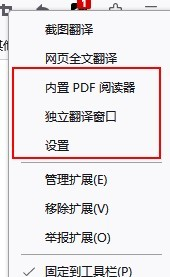
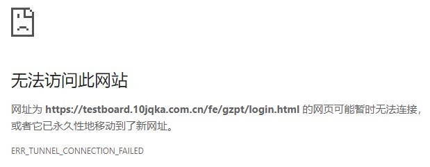

# Hosts 之殇

## 什么是 hosts

根据[维基百科](<https://en.wikipedia.org/wiki/Hosts_(file)>)的定义，`hosts` 是操作系统用来将 `host names` 映射为 `ip address` 的系统文件。是一个纯文本文件。关于 `IP` 和 `DNS` 这里先不展开

## 业务场景

在实际的开发业务中，一个功能往往要经过 开发环境->测试环境->预发布环境->正式环境 等不同环境下的功能测试，而在更多的情况下，开发环境、测试环境以及预发布都并非对外开放的。当域名无法从 DNS 服务器正确解析的时候，页面就会加载失败。于是经常需要进行的操作，就是配置系统层面的 host 文件，通过手动加入 DNS 缓存的方式，让浏览器能够正确解析域名，访问对应的 ip 地址

但是有一些业务域名，在所有环境中都是一样的，需要通过 ip 辨别，于是我们的 host 文件就会如下所示，然后通过 注释-取消 对应的 host，来进行环境的切换。这样在无形中增加了许多重复劳动，还可能会导致因为少注释了一些 host，导致测试结果不准确，从而影响到业务的进度

```
# 预发布
172.127.80.1 common-url.com
# 测试环境
172.127.230.16 common-url.com
```

`Don't Repeat Yourself` 是程序开发中很重要的一个原则。实际上这完全可以上升到日常的工作中。重复修改 host 既不优雅，也不是长久之道。自动化或者说至少可视化是当务之急

## 解决方案

主要解决思路有两个：

1. 自动化脚本修改系统内的 host 文件
2. 浏览器插件转发浏览器的请求

### 自动化脚本

关于自动化脚本修改暂不展开。大体思路如下:

1. 创建 `env1.txt` `env2.txt`等不同环境的 host 文件
2. 创建一个自动化脚本，用系统管理员权限修改系统内的 host 文件，通过单行命令控制 `hosts` 的清除与写入

甚至可以直接创建一个应用，动态切换 host，比如 [SwitchHosts](https://github.com/oldj/SwitchHosts)

这种方式的优点是方便，快速。可以全局接管 `hosts`

缺点是修改 `hosts` 文件需要系统管理员权限，这样在一些场景下，如果用户无法获取系统管理员权限，那么就无法做到修改 `hosts`

### 浏览器插件开发

浏览器插件开发的思路很简单，通过 [`Chrome.proxy`](https://developer.chrome.com/docs/extensions/reference/proxy) 提供的 API，我们可以通过 `mode=pac_script` 的模式，使用 `PacScript` 进行 `hosts` 代理

而且由于插件开发的特点~~（其实就是个富 api 的网页）~~，相比自动化脚本，插件可以实现更好的可视化效果

#### 前置知识

浏览器插件可以通过不同的文件和功能配置实现不同的效果，但通常有以下几个组成部分：

- The manifest

`manifest.json` 是一个插件系统必须要有的文件，且必须处于插件的根目录下。这个文件定义了 `metadata` , `resources` , `permissions` , `background files` 等信息

- The service worker

插件的 `service worker` 可以监听浏览器的[事件](https://developer.chrome.com/docs/extensions/reference/)，比如导航、书签变更、或者关闭标签页等。需要注意的是，`service worker` 虽然可以监听事件，但无法与页面内容发生交互，那是 `content script` 的任务

- Content scripts

顾名思义，`content script` 是注入页面的脚本。可以直接读取或操作页面的 DOM。我们常见的一些插件比如[划词翻译](https://hcfy.app/)，就是通过这个功能实现页面内容替换的。 `content script` 只能调用部分[Chrome APIs](https://developer.chrome.com/docs/extensions/reference/)，但是可以通过与 `service worker` 的通信使用其他的 api

- The popup and other pages

一个插件可以包括很多 HTML 页面，例如 popup 弹窗，options 选项页面，仍以划词翻译插件为例，鼠标左键打开的就是 popup 弹窗


鼠标右键点击打开的是额外配置的 options page 的入口



根据上述的条件，我们需要开发的插件其实很简单，主要实现功能有两个：

1. 通过 popup 编辑 hosts 列表
2. 通过 Chrome APIs 提供的功能代理 host

不需要修改页面内容，也不需要后台运行服务。因此不需要 `service worker` 和 `content script` 。主要通过 `popup and other pages` 功能。因此我们构想的 host extension 的 `manifest` 初步如下

```json
{
  "manifest_version": 3,
  "name": "Host Manager",
  "description": "A Simple Host Tool",
  "minimum_chrome_version": "24",
  "version": "0.0.1",
  "icons": {
    "16": "icons/logo-16.png",
    "48": "icons/logo-48.png",
    "128": "icons/logo-128.png"
  },
  // 控制 icon 点击行为
  "action": {
    "default_icon": "icons/logo-16.png",
    "default_title": "Host Manager",
    "default_popup": "index.html"
  },
  // 扩展权限
  "permissions": ["proxy"]
}
```

#### 开发思路

由于涉及页面开发，现代 web 当然应该使用框架，方便以后拓展。以 vite@4.2.0 和 vue@3.2.47 为例，不包含脚手架文件等内容的项目架构应该如下

```
// source
├─dist
├─public
│  ├─icons
│  └─manifest.json
└─src
    ├─assets
    ├─components
    ├─hooks
    ├─store
    ├─test
    ├─utils
    ├─App.vue
    ├─main.ts
    └─style.css
```

这样在 `src` 目录内编写 popup 文件，在 `build` 之后，编译结果和 public 文件都会被移动到 `dist` 目录内，这时的 `dist` 目录就是用来调试的 extension 源文件。

```
├─index.html
├─manifest.json
├─assets
│   ├─index-022763e2.css
│   └─index-64e73436.js
└─images
    ├─logo-128.png
    ├─logo-48.png
    ├─logo-16.png
    └─logo.png
```

#### 插件流程

具体的页面开发略去不提，唯一需要注意的一点是，我们希望插件能够记录用户的 host 信息，而并非每次打开浏览器都需要重新输入 host，因此在进行数据管理的时候，需要通过 `localStorage` 进行持久化处理。当然，结合 `@vueuse/core` 和 `pinia` ，这些行为都可以自动进行。

而整个插件的核心在于对 proxy 的配置。根据[官方文档](https://developer.chrome.com/docs/extensions/reference/proxy/)，首先需要在 `permissions` 中加入对应权限字段 `proxy`。

关于 `proxy` ，Chrome 提供了多种模式：

- direct
- auto_detect
- pac_script
- fixed_servers
- system

`direct` 直接请求，`system` 使用系统代理，`fixed_servers` 主要用于将所有请求转发到一个固定的地址，这个特性通常被用作 **魔法插件** 的一部分，比如 [SwitchyOmega](https://github.com/FelisCatus/SwitchyOmega/)。`auto_detect` 虽然也是通过 PAC 脚本解析，但是该选项的脚本必须是‘can be downloaded at http://wpad/wpad.dat’，并且不允许其他配置。

因此我们选择的是 `pac_script` 这种模式。该模式允许我们自定义来自 _数据字面量_ 或者 _URL_ 的脚本，因此也是最适合我们想要实现的 _自定义 host_ 的功能的一种模式。

至此，整个业务的流程已经完成了。

1. popup 页面，用户输入自定义 hosts
2. 将 hosts 解析为可识别的 pacScript
3. 使用 chrome api 进行解析

```typescript
// 官方示例
const config = {
  mode: 'pac_script',
  pacScript: {
    data:
      'function FindProxyForURL(url, host) {\n' +
      "  if (host == 'foobar.com')\n" +
      "    return 'PROXY blackhole:80';\n" +
      "  return 'DIRECT';\n" +
      '}'
  }
};
chrome.proxy.settings.set({ value: config, scope: 'regular' }, function () {});
```

#### PAC

如果说插件的核心是 `proxy` 的配置，那么这个配置的核心就是 `pacScript` 的生成。那么到底什么是 `PAC`？ `PAC` 实际上是 `Proxy Auto Config` 的缩写，字面意义上理解，就是“代理自动配置”

根据[mdn 的定义](https://developer.mozilla.org/en-US/docs/Web/HTTP/Proxy_servers_and_tunneling/Proxy_Auto-Configuration_PAC_file)：

> A Proxy Auto-Configuration (PAC) file is a JavaScript function that determines whether web browser requests (HTTP, HTTPS, and FTP) go directly to the destination or are forwarded to a web proxy server.

而根据[wikipediea](https://en.wikipedia.org/wiki/Proxy_auto-config)的定义：

> A proxy auto-config (PAC) file defines how web browsers and other user agents can automatically choose the appropriate proxy server (access method) for fetching a given URL

```javascript
// PAC file 中的 function
function FindProxyForURL(url, host) {
  // code
}
```

这个函数的接收两个参数：`url` & `host`，需要注意的有两点：

1. 当请求地址为 `https` 时，`URL` 中的 `path` 和 `query` 会被剥离。在不同的浏览器以及用户自定义设置下，表现可能不一致。因此，对于 `https://test.com/url.html?type=add` 这样一个地址，最安全的方式是用 `test.com` 去匹配 `url` 字段，而非全量匹配
2. `host` 是从 URL 中分解出来的字段。它跟 `URL` 中 `://` 以后到第一个 `:` 或 `/` 之间的字符串是等效的。也就是说，这个字段不会带有 `port` 的信息。

PAC 文件中的 `FindProxyForURL` 函数可以返回一个字符串，该字符串需要满足以下任意格式：

- DIRECT
- PROXY host:port
- SOCKS host:port
- HTTP: host:port
- HTTPS: host:port
- SOCKS4 host:port, SOCKS5 host:port

其中 `PROXY` 为自适应协议头

##### 一个简单实现

现在再回顾一下我们最初的目标：

```
# 自动切换以下两个地址
# 预发布
172.127.80.1 common-url.com
# 测试环境
172.127.230.16 common-url.com
```

简易版的 `PAC` 函数实现如下

```javascript
// ipConfig.js
const preIp = '172.127.80.1:80';
const testIp = '172.127.230.16:80';
const getIpByEnv = (env) => (env === 'pre' ? preIp : testIp);

// setProxy.js
const env = 'pre';
function FindProxyForURL(url, host) {
  if (host === 'common-url.com') {
    return `PROXY ${getIpByEnv(env)}`;
  } else return 'SYSTEM';
}
```

这样就可以实现对 `common-url.com` 这个地址的动态变化，只需要在 `popup` 页面上增加一个跟 `env` 变量相关的开关即可。当然这个 `PAC` 还有很多不成熟的地方：

1. 如果 `preIp` 或者 `testIp` 失效，那么请求会直接失败，最好增加一个例如 `SYSTEM` 的降级选项
2. 对于常规页面的 `host` 设置，一般涉及的应用层协议为 `http` 以及 `https`。当前方法会代理所有可能的应用层协议，比如 `ftp`
3. 对于 `localhost` ，走 `SYSTEM` proxy 会导致无法访问

在此基础上完善方法

```javascript
// setProxy.js
const env = 'pre';
function FindProxyForURL(url, host) {
  if (shExpMatch(url, 'http:*') || shExpMatch(url, 'https:*')) {
    // 仅代理 http https
    if (host === 'localhost') {
      // 特殊处理 localhost
      return 'DIRECT';
    } else {
      // 增加 fallback
      return `PROXY ${getIpByEnv(env)}; SYSTEM`;
    }
  } else {
    return 'SYSTEM';
  }
}
```

##### 预定义函数

`FindProxyForURL` 方法中的 `shExpMatch(str, shexp)` 是一种 预定义函数 _predefined function_，用法可以参考[mdn](https://developer.mozilla.org/en-US/docs/Web/HTTP/Proxy_servers_and_tunneling/Proxy_Auto-Configuration_PAC_file#shexpmatch)，用于判断一个 `str` 是否匹配给出的 `shexp` shell expression。

借助预定义函数，我们可以实现更多配置选项，比如 `isPlainHostName(host)`，判断 `host` 是否为非域名型 hostname

```javascript
isPlainHostName('www.mozilla.org'); // false
isPlainHostName('www'); // true
```

#### https

插件的初步开发到此基本就结束了。综合使用的技术回顾一下代理流程

1. 使用 `vue` + `tailwindcss` 开发 `popup` 页面，在该页面内编辑对应的 `hosts` 内容
2. 使用 `pinia` + `vueuse` 对 `hosts` 进行实时更新和持久化
3. 将 `hosts` 解析后，根据解析结果生成对应的 `FindProxyForURL` 函数，调用 `Chrome api`，更新代理

按照结论来说， `FindProxyForURL` 函数中已经代理了 https，那么我们在输入任意地址，只要域名匹配，应该就能够成功代理。但是实际上输入 `https` 的时候，是无法正确代理的。 

原因在于 https 本身的性质和 [PAC](####PAC)的原理。

回顾 `PAC` 的定义，实际上是浏览器通过代理对地址进行转发

假设我们配置的是本地代理

```
SOCK5 127.0.0.1:7890
```

那么对于任意请求，浏览器会将请求转发给 `127.0.0.1:7890`，随后 `7890` 服务器将请求进行二次转发，获取返回的结果

那么对于如下 `host`

```
192.0.200.1 test.com
```

我们解析出来的 `PAC Rule` 将是 `PROXY 192.0.200.1` ，当请求 `http://test.com` 这个地址时，会根据规则代理到 `http://192.0.200.1`，而转发的服务器 `http://192.0.200.1` 直接对响应进行返回，没有进行二次转发，进而实现与`DNS`解析类似的效果。

而 https 的设计从本质上就不允许代理。因为 `HTTP over TLS` 出现的动机就是防止 [中间人攻击(Man-in-the-middle_attack)](https://en.wikipedia.org/wiki/Man-in-the-middle_attack)，实现对交换数据的完整性和隐私性的保护。

这里可能有两个小问题：

1. 为什么系统级别的 https 是可以通过 http 进行代理？比如一些魔法工具进行命令行代理时候的命令是 `set http_proxy=http://127.0.0.1:7890 & set https_proxy=http://127.0.0.1:7890`
2. 为什么浏览器中通过 `SOCKS` 可以进行 `https` 的代理？这两个问题还有待研究

现在根据分析结果发现，我们在浏览器中借助 `PAC Rules` 将 `https://test.com` 转发至 `http://192.0.200.1` 的行为本身就是一种“中间人”行为。因此将 `https` 转发到基于 `https` 或者 `http` 的服务器代理，必然无法成功

这也是为什么系统级的 [SwitchHosts](https://github.com/oldj/SwitchHosts) 项目核心实现 [setSystemHosts.ts](https://github.com/oldj/SwitchHosts/blob/master/src/main/actions/hosts/setSystemHosts.ts) 直接写入系统级的 hosts 文件不会有这种问题

SwitchHosts 这类系统级的软件直接修改了 `hosts` 文件，在**真正意义**上改变了系统对 DNS 的解析；而浏览器插件本质上是一种代理请求拦截，系统对于 DNS 并没有发生改变。

##### 解决方案设想

1. 先将 `https` 请求转化为 `http` 请求，再走代理。

- v2 版本解决方案，通过 [webRequest api](https://developer.chrome.com/docs/extensions/reference/webRequest/) 用来进行阻塞请求，同步修改
- v3 版本引入 [declarativeNetRequest](https://developer.chrome.com/docs/extensions/reference/declarativeNetRequest/) 用来以特定的声明式规则 _阻塞_ 以及 _修改_ 网络请求，注意如果需要进行 `host` 级别的重定向，在 `manifest.json` 中 `permission` 需要欸外申请 `declarativeNetRequestWithHostAccess`

```javascript
chrome.webRequest.onBeforeRequest.addListener(
  function (details) {
    return { redirectUrl: details.url.replace('https', 'http') };
  },
  {
    urls: domains.map(function (domain) {
      const url = 'https://' + domain + base + '/*';
      return url;
    })
  },
  ['blocking']
);
// or
chrome.declarativeNetRequest.updateDynamicRules(
  {
    addRules: [
      {
        // change the scheme of the URLs which match the domains of hosts
        id: 1,
        priority: 1,
        action: {
          type: chrome.declarativeNetRequest.RuleActionType.REDIRECT,
          redirect: {
            transform: { scheme: 'http' }
          }
        },
        condition: {
          urlFilter: `||${domain}`
        }
      }
    ],
    removeRuleIds: lastRuleIds
  },
  () => {
    lastRuleIds = newRules.map((info) => info.id);
  }
);
```

这个方案可以解决绝大部分情况，但是会有一些特殊情况无法解决

- iframe 重定向报错

  考虑一个页面 `https://www.test.com`，页面内部有一个 `iframe` `https://a.test.com`，对于这两个页面：

  - 都配置了 `host`
  - `https://www.test.com` 和 `https://a.test.com` 都依赖于 `test.com` 域名下的 `cookie`

  这时候打开页面会发现， `iframe` 的请求会发生错误，如果 cookie 是用来权限认证的，页面则会直接显示权限认证失败之类的错误码。

  原因：iframe 中重定向后没有正确携带 Cookie。本质上与 [HTTP Cookie 策略](https://developer.mozilla.org/en-US/docs/Web/HTTP/Cookies)和浏览器的[cookie 机制](https://chromestatus.com/feature/5088147346030592)有关，导致 iframe 的导航链接中的 set-cookie 会被浏览器阻止，因而使得当前 iframe 没有 cookie。如果请求中的 `SameSite=Strict` 或者 `SameSite=Lax`（如果没有设置，chrome 会默认为 `SameSite=Lax`），那么浏览器就会阻止非顶级的请求 set-cookie，导致请求没有携带 cookie。当然如果都是 https 请求是没有问题，但是在重定向为 http 之后，就会出现错误

  > This Set-Cookie header didn't specify a 'SameSite" attribute and was defaulted to "SameSite=Lax," and was blocked becaus a cross-site response which was not the response to a top-level navigation. The Set-Cookie had to have been set with "Sam to enable cross-site usage.

- 无限重定向

  某些特定页面在设置了 `Upgrade-Insecure-Requests: 1` 的情况下可能会导致无限重定向的问题。当服务端返回 `Location` 的时候，`http` 请求会被重定向为 `https` 的 `Location`，而新的 `https` 地址会被 extension 重定向为 `http`，因而导致无限循环

  注：这个问题在无痕模式下不会产生。观察请求头 `Upgrade-Insecure-Requests: 1`仍然是存在的，推测是浏览器内部表现

#### 成品

把流程和技术点理清后，可以直接上 github 搜了，这种插件必然已经存在，但是出乎意料的是，插件并不多

举例来说，有两个比较有代表性(star 较多)的插件 [host-switch-plus](https://github.com/Riant/host-switch-plus) 和 [awesome-host-manager](https://github.com/keelii/awesome-host-manager)

其中 `host-switch-plus` 已经从 Chrome WebStore 下架了，虽然 `awesome-host-manager` 仍能从商店安装使用，但上一次 feat 更新也已经是四年前了，并且这两个插件技术相对较为老旧，本地调试困难， `manifest` 版本也还停留在 2 的版本

于是干脆重开了一个项目，[HostsWitch](https://github.com/X-sky/HostsWitch)，使用 react+mui+jotai 开发

#### 开发痛点

初次开发的时候只研究了架构，开发流程为直接开发静态页面，再通过 build+reload，更新浏览器插件进行联调。后来发现已经有对应的轮子了。。。可用脚手架[vitesse-webext](https://github.com/antfu/vitesse-webext/blob/main/README.md)
