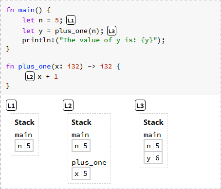
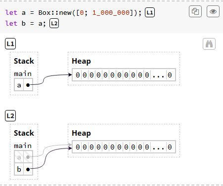

# The Rust Programming Language

> reading notes of [The Rust Programming Language](https://rust-book.cs.brown.edu/ch03-00-common-programming-concepts.html) from the official site of Rust.

## Common Concepts

Discuss some common concepts and their conventions around using them in the context of Rust. Mainly in:

- variables
- basic types
- functions
- comments
- control flow

::: tip about keywords

before you learn, you should look through a set of [_keywords_](https://rust-book.cs.brown.edu/appendix-01-keywords.html) in Rust. You can not use keywords as variable names in ANY kind of languages.

:::

### Variables

Variables are **IMMUTABLE** by default, but it can be marked as mutable by adding the keyword `mut`

```rust
fn main() {
  let x = 5;
  x = 6; // error[E0384]: cannot assign twice to immutable variable `x`
  let mut y = 5;
  y = 6; // it's ok!
}
```

Also, variables can only be used in a function

```rust
let x = 1; // Syntax Error: expected an item
fn main() {
  let y = 5; // it's ok!
}
```

#### Constants

like immutable variables, _constants_ are not allowed to change. However, there are a few differences:

1. `const` not allowed to use `mut`.
2. the _type_ of `const` must be annotated.
3. `const` can be used in the **global scope**, while `let` can **only** be used in a function
4. `const` can only be set to a constant expression instead of the result of a value computed at runtime.
5. Rust’s naming convention for `const` is to use all **UPPER_CASE** with underscores between words

#### Shadowing

> While variables are immutable by default, you can define a new variable with the same name as a previous variable. It is normally called _shadowing_.

The key concept of shadowing is that it means overriding inside a scope instead of actually affecting the variables, which means:

1. the use of `let` in shadowing can not be neglected. Variables will still be immutable when out of scope.
2. shadowing can change the type of variables while `mut` can not.

```rust
fn main() {
    let x = 5;
    let x = x + 1; // it's ok! And `x` will be shadowing as 6;
    {
        let x = x * 2; // it's ok and `x` will be shadowing as 12
        {
          let x = 'c'; // it's ok and type of `x` will be shadowing as String
        }
    }
    println!("The value of x is: {x}"); // still 6;
}
```

### Data Types

> Rust is a statically-typed language. In a word, Rust must know exact types of every single variable at compile time.[See other statically-typed language here](https://en.wikipedia.org/wiki/Category:Statically_typed_programming_languages)

Rust usually _infer_ what type we want to use based on the value and how we use it. In cases _many_ types are possible, we must add a type annotation.

```rust
let guess = "42".parse().expect("Not a number!"); // error[E0282]: type annotations needed
let guess: i8 = "42".parse().expect("Not a number!"); // it's ok.
```

Some more complex types like `struct` will be introduced afterwards.

#### Scalar Types

> A scalar type represents a single value.

Rust has 4 primary scalar types:

- integers
- floating-point numbers
- Booleans
- characters

##### Integer Types

Like other programming languages, different integer types meas difference allocation in the computer memory and different number ranges.

| Length  | Signed | Unsigned |
| ------- | ------ | -------- |
| 8-bit   | i8     | u8       |
| 16-bit  | i16    | u16      |
| 32-bit  | i32    | u32      |
| 64-bit  | i64    | u64      |
| 128-bit | i128   | u128     |
| arch    | isize  | usize    |

Additionally, isize and usize are two special integer types in Rust. They depend on the architecture of the machine the program **RUNNING** on. It will be 64 bits if you’re on a 64-bit architecture and 32 bits if you’re on a 32-bit architecture. Normally, it will be used for pointer or memory related actions.

Integer literals can be in any of the forms below. And also can be visually separated by `_` for easier reading.

| Number literals | Example     |
| --------------- | ----------- |
| Decimal         | 98_222      |
| Hex             | 0xff        |
| Octal           | 0o77        |
| Binary          | 0b1111_0000 |
| Byte (u8 only)  | b'A'        |

::: warning Be careful of the Integer Overflow

Rust will **only** check integer overflow and _panics_ in debug mode. Which means overflow does not count as a compiling error.

Say you have a variable of type `u8` that holds values between 0 - 255. If that variable was assigned to 256, in debug mode, the program panics. However with `--release` flag, the program will be fine and Rust performs so-called [_two's complement wrapping_](https://en.wikipedia.org/wiki/Two%27s_complement), and thus the value 256 will become 0.

To explicitly handle the possible overflow:

1. Wrap in all modes with the wrapping\_\* methods, such as wrapping_add.
2. Return the None value if there is overflow with the checked\_\* methods.
3. Return the value and a boolean indicating whether there was overflow with the overflowing\_\* methods.
4. Saturate at the value’s minimum or maximum values with the saturating\_\* methods.

```rust

fn main() {
    let a: u8 = 255; // u8 max value

    // wrapping_add wraps around on overflow
    let wrap_result = a.wrapping_add(1);
    println!("wrapping_add: {}", wrap_result); // Outputs 0

    // checked_add returns None on overflow
    match a.checked_add(1) {
        Some(x) => println!("checked_add: {}", x),
        None => println!("checked_add: Overflow occurred"),
    }

    // overflowing_add returns a tuple (result, is_overflow)
    let (overflow_result, is_overflow) = a.overflowing_add(1);
    println!("overflowing_add: {}, overflowed: {}", overflow_result, is_overflow); // Outputs 0, true

    // saturating_add saturates at the maximum value
    let saturate_result = a.saturating_add(1);
    println!("saturating_add: {}", saturate_result); // Outputs 255
}

```

:::

:::details number ranges

Each signed variant can store numbers from -(2n - 1) to 2n - 1 - 1 inclusive, where n is the number of bits that variant uses. So an i8 can store numbers from -(27) to 27 - 1, which equals -128 to 127. Unsigned variants can store numbers from 0 to 2n - 1, so a u8 can store numbers from 0 to 28 - 1, which equals 0 to 255.

:::

##### Floating-Point Types

- f32 32-bits single-precision float
- f64 64-bits double-precision float

`f64` is roughly the same speed as `f32` but capable of more precision. They are represented according to the [IEEE-754 standard](https://en.wikipedia.org/wiki/IEEE_754)

##### The Boolean Type

The Boolean type in Rust is specified using `bool`. The main way to use Boolean values is through conditionals

```rust
fn main() {
  let t: bool = true;
}
```

##### The Character Type

Rust's `char` literal is specified with single quotes, as opposed to string literals, which use double quotes.

The `char` type is 4 bytes in size and represents Unicode Scalar Value and thus differs from `char` type in `C++` which is only 1 byte in size.

#### Compound Types

Compound types can group multiple values into one type. Rust has two primitive compound types:

- tuples
- arrays

##### The Tuple Type

Tuples have a fixed length: once declared, they cannot grow or shrink in size.

A tuple value can be accessed though `dot` operator.

```rust
fn main() {
  let tup: (i32, f64, u8) = (500, 6.4, 1);

  println!("The value of the first el of tup is: {}", tup.0)
}
```

A tuple can be destructured just like `python` or `javascript`. `let (x, y, z) = tup;`.

A tuple without any values has a special name `unit`. Consider `()` as `void` in other languages. Expressions implicitly return the unit value if they don’t return any other value.

##### The Array Type

Unlike tups, every element of an array must have the **SAME** type. `let x = ["string", 2]` cause a syntax error.

And unlike arrays in some other language, arrays have a _fixed_ length. If you’re unsure whether the collection has a fixed number of elements, chances are you should use a vector, a similar collection type provided by the standard library that is allowed to grow or shrink in size.

```rust
fn main() {
  let list = [1, 2, 3];
  let list: [i32; 3] = [1, 2, 3];
  let list = [3; 2]; // [3, 3]
}
```

::: warning Invalid Array Element Access

Similar to the number range panic, if you try to access an element of an array that is past the end of the array, you will get a runtime error, though the code may be compiled successfully.

This kind of runtime error may not occur in many other languages like C++, which may be confusing to get an invalid memory.

However, if you define an array with explicit numbers and also try to access with explicit number past the end of the array, Rust will fail to compile as usual.

:::

### Functions

Rust code uses snake_case as the conventional style for function and variable names. Like `javascript`, Rust will elevate the functions to the top of the scope, which means you can call a function which was defined afterwards in the scope.

```rust
fn main() {
  another_func();
}

fn another_func(x: i32) {
  println!("The value of x is: {x}");
}
```

In function signatures, you _must_ declare the type of each parameter.

#### Statements and Expressions

**Statements** are instructions that perform some action and do not return a value. `let x = 6` does not return value.

**Expressions** evaluate to a resultant value.

- calling a function `any_func()` is an expression.
- Calling a macro `println!("1")` is an expression.
- A new scope block `{}` is an expression.

Rust is an expression-based language.

#### Functions with Return Values

In Rust, the return value of the function is synonymous with the value of the final expression in the block of the body of the function.

You can explicitly return early using `return` keyword, or the last expression will be returned implicitly.

The type of the return values should be declared after an arrow `->`. Exp: `fn five() -> i32 {}`. If omitted, Rust will treat the return type as `()`

::: warning

It's important to distinguish the differences between `statements` and `expressions`. Though Rust will return the last expression of the function, it has to be explicitly _expressed_. The code snippet below will occur an error for the there is no so-called last expression. Remove the semicolon, and it will be alright.

```rust
fn main() {
  let x = plus_one(5);

  println!("The value of x is: {x}");
}

fn plus_one(x: i32) -> i32 {
  x + 1; [!code error]
}
```

:::

### Control Flow

#### if Expressions

Like all other languages like `python`, Rust has built-in `tuple` type declared by `()`, which may be the reason the condition controls in these languages don't need any parentheses. However, in Rust, they still need to be wrapped in brackets.

```rust
fn main() {
  let num = 3;

  if num < 5 {
    println!("condition is true");
  } else {
    println!("condition is true");
  }
}
```

You can also using `if` in `let` statement like conditional operator in `javascript`.

```rust
fn main() {
  let condition = true;
  let number = if condition { 5 } else { 6 };
  println!("The value of number is: {number}");
}
```

If the types are mismatched, as in the following example, we’ll get an error:

```rust
fn main() {
  let condition = true;
  let number = if condition { 5 } else { "six" }; [!code error]
  println!("The value of number is: {number}");
}
```

#### Repetition with Loops

Rust has 3 kinds of loops: `loop` `while` `for`

##### Loop

The `loop` keyword tells Rust to execute a block of code over and over again forever or until you explicitly tell it to stop.

```rust
fn main() {
  let mut counter = 0;

  let result = loop {
    counter += 1;
    if counter == 10 {
      break counter * 2;
    }
  }

  println!("The result is {result}"); // 20
}
```

::: info

`break` is very similar to `return`. So the `counter * 2` after `break` is technically optional. if omitted, the Rust compiler treats `break` and `return` expression as having the value unit `()`.

:::

If you have loops within loops, `break` and `continue` apply to the innermost loop at that point. You can optionally specify a `loop label` on a loop to specify the target.

```rust
fn main() {
    let mut count = 0;
    'counting_up: loop {
        println!("count = {count}");
        let mut remaining = 10;

        loop {
            println!("remaining = {remaining}");
            if remaining == 9 {
                break;
            }
            if count == 2 {
                break 'counting_up;
            }
            remaining -= 1;
        }

        count += 1;
    }
    println!("End count = {count}");
}
```

It's NOT recommended to break with values inside multiple loops. The `mismatched types` error will be a catastrophe.

##### while and for

In a word, `while` is a _conditional_ `loop` and `for` is a `loop` for _iterables_

```rust
fn main() {
    // while
    let mut number = 3;

    while number != 0 {
        println!("{number}!");

        number -= 1;
    }
    println!("while LIFTOFF!!!");

    let list = [1, 2, 3, 4];
    for el in list {
      println!("the value in list is: {el}");
    }
    println!("for LIFTOFF!!!");
}
```

## Ownership

> Ownership is Rust’s most unique feature and has deep implications for the rest of the language.

Ownership is a discipline for ensuring the safety of Rust programs.

### Understanding Safety in Rust

A foundational goal of Rust is to ensure that your programs never have undefined behavior. And **ANY UNDEFINED BEHAVIOR** will be checked by Rust at compile-time. For example, the memory corruption.

The compile-time checking has two motivations over run-time checking:

1. Avoiding bugs in production will improve the reliability of your software.
2. Fewer run-time checks will improve the performance.

Conclusively, safety IS the absence of undefined behavior.

### Ownership as a Discipline for Memory Safety

Since ownership is about safety, the absence of undefined behavior, we need to understand ownership in terms of WHAT undefined behaviors it prevents.

From a large list of ["Behavior considered undefined"](https://doc.rust-lang.org/reference/behavior-considered-undefined.html) The Rust Reference maintains, we will focus on one category: operations on memory.

::: info about memory

Memory is the space where data is stored during the execution of a program, some respected as `RAM`, some `malloc`, and others as other forms, but NONE of them is a useful way to think about how Rust works.

:::

### Variables Live in the Stack

Variables live in **frames**. A frame is a mapping from variables to values within a single scope, such as a function.



The diagram above shows the contents of memory during the program's execution at the three marked points `L1` `L2` and `L3`.

Frames are organized into a stack of currently-called-functions:

1. `fn main` is called, a variable stack (aka what we call frame) of `main` is allocated from memory. And this frame hold `n=5`
2. `fn plus_one` is called, a frame B holds `x=5` is allocated.
3. `fn plus_one` is finished, frame B will be _deallocated_(also known as freed or dripped) and the frame for main will hold another variable

Note that this memory model does not fully describe how Rust actually works! Only a simpler case for understanding the safety in Rust.

### Boxes Live in the Heap

However，copying data can take up a lot of memory. For example, the `copy` behavior below causes the `main` frame to contain 2 million elements.

```rust
let a = [0; 1_000_000];
let b = a;
```

To transfer access to data without copying it, Rust uses pointers. A pointer is a value that describes a location in memory. The value that a pointer points-to is called its pointee.

One common way to make a pointer is to allocate memory in the heap. Head data is NOT tied to a specific stack frame.

Rust provides a construct called `Box` for putting data on the heap like this.



Note that `a` is now grayed because it has been moved because of the [Box Deallocation Principle](#box-deallocation-principle) we'll talk about later.

### Collections Use Boxes

Boxes are used by Rust data structures1 like Vec, String, and HashMap to hold a variable number of elements.

These data structures don't use the literal Box type. For example, String is implemented with Vec, and Vec is implemented with RawVec rather than Box. But types like RawVec are still box-like: they own memory in the heap.

```rust
fn main() {
    let first = String::from("Ferris");
    let full = add_suffix(first);
    println!("{full}");
    println!("first"); //[!#code error] variables cannot be used after being moved
}

fn add_suffix(mut name: String) -> {
    name.push_str(" Jr.");
    name
}
```

#### Box Deallocation Principle

> (almost correct) If a variable is bound to a box, when Rust deallocate the variable's frame, then Rust deallocates the box's heap memory.

The [codes above](#boxes-live-in-the-heap) has a boxed array bound to both `a` and `b`. However by the "almost correct" principle, Rust would try to free the heap memory _twice_ on behalf of both variables, which is undefined behavior too! To avoid this, we finally arrive ownership.

> (fully correct): If a variable OWNS a box, when Rust deallocates the variable's frame, then Rust deallocates the box's heap memory.

::: info heap and stack

- Frames in the stack are associated with a specific function, and are deallocated when the function returns, which is automatically managed by Rust while data on the heap can live **INDEFINITELY**.
- Both data can be MUTABLE and COPYABLE.
- Both allowed to contain pointers

:::

#### Moved Heap Data Principle

> if a variable `x` moves ownership of heap data to another variable `y`, then `x` cannot be used after the move.

You may notice that there is an error line in the [example](#collections-use-boxes). That's because variables cannot be used after being moved due to memory safety.

Reading `first` pointing to deallocated memory is a violation of memory safety. It is NOT the pointing itself but the USING/READING of the variable, an undefined behavior. See this example

```rust
fn main() {
    let b = Box::new(0);
    let b2 = b;
    println!("{}", b);
    move_a_box(b2);
}
fn move_a_box(b: Box<i32>) {
  // This space intentionally left blank
}
```

Just doing `let b2 = b;` and then print it is not an undefined behavior, though `b` is moved but its data is NOT deallocated until `move_a_box` is called.

Therefore if we comment the `move_a_box(b2)`, the program is technically safe, although still rejected by Rust and won't compile.

One way to avoid moving data is to `clone` it using `.clone()` method.

```rust
fn main() {
    let first = String::from("Ferris");
    let full = add_suffix(first.clone());
    println!("{full}");
    println!("first"); // it's alright!
}

fn add_suffix(mut name: String) -> {
    name.push_str(" Jr.");
    name
}
```

### References and Borrowing

So far, Rust provides boxes and moves for safely programming with the heap. However, move-only APIs can be inconvenient to use. Strings, for instance, are very common in programs to be used for more than once.

An alternate solution is to `return` the ownership of the strings.

```rust
fn main() {
    let s = String::from("Hello");
    let s_again = greet(s);
    println!("{s_again}")
}
fn greet(s: String) -> String {
    println!("inside greet {s}");
    s
}
```

This style of program is quite verbose. Therefore Rust provides a concise style of reading and writing without moves. References.

> References are non-owning pointers (again, a pointer is a value that describes a location in memory). The do not OWN the data they point to.

References make it easier to write the program in a more convenient manner.

```rust
fn main() {
    let m1 = String::from("Hello");
    let m2 = String::from("world");
    greet(&m1, &m2);
    let s = format!("{m1}, {m2}");
}
fn greet(g1: &String, g2: &String) {
    println!("inside greet {g1}, {g2}")
}
```

### Dereference

The previous example has not shown how Rust "follows" a pointer to data. The `println!` macro has mysteriously worked for both _owned strings_ and for _string references_. The underlying mechanism is the **dereference** operator.

```rust
fn main() {
    let mut x: Box<i32> = Box::new(1);
    let a: i32 = *x;         // *x reads the heap value, so a = 1
    *x += 1;                 // *x on the left-side modifies the heap value,
                            //     so x points to the value 2

    let r1: &Box<i32> = &x;  // r1 points to x on the stack
    let b: i32 = **r1;       // two dereferences get us to the heap value

    let r2: &i32 = &*x;      // r2 points to the heap value directly
    let c: i32 = *r2;    // so only one dereference is needed to read it
}
```

`**` is pretty common in `C++`, as we call it `a pointer to the pointer`. Here is an example to help understanding.

```rust
fn main() {
    let x = Box::new(0);
    let y = Box::new(&x);
    // need there dereference operators to get a copy of number 0 out of Box.
    let copy_0 = ***y;
}
```

### Rust Avoids Simultaneous Aliasing and Mutation

Aliasing itself is harmless but combined with mutation is a recipe for disaster.

- Once the aliased data deallocated, the variable would point to deallocated memory.
- Once the aliased data mutated, another variable would have invalidating runtime properties.
- Concurrently mutating the aliased data will cause a data race condition.

To avoid these issues, Rust follows a basic principle: Pointer Safety Principle.

#### Pointer Safety Principle

> data should never be aliased and mutated at the same time.

By design, references are meant to temporarily create aliases. Rust ensures the safety of references through the **borrow checker**.

The core idea behind the borrow checker is that variables have three kinds of permissions on their data:

- Read (R): data can be copied to another location.
- Write (W): data can be mutated in-place.
- Own (O): data can be moved or dropped.
